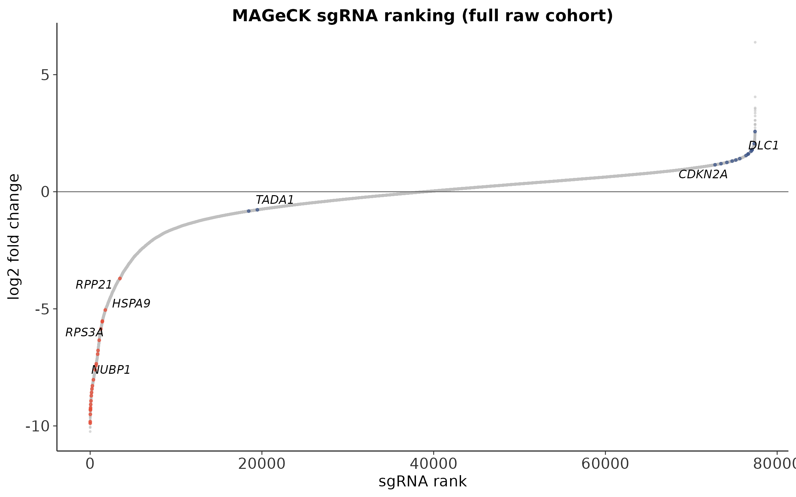
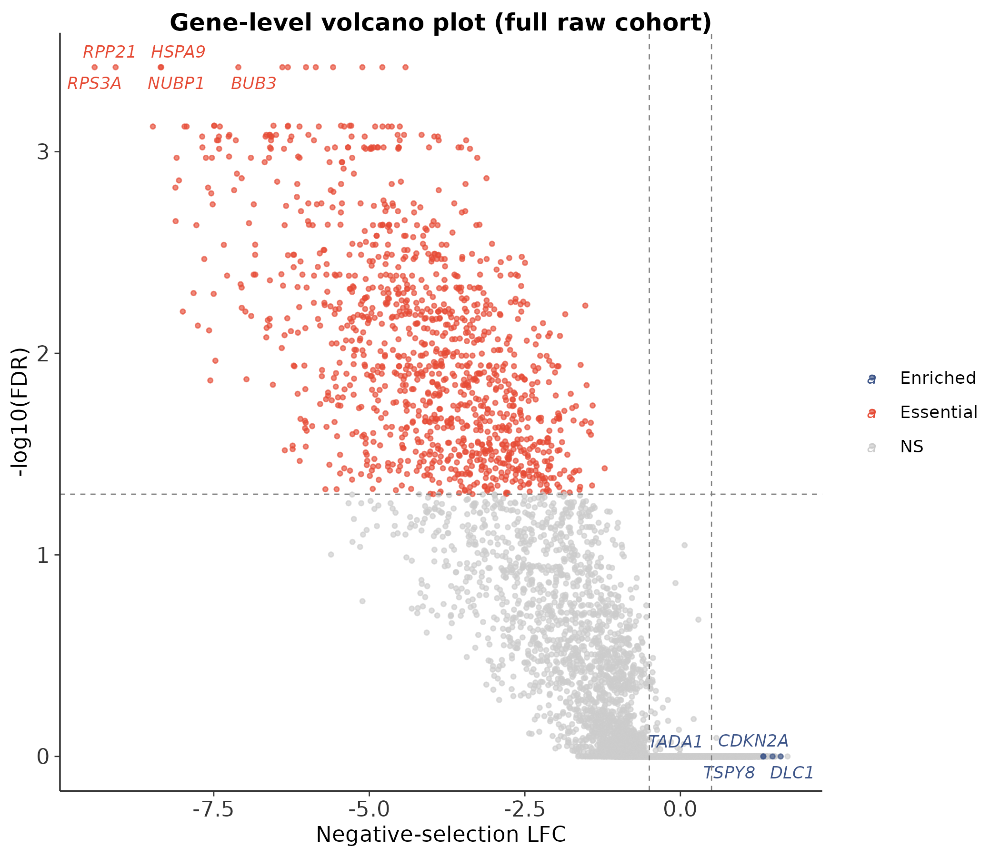
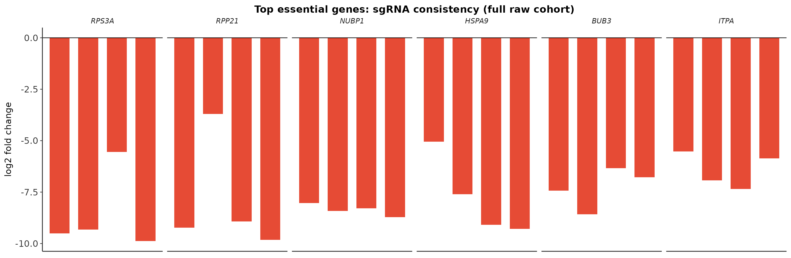
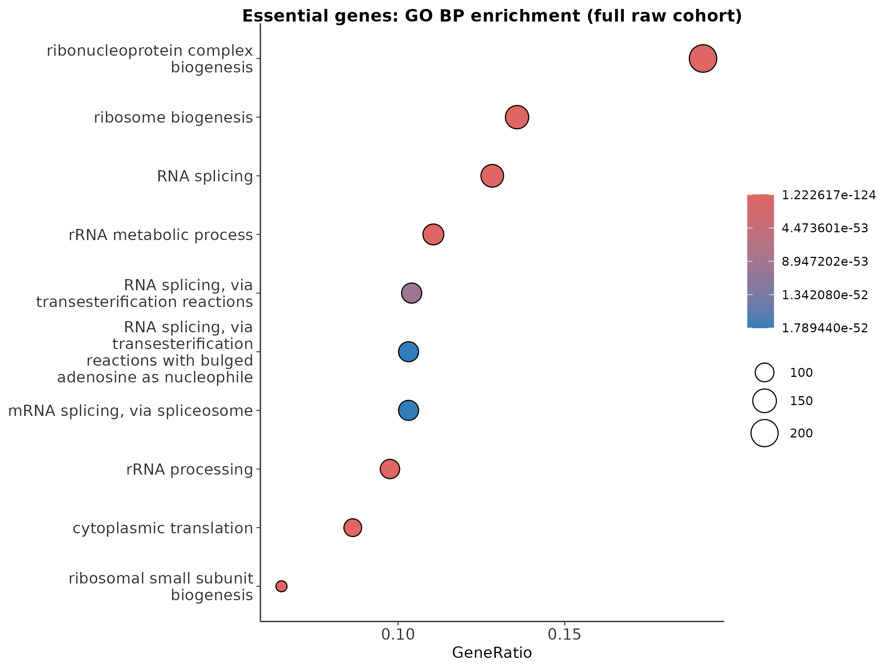

> 本篇代码与数据：[GitHub 仓库](https://github.com/petemeng/MAGeCK-Tutorial) ｜ [网页版教程](https://petemeng.github.io/MAGeCK-Tutorial/)
> 数据来源：Sanson et al., 2018, *Nature Communications*；原始筛选测序数据：SRA `SRP172473`

---

## 从原始 FASTQ 到 essential gene list，一篇跑通

这篇直接从公开原始数据出发，完整走一遍 MAGeCK 基础流程：下载 Brunello 文库注释和原始 FASTQ → `mageck count` 生成 sgRNA count table → `mageck test` 做负筛选 / 正筛选分析 → 输出 rank plot、volcano plot、sgRNA 一致性图和 GO 富集图 → 结合真实 QC 指标判断 screen 质量。

如果你之前已经会跑 `mageck test`，这一篇最有价值的地方不是命令本身，而是：**真实数据该怎么看、QC 该怎么看、结果该怎么解释。**

---

## 生物学背景：dropout screen 在找什么

在 pooled CRISPR knockout screen 里，每个细胞通常只携带一条 sgRNA。感染完成后，所有携带不同 sgRNA 的细胞一起培养；如果某个基因对细胞存活至关重要，敲掉它的细胞就会逐渐减少，对应 sgRNA 的测序计数也会下降。

两类最常见的命中：

- **negative selection / dropout hits**：计数显著下降，通常对应 essential genes
- **positive selection / enriched hits**：计数显著上升，通常对应抑癌、细胞周期刹车或特定压力下的耐受相关基因

MAGeCK 的核心思想是两步：`mageck count` 把 FASTQ 读段精确匹配到 sgRNA 文库，得到每个样本的 sgRNA 计数；`mageck test` 比较 treatment 与 control 的计数变化，再用 RRA（Robust Rank Aggregation）把 sgRNA 层面的信号聚合到基因层面。

---

## 本教程使用的数据集

本篇使用 Sanson 等人在 `SRP172473` 中公开的人类全基因组 CRISPRko screen，选择其中最适合作为基础教学案例的一组：Brunello modified tracrRNA 文库、A375 细胞系、pDNA 基线 + 3 个终点重复。

### 样本对应关系

| 样本标签 | 条件 | SRA run | 说明 |
|---|---|---|---|
| `BrunelloMod_pDNA` | pDNA | `SRR8297997` | 文库初始分布 |
| `BrunelloMod_A375_repA` | dropout | `SRR8297836` + `SRR8297837` | 重复 A，原始数据分成 2 个 run |
| `BrunelloMod_A375_repB` | dropout | `SRR8297838` + `SRR8297839` | 重复 B，原始数据分成 2 个 run |
| `BrunelloMod_A375_repC` | dropout | `SRR8297840` + `SRR8297841` | 重复 C，原始数据分成 2 个 run |

本篇要回答的问题很直接：**在 A375 细胞里，哪些基因在这个筛选条件下表现出稳定而显著的 dropout？**

---

## 环境准备

```bash
conda create -n mageck_full python=3.9 -y
conda activate mageck_full
pip install mageck
mageck -v
```

```
📊 输出：
0.5.9.5
```

如果要重新生成图，还需要 R 包：`ggplot2`、`dplyr`、`readr`、`ggrepel`、`patchwork`、`clusterProfiler`、`org.Hs.eg.db`。

---

## Step 1：下载 Brunello 文库和原始 FASTQ

以下命令均在仓库根目录执行，分为 4 段，按顺序运行即可。

### 1）下载 Brunello 原始注释

```bash
mkdir -p MAGeCK/full/external/brunello
curl -L 'https://media.addgene.org/cms/filer_public/f8/f7/f8f73d69-94f5-4382-bf5f-658c78e38f2f/broadgpp-brunello-library-contents.txt' -o MAGeCK/full/external/brunello/library_raw.txt
```

### 2）转成 MAGeCK 需要的三列表

```bash
python - <<'PYCODE'
import csv
from collections import Counter
from pathlib import Path

raw_path = Path('MAGeCK/full/external/brunello/library_raw.txt')
lib_path = Path('MAGeCK/full/external/brunello/library.tsv')
meta_path = Path('MAGeCK/full/external/brunello/library_metadata.tsv')
counts = Counter()

with raw_path.open() as src, lib_path.open('w') as lib, meta_path.open('w') as meta:
    reader = csv.DictReader(src, delimiter='\t')
    fields = ['sgRNA', 'Gene', 'Sequence'] + list(reader.fieldnames or [])
    writer = csv.DictWriter(meta, fieldnames=fields, delimiter='\t', lineterminator='\n')
    writer.writeheader()
    for row in reader:
        gene = row['Target Gene Symbol'].strip()
        seq = row['sgRNA Target Sequence'].strip().upper()
        if not gene or any(base not in 'ACGT' for base in seq):
            continue
        counts[gene] += 1
        sgrna = f'{gene}_sg{counts[gene]}'
        lib.write(f'{sgrna}\t{seq}\t{gene}\n')
        writer.writerow({'sgRNA': sgrna, 'Gene': gene, 'Sequence': seq, **row})
PYCODE
```

### 3）下载 article 1 用到的全部 FASTQ

```bash
base='MAGeCK/full/raw/article1_basic_full_raw'
mkdir -p "$base/runs" "$base/merged"

urls=(
  'https://ftp.sra.ebi.ac.uk/vol1/fastq/SRR829/007/SRR8297997/SRR8297997.fastq.gz'
  'https://ftp.sra.ebi.ac.uk/vol1/fastq/SRR829/006/SRR8297836/SRR8297836.fastq.gz'
  'https://ftp.sra.ebi.ac.uk/vol1/fastq/SRR829/007/SRR8297837/SRR8297837.fastq.gz'
  'https://ftp.sra.ebi.ac.uk/vol1/fastq/SRR829/008/SRR8297838/SRR8297838.fastq.gz'
  'https://ftp.sra.ebi.ac.uk/vol1/fastq/SRR829/009/SRR8297839/SRR8297839.fastq.gz'
  'https://ftp.sra.ebi.ac.uk/vol1/fastq/SRR829/000/SRR8297840/SRR8297840.fastq.gz'
  'https://ftp.sra.ebi.ac.uk/vol1/fastq/SRR829/001/SRR8297841/SRR8297841.fastq.gz'
)
for url in "${urls[@]}"; do
  curl -L --retry 5 --continue-at - -o "$base/runs/$(basename "$url")" "$url"
done
```

### 4）合并 lane-split run，并快速检查结果

```bash
base='MAGeCK/full/raw/article1_basic_full_raw'

cat "$base/runs/SRR8297997.fastq.gz" > "$base/merged/BrunelloMod_pDNA.fastq.gz"
cat "$base/runs/SRR8297836.fastq.gz" "$base/runs/SRR8297837.fastq.gz" > "$base/merged/BrunelloMod_A375_repA.fastq.gz"
cat "$base/runs/SRR8297838.fastq.gz" "$base/runs/SRR8297839.fastq.gz" > "$base/merged/BrunelloMod_A375_repB.fastq.gz"
cat "$base/runs/SRR8297840.fastq.gz" "$base/runs/SRR8297841.fastq.gz" > "$base/merged/BrunelloMod_A375_repC.fastq.gz"
gzip -t "$base"/merged/*.fastq.gz

head -5 MAGeCK/full/external/brunello/library.tsv
wc -l MAGeCK/full/external/brunello/library.tsv
ls -lh MAGeCK/full/raw/article1_basic_full_raw/merged
```

```
📊 输出：
A1BG_sg1  CATCTTCTTTCACCTGAACG  A1BG
A1BG_sg2  CTCCGGGGAGAACTCCGGCG  A1BG
A1BG_sg3  TCTCCATGGTGCATCAGCAC  A1BG
A1BG_sg4  TGGAAGTCCACTCCACTCAG  A1BG
A2M_sg1   ACTGCATCTGTGCAAACGGG  A2M

77441 MAGeCK/full/external/brunello/library.tsv

total 6.2G
-rw-rw-r-- 1 t060551 t060551 1.9G Mar 17 01:34 BrunelloMod_A375_repA.fastq.gz
-rw-rw-r-- 1 t060551 t060551 2.1G Mar 17 01:35 BrunelloMod_A375_repB.fastq.gz
-rw-rw-r-- 1 t060551 t060551 1.9G Mar 17 01:36 BrunelloMod_A375_repC.fastq.gz
-rw-rw-r-- 1 t060551 t060551 335M Mar 17 01:00 BrunelloMod_pDNA.fastq.gz
```

这一步有两个关键信息：

- 文库是**完整 Brunello**，共有 **77,441** 条 sgRNA，覆盖 **19,115** 个基因 / 分组（含 `Non-Targeting Control`）
- 原始数据是合并后的 4 个样本 FASTQ，总体量约 **6.2 GB**

### 一个很容易忽略的细节：`trim-5`

CRISPR screen 的 read 里并不是从 sgRNA 第 1 个碱基直接开始读，不同载体、不同建库方式，5' 端都会有一段固定前缀。这批数据在 pDNA 样本上用 `mageck count --test-run` 扫了 `20–35` 的候选偏移窗口，正文保留的是已经在正式全量流程里验证稳定的保守窗口。

## Step 2：从 FASTQ 生成 sgRNA count table

`mageck count` 的输入是文库文件和 FASTQ，输出是每条 sgRNA 在每个样本中的原始计数和归一化计数。这里直接用已经验证过的参数：

```bash
mageck count \
  -l MAGeCK/full/external/brunello/library.tsv \
  --fastq \
    MAGeCK/full/raw/article1_basic_full_raw/merged/BrunelloMod_pDNA.fastq.gz \
    MAGeCK/full/raw/article1_basic_full_raw/merged/BrunelloMod_A375_repA.fastq.gz \
    MAGeCK/full/raw/article1_basic_full_raw/merged/BrunelloMod_A375_repB.fastq.gz \
    MAGeCK/full/raw/article1_basic_full_raw/merged/BrunelloMod_A375_repC.fastq.gz \
  --sample-label BrunelloMod_pDNA,BrunelloMod_A375_repA,BrunelloMod_A375_repB,BrunelloMod_A375_repC \
  --trim-5 23,24,25,26,27,28,29,30 \
  -n MAGeCK/full/counts/article1_basic_full_raw/mageck_count
```

跑完以后，先看 MAGeCK 自动输出的 QC 摘要：

```bash
cat MAGeCK/full/counts/article1_basic_full_raw/mageck_count.countsummary.txt
```

```
📊 输出：
File  Label  Reads  Mapped  Percentage  TotalsgRNAs  Zerocounts  GiniIndex
MAGeCK/full/raw/article1_basic_full_raw/merged/BrunelloMod_pDNA.fastq.gz        BrunelloMod_pDNA        9821128   7719675   0.7860  77441  13    0.07916
MAGeCK/full/raw/article1_basic_full_raw/merged/BrunelloMod_A375_repA.fastq.gz   BrunelloMod_A375_repA   76471324  56113866  0.7338  77441  1115  0.10780
MAGeCK/full/raw/article1_basic_full_raw/merged/BrunelloMod_A375_repB.fastq.gz   BrunelloMod_A375_repB   85301059  61564564  0.7217  77441  1031  0.10680
MAGeCK/full/raw/article1_basic_full_raw/merged/BrunelloMod_A375_repC.fastq.gz   BrunelloMod_A375_repC   75356900  55558003  0.7373  77441  1114  0.11380
```

### 这些 QC 指标说明了什么

先看好消息：pDNA 样本有 **982 万** reads，其中 **771 万**成功匹配到文库，比对率 **78.6%**。三个 A375 终点样本分别有 **7536 万–8530 万** reads，比对率稳定在 **72.2%–73.7%**。对 Brunello 这类 20 nt guide 文库来说，70%+ 的比对率已经属于健康范围。pDNA 的 Gini index 只有 **0.079**，说明起始文库分布非常均匀。

再看真正体现 dropout 的地方：pDNA 中只有 **13** 条 sgRNA 为 0，几乎可以看作文库覆盖完整；三个终点样本各有约 **1031–1115** 条 sgRNA 归零，说明经过筛选后确实出现了大规模 depletion；Gini 都升到 **0.106–0.114**，但仍在健康范围内。

这正是一个合格 dropout screen 应该呈现的样子：**基线文库均匀，终点样本出现系统性耗竭。**

### 看一眼 count table 的真实内容

```bash
head -5 MAGeCK/full/counts/article1_basic_full_raw/mageck_count.count.txt | sed 's/\t/    /g'
```

```
📊 输出：
sgRNA    Gene    BrunelloMod_pDNA    BrunelloMod_A375_repA    BrunelloMod_A375_repB    BrunelloMod_A375_repC
CCDC69_sg4    CCDC69    131    1572    1322    1201
IDUA_sg3      IDUA      45     444     326     214
IFNAR2_sg3    IFNAR2    70     1221    987     766
HELT_sg3      HELT      158    720     1059    1200
```

这里看到的是原始计数，不同样本测序深度差异还没有完全折叠进统计结果里。真正的显著性判断在下一步 `mageck test` 完成。

---

## Step 3：基因层面差异分析——`mageck test`

对于这种最经典的“一个 baseline vs 多个终点重复”的设计，RRA 是最直接也最稳妥的起点：

```bash
mageck test \
  -k MAGeCK/full/counts/article1_basic_full_raw/mageck_count.count.txt \
  -t BrunelloMod_A375_repA,BrunelloMod_A375_repB,BrunelloMod_A375_repC \
  -c BrunelloMod_pDNA \
  -n MAGeCK/full/results/article1_basic_full_raw/mageck_test \
  --normcounts-to-file
```

跑完以后，我们先用一个很简单的脚本统计显著命中数和 top hits：

```bash
python - <<'PY'
import csv
path = 'MAGeCK/full/results/article1_basic_full_raw/mageck_test.gene_summary.txt'
with open(path) as f:
    rows = list(csv.DictReader(f, delimiter='\t'))

neg = sorted([r for r in rows if float(r['neg|fdr']) < 0.05], key=lambda x: float(x['neg|fdr']))
pos = sorted([r for r in rows if float(r['pos|fdr']) < 0.05], key=lambda x: float(x['pos|fdr']))

print('negative hits:', len(neg))
print('positive hits:', len(pos))
print('\nTop negative hits:')
for r in neg[:10]:
    print(r['id'], r['num'], r['neg|lfc'], r['neg|fdr'], sep='\t')
print('\nTop positive hits:')
for r in pos[:10]:
    print(r['id'], r['num'], r['pos|lfc'], r['pos|fdr'], sep='\t')
PY
```

```
📊 输出：
negative hits: 1181
positive hits: 5

Top negative hits:
BUB3    4    -7.1050   0.000381
RPS3A   4    -9.4150   0.000381
RPL19   4    -6.0180   0.000381
RPP21   4    -9.0775   0.000381
NUBP1   4    -8.3540   0.000381
HSPA9   4    -8.3440   0.000381
RPL7    4    -5.8605   0.000381
ITPA    4    -6.3977   0.000381
ALDOA   4    -5.1118   0.000381
PRMT5   4    -4.7908   0.000381

Top positive hits:
TADA1   4    0.50482   0.008251
DLC1    4    1.61100   0.008251
CDKN2A  4    1.33170   0.008251
TSPY8   4    1.33360   0.028465
TAF5L   4    1.48080   0.032673
```

### 怎么读这份结果

先看 negative hits，前面几位非常符合生物学预期：`RPS3A`、`RPL19`、`RPL7`（核糖体相关）、`PRMT5`（RNA processing / 细胞存活）、`HSPA9`（线粒体伴侣蛋白）、`BUB3`（有丝分裂检查点）。更重要的是，这批 top hit 大多都是 **4 条 sgRNA 同方向下降**，信号不是单条 sgRNA 偶然偏低，而是一个基因内部多条 guide 的一致支持。

这些 top negative genes 的 `neg|fdr` 都是同一个 `0.000381`——这不是排序出错，而是 RRA 排列检验的显著性分辨率有限，多个达到最小显著性档位的基因会共享同一个最小 FDR。

再看 positive hits：数量只有 **5 个**，远少于 negative hits。这很符合 dropout screen 的经验——必需基因更容易”掉下去”，而真正能给细胞明显生长优势的敲除位点往往少得多。像 `CDKN2A`、`DLC1` 这类偏”细胞周期刹车 / 抑癌方向”的 enriched hit 并不是完全没有生物学解释，但必须结合 A375 的细胞背景和 sgRNA-level 一致性再判断。当 positive hits 这么少时，更稳妥的做法是先当作**待复核线索**。

另外两个结果文件也值得记一下规模：

```bash
wc -l MAGeCK/full/results/article1_basic_full_raw/mageck_test.gene_summary.txt
wc -l MAGeCK/full/results/article1_basic_full_raw/mageck_test.sgrna_summary.txt
```

```
📊 输出：
20115 MAGeCK/full/results/article1_basic_full_raw/mageck_test.gene_summary.txt
77442 MAGeCK/full/results/article1_basic_full_raw/mageck_test.sgrna_summary.txt
```

也就是说，这一轮分析最终给出了：

- **20,114** 行 gene-level 结果
- **77,441** 条 sgRNA 的 summary 结果

---

## Step 4：生成本篇主图

4 张主图分别对应 4 段代码，每段都可以单独执行。

### 图 1：sgRNA rank plot

```bash
cd MAGeCK/repro
Rscript - <<'RSCRIPT'
source('analysis/_common.R')
results_dir <- '../full/results/article1_basic_full_raw'
fig_dir <- '../full/reports/figures'
dir.create(fig_dir, recursive = TRUE, showWarnings = FALSE)
gene_res <- read_tsv(file.path(results_dir, 'mageck_test.gene_summary.txt'), show_col_types = FALSE)
sgrna <- read_tsv(file.path(results_dir, 'mageck_test.sgrna_summary.txt'), show_col_types = FALSE)
neg_hits <- gene_res %>% filter(`neg|fdr` < 0.05) %>% arrange(`neg|fdr`, `neg|lfc`)
pos_hits <- gene_res %>% filter(`pos|fdr` < 0.05) %>% arrange(`pos|fdr`, desc(`pos|lfc`))
top_neg <- neg_hits %>% slice_head(n = 6) %>% pull(id)
top_pos <- pos_hits %>% slice_head(n = 4) %>% pull(id)
label_genes <- unique(c(top_neg[1:min(4, length(top_neg))], top_pos[1:min(3, length(top_pos))]))
sgrna_rank <- sgrna %>% arrange(LFC) %>% mutate(rank = row_number())
label_df <- sgrna_rank %>%
  filter(Gene %in% label_genes) %>%
  group_by(Gene) %>%
  slice_min(abs(LFC), n = 1, with_ties = FALSE) %>%
  ungroup()
cat('sgRNA rows:', nrow(sgrna), '\n')
cat('gene rows:', nrow(gene_res), '\n')
p_rank <- ggplot(sgrna_rank, aes(rank, LFC)) +
  geom_point(color = 'grey75', size = 0.3, alpha = 0.45) +
  geom_point(data = filter(sgrna_rank, Gene %in% top_neg), color = screen_colors$essential, size = 0.6, alpha = 0.7) +
  geom_point(data = filter(sgrna_rank, Gene %in% top_pos), color = screen_colors$enriched, size = 0.6, alpha = 0.7) +
  geom_text_repel(data = label_df, aes(label = Gene), size = 3, fontface = 'italic', max.overlaps = 20) +
  geom_hline(yintercept = 0, color = 'grey40', linewidth = 0.3) +
  labs(x = 'sgRNA rank', y = 'log2 fold change', title = 'MAGeCK sgRNA ranking (full raw cohort)') +
  theme_screen()
save_plot(file.path(fig_dir, 'article1_pub_sgrna_rank_full.png'), p_rank, 8, 5)
RSCRIPT
```

```
📊 输出：
sgRNA rows: 77441
gene rows: 20114
```

### 图 2：gene-level volcano plot

```bash
cd MAGeCK/repro
Rscript - <<'RSCRIPT'
source('analysis/_common.R')
results_dir <- '../full/results/article1_basic_full_raw'
fig_dir <- '../full/reports/figures'
dir.create(fig_dir, recursive = TRUE, showWarnings = FALSE)
gene_res <- read_tsv(file.path(results_dir, 'mageck_test.gene_summary.txt'), show_col_types = FALSE)
neg_hits <- gene_res %>% filter(`neg|fdr` < 0.05) %>% arrange(`neg|fdr`, `neg|lfc`)
pos_hits <- gene_res %>% filter(`pos|fdr` < 0.05) %>% arrange(`pos|fdr`, desc(`pos|lfc`))
label_genes <- unique(c(
  neg_hits %>% slice_head(n = 5) %>% pull(id),
  pos_hits %>% slice_head(n = 5) %>% pull(id)
))
gene_plot <- gene_res %>% mutate(
  neg_log_fdr = -log10(`neg|fdr` + 1e-30),
  class = case_when(
    `neg|fdr` < 0.05 & `neg|lfc` < -0.5 ~ 'Essential',
    `pos|fdr` < 0.05 & `pos|lfc` > 0.5 ~ 'Enriched',
    TRUE ~ 'NS'
  ),
  label = if_else(id %in% label_genes, id, NA_character_)
)
p_volcano <- ggplot(gene_plot, aes(`neg|lfc`, neg_log_fdr, color = class)) +
  geom_point(size = 0.8, alpha = 0.65) +
  geom_text_repel(data = filter(gene_plot, !is.na(label)), aes(label = label), size = 3, fontface = 'italic', max.overlaps = 15) +
  scale_color_manual(values = c(Essential = screen_colors$essential, Enriched = screen_colors$enriched, NS = screen_colors$ns)) +
  geom_vline(xintercept = c(-0.5, 0.5), linetype = 'dashed', color = 'grey50', linewidth = 0.3) +
  geom_hline(yintercept = -log10(0.05), linetype = 'dashed', color = 'grey50', linewidth = 0.3) +
  labs(x = 'Negative-selection LFC', y = '-log10(FDR)', title = 'Gene-level volcano plot (full raw cohort)') +
  theme_screen()
save_plot(file.path(fig_dir, 'article1_pub_gene_volcano_full.png'), p_volcano, 7, 6)
RSCRIPT
```

### 图 3：top essential genes 的 sgRNA 一致性

```bash
cd MAGeCK/repro
Rscript - <<'RSCRIPT'
source('analysis/_common.R')
results_dir <- '../full/results/article1_basic_full_raw'
fig_dir <- '../full/reports/figures'
dir.create(fig_dir, recursive = TRUE, showWarnings = FALSE)
gene_res <- read_tsv(file.path(results_dir, 'mageck_test.gene_summary.txt'), show_col_types = FALSE)
sgrna <- read_tsv(file.path(results_dir, 'mageck_test.sgrna_summary.txt'), show_col_types = FALSE)
top_neg <- gene_res %>%
  filter(`neg|fdr` < 0.05) %>%
  arrange(`neg|fdr`, `neg|lfc`) %>%
  slice_head(n = 6) %>%
  pull(id)
bar_df <- sgrna %>% filter(Gene %in% top_neg) %>% mutate(Gene = factor(Gene, levels = top_neg))
p_bar <- ggplot(bar_df, aes(sgrna, LFC, fill = Gene)) +
  geom_col(width = 0.7) +
  geom_hline(yintercept = 0, linewidth = 0.3) +
  facet_wrap(~Gene, scales = 'free_x', nrow = 1) +
  scale_fill_manual(values = rep(screen_colors$essential, length(unique(bar_df$Gene)))) +
  labs(x = NULL, y = 'log2 fold change', title = 'Top essential genes: sgRNA consistency (full raw cohort)') +
  theme_screen(9) +
  theme(axis.text.x = element_blank(), axis.ticks.x = element_blank(), legend.position = 'none', strip.text = element_text(face = 'italic'))
save_plot(file.path(fig_dir, 'article1_pub_sgrna_barplot_full.png'), p_bar, 11, 3.6)
RSCRIPT
```

### 图 4：essential genes 的 GO BP 富集图

```bash
cd MAGeCK/repro
Rscript - <<'RSCRIPT'
source('analysis/_common.R')
suppressPackageStartupMessages({
  library(clusterProfiler)
  library(org.Hs.eg.db)
})
results_dir <- '../full/results/article1_basic_full_raw'
fig_dir <- '../full/reports/figures'
dir.create(fig_dir, recursive = TRUE, showWarnings = FALSE)
gene_res <- read_tsv(file.path(results_dir, 'mageck_test.gene_summary.txt'), show_col_types = FALSE)
depmap_ref <- read_tsv('refs/depmap_common_essential.tsv', show_col_types = FALSE)
essential_ids <- gene_res %>% filter(`neg|fdr` < 0.05) %>% pull(id)
gene_map <- bitr(essential_ids, fromType = 'SYMBOL', toType = 'ENTREZID', OrgDb = org.Hs.eg.db)
cat('mapped essential genes:', nrow(gene_map), '\n')
go_bp <- enrichGO(
  gene = gene_map$ENTREZID,
  OrgDb = org.Hs.eg.db,
  keyType = 'ENTREZID',
  ont = 'BP',
  pAdjustMethod = 'BH',
  qvalueCutoff = 0.2,
  readable = TRUE
)
cat('significant GO BP terms:', nrow(go_bp@result), '\n')
write_tsv(as_tibble(go_bp@result), file.path(results_dir, 'go_bp.tsv'))
p_go <- dotplot(go_bp, showCategory = 10) +
  labs(title = 'Essential genes: GO BP enrichment (full raw cohort)') +
  theme_screen(10)
save_plot(file.path(fig_dir, 'article1_pub_go_enrichment_full.png'), p_go, 8, 6)
depmap_overlap <- tibble(Gene = essential_ids) %>% inner_join(depmap_ref, by = 'Gene')
cat('essential genes (FDR<0.05):', length(essential_ids), '\n')
cat('DepMap overlap:', nrow(depmap_overlap), '\n')
RSCRIPT
```

```
📊 输出：
mapped essential genes: 1110
significant GO BP terms: 4039
essential genes (FDR<0.05): 1181
DepMap overlap: 38
```

这里的 `DepMap overlap: 38`，用于把本次 essential gene 名单和本地 common-essential 参考集做快速方向性核对。DepMap 参考集本身的定义和这个数字的系统解释，放到第 3 篇再展开。

本节对应 4 张图：

1. sgRNA 全局 rank plot
2. gene-level volcano plot
3. top essential genes 的 sgRNA 一致性条形图
4. essential genes 的 GO Biological Process 富集图

### 图 1：sgRNA rank plot



这张图是整个 screen 最直观的“全局像”。左侧大幅下沉的 sgRNA 对应耗竭信号，右侧少量抬升的 sgRNA 对应 enriched signal。对这套数据来说，左侧尾部远比右侧明显，和前面看到的“negative hits 1181 vs positive hits 5”完全一致。

### 图 2：基因层面 volcano plot



这里横轴是 negative-selection LFC，纵轴是 `-log10(FDR)`。大部分显著点都集中在左侧，说明主信号来自 dropout；标出来的 `RPS3A`、`RPL19`、`PRMT5`、`BUB3` 等，都是很有说服力的 essential genes。

### 图 3：top essential genes 的 sgRNA 一致性



这张图在审稿和答辩里非常有用。你真正想给人看的不是“某个基因显著”，而是“**这个基因的多条 sgRNA 都在往同一个方向走**”。对 `BUB3`、`RPS3A`、`RPL19`、`RPP21`、`NUBP1`、`HSPA9` 来说，这一点非常清楚。

### 图 4：GO Biological Process 富集



为了不只停留在“基因名单”，再看一下富集到的过程。我们把 `neg|fdr < 0.05` 的 essential genes 做 GO BP enrichment，前五个条目如下：

```bash
python - <<'PY'
import pandas as pd
path = 'MAGeCK/full/results/article1_basic_full_raw/go_bp.tsv'
df = pd.read_csv(path, sep='\t')
print(df[['Description', 'Count', 'p.adjust']].head(5).to_string(index=False))
PY
```

```
📊 输出：
                         Description  Count      p.adjust
ribonucleoprotein complex biogenesis    206 1.222617e-124
                 ribosome biogenesis    146  9.181014e-94
              rRNA metabolic process    119  1.912439e-73
             cytoplasmic translation     93  4.138190e-69
                     rRNA processing    105  2.324772e-67
```

方法上，这一步用的是 `clusterProfiler::enrichGO` + `org.Hs.eg.db`，`ont = 'BP'`、`pAdjustMethod = 'BH'`，输入基因集是 `neg|fdr < 0.05` 的 essential genes，经 `bitr()` 映射成 Entrez ID。脚本没有额外指定 `universe`，所以背景是 `org.Hs.eg.db` 中可映射的人类基因，而不是本文这 20,114 个 MAGeCK 结果基因。

这套结果非常稳定：核糖体生物发生、rRNA 代谢、翻译过程都排在最前面，说明这套 screen 抓到的是细胞最基础、最核心的生长依赖网络。

---

## Step 5：这套筛选质量如何判断？

如果只看 top genes，很多质量一般的数据也可能显得”有结果”。真正判断这套 screen 是否可靠，要同时看三层：

**1）文库起始状态是否均匀**——pDNA Gini 0.079，只有 13 条 sgRNA 零计数，非常健康。

**2）终点样本是否出现了真实 dropout**——三个终点样本各有约 1031–1115 条 sgRNA 归零，Gini 从 0.079 升到 0.107–0.114，正是筛选压力生效后的典型表现。

**3）生物学上是否讲得通**——top negative genes 以核糖体、RNA processing、细胞分裂相关基因为主；GO 富集集中在 ribosome biogenesis、rRNA processing、translation 等核心通路；与 DepMap common essential 参考集有 38 个重叠。统计和生物学都对得上。

---

## 本篇关键输出文件

```bash
du -h \
  MAGeCK/full/counts/article1_basic_full_raw/mageck_count.count.txt \
  MAGeCK/full/counts/article1_basic_full_raw/mageck_count.count_normalized.txt \
  MAGeCK/full/results/article1_basic_full_raw/mageck_test.gene_summary.txt \
  MAGeCK/full/results/article1_basic_full_raw/mageck_test.sgrna_summary.txt \
  MAGeCK/full/results/article1_basic_full_raw/go_bp.tsv \
  MAGeCK/full/reports/figures/article1_pub_sgrna_rank_full.png \
  MAGeCK/full/reports/figures/article1_pub_gene_volcano_full.png \
  MAGeCK/full/reports/figures/article1_pub_sgrna_barplot_full.png \
  MAGeCK/full/reports/figures/article1_pub_go_enrichment_full.png
```

```
📊 输出：
2.5M  MAGeCK/full/counts/article1_basic_full_raw/mageck_count.count.txt
6.7M  MAGeCK/full/counts/article1_basic_full_raw/mageck_count.count_normalized.txt
1.6M  MAGeCK/full/results/article1_basic_full_raw/mageck_test.gene_summary.txt
9.3M  MAGeCK/full/results/article1_basic_full_raw/mageck_test.sgrna_summary.txt
872K  MAGeCK/full/results/article1_basic_full_raw/go_bp.tsv
112K  MAGeCK/full/reports/figures/article1_pub_sgrna_rank_full.png
764K  MAGeCK/full/reports/figures/article1_pub_gene_volcano_full.png
48K   MAGeCK/full/reports/figures/article1_pub_sgrna_barplot_full.png
180K  MAGeCK/full/reports/figures/article1_pub_go_enrichment_full.png
```

如果你要继续做下游分析，第一个优先读的文件通常是：

- `mageck_test.gene_summary.txt`：基因层面的主结果
- `mageck_test.sgrna_summary.txt`：查看 guide 一致性
- `mageck_test.normalized.txt`：后续做热图、散点、聚类时最方便

---

## 本篇小结

本篇使用公开原始数据的全量 cohort：77,441 条 sgRNA、19,115 个基因、4 个样本合计约 6.2 GB FASTQ。RRA 结果：negative hits 1181，positive hits 5。代表性 essential genes：`BUB3`、`RPS3A`、`RPL19`、`RPP21`、`NUBP1`、`HSPA9`、`PRMT5`。

如果你只想记住一句话：**一套靠谱的 MAGeCK 基础分析，首先要有健康的 pDNA 分布，其次要有一致的 sgRNA dropout，最后才是漂亮的 top hit 名单。**

---

## FAQ

**Q1：为什么用 pDNA，而不是 T0 细胞样本做对照？**

`pDNA` 更接近”文库初始分布”，适合做最基础的入口分析。如果实验里有质量可靠的 `T0/T1` 细胞基线，通常更推荐拿它做效应估计，因为它能吸收感染和早期培养阶段已经发生的漂移。

**Q2：为什么 `--trim-5` 不是一个固定数字？**

因为这批 reads 里 sgRNA 起始位并不完全固定。MAGeCK 允许给一个候选窗口，它会在这些偏移量上尝试匹配。

**Q3：negative hits 特别多，正常吗？**

对高质量 dropout screen 来说完全正常。真正的 essential network 往往包含上千个基因。要警惕的不是”命中太多”，而是 top hits 和 GO 过程完全不合生物学常识。

**Q4：positive hits 只有 5 个，会不会太少？**

不会。dropout screen 天然更擅长检测 loss-of-fitness signal。能让细胞显著获得优势的 knockout 位点通常远少于 essential genes。

---

## 本系列导航

- **第 1 篇：MAGeCK 分析——从 sgRNA 计数到必需基因**
