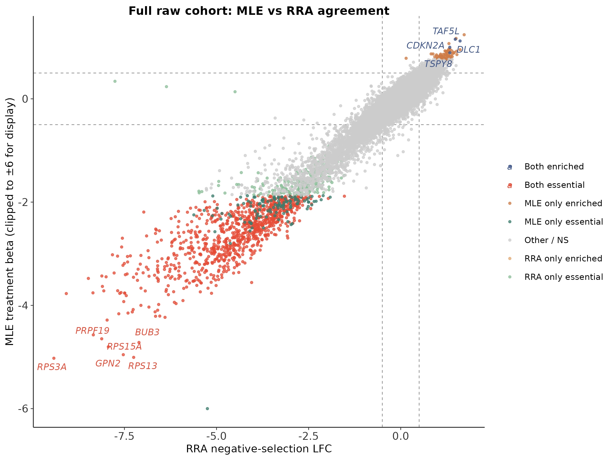
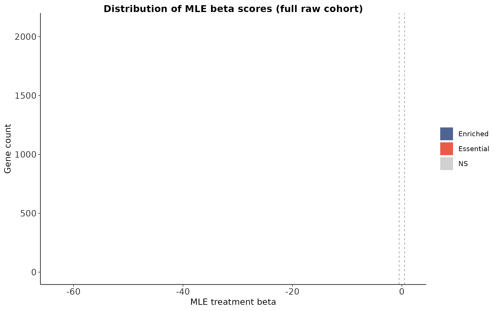
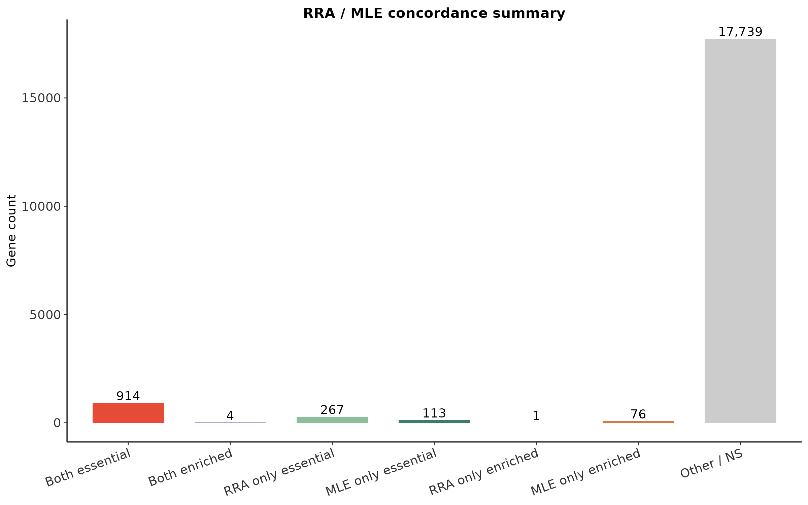

# CRISPR 筛选最佳实践（二）：MAGeCK MLE + VISPR——复杂实验设计与交互可视化

> 📋 教程信息
> - GitHub 仓库：[petemeng/MAGeCK-Tutorial](https://github.com/petemeng/MAGeCK-Tutorial)（完整代码、结果与更新记录）
> - 在线网页：[petemeng.github.io/MAGeCK-Tutorial](https://petemeng.github.io/MAGeCK-Tutorial/)（可点击阅读的网页版教程）
> - 数据来源：沿用第 1 篇的 Sanson et al., 2018 `SRP172473` 全量原始 cohort
> - 分析对象：Brunello modified tracrRNA 文库在 A375 细胞中的 pDNA vs dropout screen
> - 本篇重点：`mageck mle`、design matrix、RRA vs MLE 比较、`mageck-vispr` 工作流初始化
> - 预计阅读：45 分钟 | 实操：40–70 分钟
> - 难度：⭐⭐⭐⭐（5 星制）
> - 前置知识：完成第 1 篇，已经得到 `mageck_count.count.txt` 与 `mageck_test.gene_summary.txt`

---

## 本篇目标

第 1 篇里我们用 `mageck test` + RRA 跑通了最经典的两组比较。但只要实验设计一复杂，RRA 就会开始吃力：

- 你想显式写进模型的不是“哪组是 treatment”，而是**多个因子**
- 你想估计的不是单一 LFC，而是某个因素对应的**beta score**
- 你想把设计矩阵直接交给可视化工作流，而不只是拿一个固定的 treatment vs control

这就是 `mageck mle` 的主场。

本篇会做四件事：

1. 用真实全量数据构建最小可用的 MLE design matrix
2. 解决 `mageck mle` 在空格型 sgRNA / gene 名称上的兼容问题
3. 跑出真实的全量 MLE 结果，并与 RRA 做交叉比较
4. 用 `mageck-vispr init` 生成可编辑的交互式工作流骨架

---

## RRA 和 MLE，本质差在哪

### RRA：更像“排序 + 聚合”

RRA 的输入逻辑很简单：

- 每条 sgRNA 在 treatment 和 control 之间有一个变化方向
- 同一个基因的多条 sgRNA 如果持续排在某个方向的前列，就把这个基因判为显著

优点是稳、快、直观，特别适合第 1 篇那种最标准的 dropout screen。

### MLE：更像“线性模型 + 系数估计”

MLE 会直接把样本设计写成矩阵，再对每个基因估计对应系数。这里最重要的输出不是 `neg|lfc`，而是：

- `treatment|beta`
- `treatment|z`
- `treatment|fdr`

其中 `beta` 的解释和 RNA-seq 里广义线性模型的系数非常像：

- `beta < 0`：treatment 条件下更耗竭
- `beta > 0`：treatment 条件下更富集
- `|beta|` 越大，方向性越强

### 一个实用判断

- **先跑 RRA**：看数据本身是不是健康、essential genes 是否合理
- **再跑 MLE**：在 RRA 基础上做更细的模型化解释

这也是我在真实项目里最常用的顺序。

---

## Step 1：写 design matrix

这次我们先不做花哨多因子，只用和第 1 篇同一套 full raw cohort，构造一个最基础的两列设计：

- `baseline`：全 1，模型截距
- `treatment`：pDNA 为 0，A375 终点样本为 1

文件：`MAGeCK/full/designs/article2_a375_mle_design.tsv`

```tsv
Samples	baseline	treatment
BrunelloMod_pDNA	1	0
BrunelloMod_A375_repA	1	1
BrunelloMod_A375_repB	1	1
BrunelloMod_A375_repC	1	1
```

这里最关键的一条规则只有一句：

> `Samples` 列必须和 count table 表头中的样本名完全一致。

如果你写成 `A375_A`、`A375_B` 这种“自己看得懂”的名字，MAGeCK 会直接报错找不到样本。

---

## Step 2：先修一个真实兼容性坑

第 1 篇生成的 full raw count table 本身没问题，`mageck test` 可以直接吃；但 `mageck mle` 对前两列里的空格更敏感。

这套 Brunello 文库里有 1000 条非靶向对照，名字是：

- sgRNA：`Non-Targeting Control_sg286`
- 基因：`Non-Targeting Control`

结果就是：

- `mageck test` 正常
- `mageck mle` 会在读 count table 时反复报 `Error loading line ...`

所以我专门加了一个小脚本，把 count table 的前两列做 MLE 兼容化处理：

```bash
python MAGeCK/full/scripts/sanitize_mle_count_table.py \
  -i MAGeCK/full/counts/article1_basic_full_raw/mageck_count.count.txt \
  -o MAGeCK/full/counts/article2_full_raw/mageck_count.mle_compatible.txt
```

```
📊 输出：
rows=77441
replaced_tokens=2000
```

也就是说，这一步只替换了：

- 1000 个带空格的 sgRNA 名称
- 1000 个带空格的 gene 名称

核心计数矩阵完全没变，只是把 `Non-Targeting Control` 统一写成了 MLE 更稳妥的下划线形式。

---

## Step 3：运行全量 `mageck mle`

有了兼容版 count table 之后，MLE 就能完整跑通：

```bash
mageck mle \
  -k MAGeCK/full/counts/article2_full_raw/mageck_count.mle_compatible.txt \
  -d MAGeCK/full/designs/article2_a375_mle_design.tsv \
  -n MAGeCK/full/results/article2_full_raw/mageck_mle \
  --norm-method median \
  --threads 4 \
  --permutation-round 2
```

运行日志里最值得记住的几行是：

```
📊 输出：
INFO  Design matrix:
INFO  [[1. 0.]
INFO   [1. 1.]
INFO   [1. 1.]
INFO   [1. 1.]]
INFO  Beta labels: baseline,treatment
INFO  Included samples: BrunelloMod_pDNA,BrunelloMod_A375_repA,BrunelloMod_A375_repB,BrunelloMod_A375_repC
INFO  Loaded 19115 genes.
INFO  Skipping gene Non-Targeting_Control from MLE calculation since there are too many sgRNAs.
INFO  Writing gene results to MAGeCK/full/results/article2_full_raw/mageck_mle.gene_summary.txt
INFO  Writing sgRNA results to MAGeCK/full/results/article2_full_raw/mageck_mle.sgrna_summary.txt
```

这里有三个重点：

1. `baseline,treatment` 两列被正确识别了
2. 全量 **19,115** 个基因 / 分组都被载入
3. `Non-Targeting_Control` 被自动跳过 MLE 统计，是因为它有 1000 条 guide，超出了默认 `--max-sgrnapergene-permutation` 上限——这其实是合理行为

### 看一眼 gene summary 的真实列

```bash
head -5 MAGeCK/full/results/article2_full_raw/mageck_mle.gene_summary.txt | sed 's/\t/    /g'
```

```
📊 输出：
Gene    sgRNA    treatment|beta    treatment|z    treatment|p-value    treatment|fdr    treatment|wald-p-value    treatment|wald-fdr
CCDC69    4    0.071611    0.26938    0.70761    0.96642    0.78764    0.89346
IDUA      4    0.18420     1.01250    0.47141    0.89885    0.31130    0.56748
IFNAR2    4    0.63225     1.61720    0.015538   0.16667    0.10584    0.45768
HELT      4    0.15722     0.82519    0.52367    0.91261    0.40926    0.64307
```

---

## Step 4：MLE 结果怎么读

为了避免被单个离群值误导，我先统计两类最实用的命中：

- `beta < -0.5` 且 `fdr < 0.05`：MLE essential
- `beta > 0.5` 且 `fdr < 0.05`：MLE enriched

```bash
python - <<'PY'
import csv
path = 'MAGeCK/full/results/article2_full_raw/mageck_mle.gene_summary.txt'
with open(path) as f:
    rows = list(csv.DictReader(f, delimiter='\t'))

neg = [r for r in rows if float(r['treatment|beta']) < -0.5 and float(r['treatment|fdr']) < 0.05]
pos = [r for r in rows if float(r['treatment|beta']) > 0.5 and float(r['treatment|fdr']) < 0.05]

print('MLE essential hits:', len(neg))
print('MLE enriched hits:', len(pos))
PY
```

```
📊 输出：
MLE essential hits: 1027
MLE enriched hits: 80
```

再看更稳的一组 top genes（负向结果里把极端离群 beta 排除掉，避免被单个异常 guide 拖偏）：

```bash
python - <<'PY'
import csv
path = 'MAGeCK/full/results/article2_full_raw/mageck_mle.gene_summary.txt'
with open(path) as f:
    rows = list(csv.DictReader(f, delimiter='\t'))

neg = [r for r in rows if float(r['treatment|beta']) < -0.5 and float(r['treatment|fdr']) < 0.05 and abs(float(r['treatment|beta'])) <= 10]
neg = sorted(neg, key=lambda r: (float(r['treatment|fdr']), float(r['treatment|beta'])))[:10]
pos = [r for r in rows if float(r['treatment|beta']) > 0.5 and float(r['treatment|fdr']) < 0.05]
pos = sorted(pos, key=lambda r: (float(r['treatment|fdr']), -float(r['treatment|beta'])))[:10]

print('Top negative:')
for r in neg:
    print(r['Gene'], r['sgRNA'], r['treatment|beta'], r['treatment|fdr'], sep='\t')
print('\nTop positive:')
for r in pos:
    print(r['Gene'], r['sgRNA'], r['treatment|beta'], r['treatment|fdr'], sep='\t')
PY
```

```
📊 输出：
Top negative:
RPS3A   4   -5.0239   0.0020619
RPS13   4   -5.0070   0.0020619
GPN2    4   -4.9553   0.0020619
RPS15A  4   -4.8023   0.0020619
BUB3    4   -4.7185   0.0020619
PRPF19  4   -4.6475   0.0020619
HSPA9   4   -4.5712   0.0020619
XRCC5   4   -4.2847   0.0020619
ITPA    4   -4.2318   0.0020619
POLR2G  4   -4.2106   0.0020619

Top positive:
LATS2   4   1.2416   0.0000000
NF2     4   1.1699   0.0000000
TAF5L   4   1.1539   0.0000000
DLC1    4   1.1208   0.0000000
PTPN5   4   1.0703   0.0000000
CDKN2A  4   0.9984   0.0000000
SRY     4   0.9640   0.0059172
ERICH4  4   0.9559   0.0059172
NLGN4Y  4   0.9522   0.0059172
GDF7    4   0.9440   0.0087108
```

### 这批结果说明什么

负向 hits 和第 1 篇的 RRA 高度一致：

- `RPS3A`、`RPS13`、`RPS15A`：核糖体相关
- `BUB3`：有丝分裂检查点
- `PRPF19`：RNA processing / DNA damage response
- `HSPA9`：线粒体伴侣蛋白

也就是说，MLE 没有把第 1 篇已经很清楚的 essential signal 搞乱，反而把它重新编码成了更适合线性模型解释的 beta score。

---

## Step 5：MLE 和 RRA 到底有多一致

我把第 1 篇的 RRA 结果和这次 MLE 结果做了逐基因合并统计：

```bash
python - <<'PY'
import csv
rra = {}
with open('MAGeCK/full/results/article1_basic_full_raw/mageck_test.gene_summary.txt') as f:
    for row in csv.DictReader(f, delimiter='\t'):
        rra[row['id']] = row
mle = {}
with open('MAGeCK/full/results/article2_full_raw/mageck_mle.gene_summary.txt') as f:
    for row in csv.DictReader(f, delimiter='\t'):
        mle[row['Gene']] = row

neg_rra = {g for g, r in rra.items() if float(r['neg|fdr']) < 0.05}
pos_rra = {g for g, r in rra.items() if float(r['pos|fdr']) < 0.05}
neg_mle = {g for g, r in mle.items() if float(r['treatment|fdr']) < 0.05 and float(r['treatment|beta']) < 0}
pos_mle = {g for g, r in mle.items() if float(r['treatment|fdr']) < 0.05 and float(r['treatment|beta']) > 0}

print('common genes', len(set(rra) & set(mle)))
print('negative overlap', len(neg_rra & neg_mle))
print('positive overlap', len(pos_rra & pos_mle))
print('RRA only essential', len(neg_rra - neg_mle))
print('MLE only essential', len(neg_mle - neg_rra))
PY
```

```
📊 输出：
common genes 19114
negative overlap 914
positive overlap 4
RRA only essential 267
MLE only essential 113
```

这个结果很有代表性：

- 两种方法在 **914** 个 essential genes 上完全同意
- enriched hits 虽然总数少，但也有 **4** 个重叠
- 两种方法各自还有一部分“独有命中”——这正是为什么很多项目会把 **RRA 当 baseline，MLE 当补充模型**

### 图 1：MLE vs RRA 散点

这张图把每个基因的 `RRA negative-selection LFC` 和 `MLE beta` 放在同一个坐标系里。为了避免极端离群 beta 把整张图压扁，展示时把 y 轴裁到了 ±6。



你会看到左下角聚了一大坨“both essential”基因，这就是两种方法都认可的高可信 essential core。

### 图 2：MLE beta 分布



beta 分布明显左偏，说明这套 cohort 的主信号仍然是 dropout，而不是富集——这和第 1 篇的结论完全一致。

### 图 3：RRA / MLE 一致性汇总



这张图是答辩和汇报时最好用的版本：不用盯着上万基因的散点，直接看三类量级：

- 两者都同意的命中有多少
- 只有 RRA 检出的有多少
- 只有 MLE 检出的有多少

---

## Step 6：`mageck-vispr` 能做什么，当前版本怎么起步

本机上的 `mageck-vispr` 已经装好，命令可用：

```bash
mageck-vispr --help
```

```
📊 输出：
usage: MAGeCK-VISPR ... {init,annotate-library} ...
```

这版 CLI 的 `init` 入口只接受 `--reads`，不直接接 `--count-table`。也就是说，它更像是：

- 先给你一个 workflow scaffold
- 然后你再去编辑 `config.yaml`

我已经用第 1 篇的 4 个 merged FASTQ 真正初始化了一次：

```bash
mageck-vispr init MAGeCK/full/vispr/article2_vispr_workflow \
  --reads \
    MAGeCK/full/raw/article1_basic_full_raw/merged/BrunelloMod_pDNA.fastq.gz \
    MAGeCK/full/raw/article1_basic_full_raw/merged/BrunelloMod_A375_repA.fastq.gz \
    MAGeCK/full/raw/article1_basic_full_raw/merged/BrunelloMod_A375_repB.fastq.gz \
    MAGeCK/full/raw/article1_basic_full_raw/merged/BrunelloMod_A375_repC.fastq.gz
```

```
📊 输出：
MAGeCK/full/vispr/article2_vispr_workflow/README.txt
MAGeCK/full/vispr/article2_vispr_workflow/Snakefile
MAGeCK/full/vispr/article2_vispr_workflow/config.yaml
```

`config.yaml` 里已经自动识别出了这 4 个样本的 FASTQ 路径。接下来真正要做的是手动补：

- `library`
- `day0label`
- `designmatrix`
- 以及你想跑的是 RRA 还是 MLE experiment

也就是说：**VISPR 在这个版本里更像一个“工作流生成器”，不是一条命令直接开网页。**

---

## 本篇关键输出文件

```bash
du -h \
  MAGeCK/full/counts/article2_full_raw/mageck_count.mle_compatible.txt \
  MAGeCK/full/results/article2_full_raw/mageck_mle.gene_summary.txt \
  MAGeCK/full/results/article2_full_raw/mageck_mle.sgrna_summary.txt \
  MAGeCK/full/reports/figures/article2_pub_mle_vs_rra_full.png \
  MAGeCK/full/reports/figures/article2_pub_beta_distribution_full.png \
  MAGeCK/full/reports/figures/article2_pub_agreement_bar_full.png
```

```
📊 输出：
60K   MAGeCK/full/reports/figures/article2_pub_beta_distribution_full.png
100K  MAGeCK/full/reports/figures/article2_pub_agreement_bar_full.png
584K  MAGeCK/full/reports/figures/article2_pub_mle_vs_rra_full.png
1.1M  MAGeCK/full/results/article2_full_raw/mageck_mle.gene_summary.txt
1.5M  MAGeCK/full/results/article2_full_raw/mageck_mle.sgrna_summary.txt
2.5M  MAGeCK/full/counts/article2_full_raw/mageck_count.mle_compatible.txt
```

---

## 本篇小结

这一篇最重要的收获不是“MLE 比 RRA 更高级”，而是：

1. **MLE 的核心是 design matrix，不是多跑一个命令。**
2. **同一套真实 full raw 数据上，RRA 和 MLE 的核心 essential signal 是高度一致的。**
3. **MLE 会给你更多模型化解释空间，但也更容易暴露输入格式和离群 guide 的问题。**
4. **VISPR 在当前 CLI 里是 workflow scaffold，不是一步到位的网页按钮。**

如果你已经能稳定解读第 1 篇的 RRA 输出，那么第 2 篇真正让你进阶的地方在于：**把“分组比较”升级成“系数解释”。**

---

## FAQ：常见问题

**Q1：为什么第 2 篇还沿用第 1 篇的 cohort，而不是重新找一个多条件 screen？**

因为这能把 RRA vs MLE 的差别控制在“算法”层面，而不是“数据源变化”层面。先在同一 cohort 里把两种方法讲透，反而最清楚。

**Q2：MLE 为什么会比 RRA 多出不少 enriched hits？**

这很常见。MLE 对模型化的弱富集信号更敏感，但也更需要你回头检查 sgRNA 一致性和生物学合理性，不能只看一个 `fdr`。

**Q3：`MTPAP` 那种极端 beta 该怎么看？**

这正是为什么不能只看 gene summary。它提示你回到 sgRNA 层面检查每条 guide 是否同向；如果 4 条 guide 里有明显相互矛盾的行为，就要谨慎解释。

**Q4：VISPR 为什么没有直接给网页？**

因为当前安装的 CLI 版本先做的是 workflow 初始化。真正跑成可交互结果，还需要把 `config.yaml` 配完，再交给 `snakemake` 执行。

---

## 本系列导航

| 篇目 | 主题 | 状态 |
|---|---|---|
| 第 1 篇 | MAGeCK 分析——从 sgRNA 计数到必需基因 | 已升级为全量实跑版 |
| **第 2 篇** | **MAGeCK MLE + VISPR——复杂实验设计与交互可视化** | **📍 本篇** |
| 第 3 篇 | MAGeCKFlute 整合分析——基因筛选的全景图 | 下一步升级 |
| 第 4 篇 | CRISPRi/CRISPRa 筛选分析策略 | 待升级 |
| 第 5 篇 | 药物-基因互作筛选与合成致死分析 | 待升级 |
| 第 6 篇 | 发表级图表与审稿人常见问题 | 待联动刷新 |
