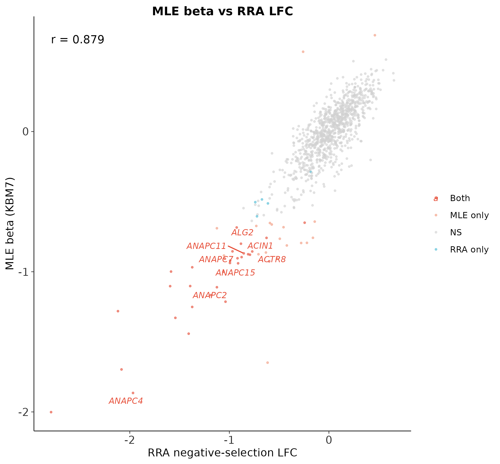
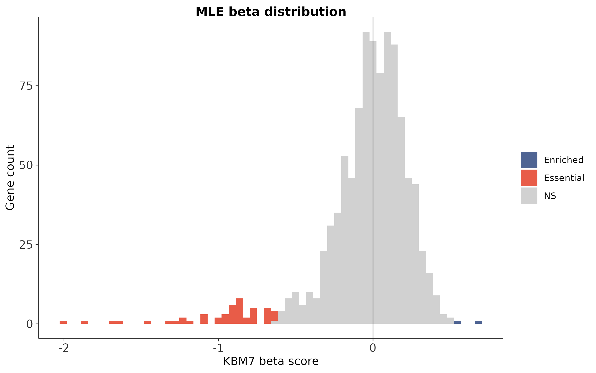
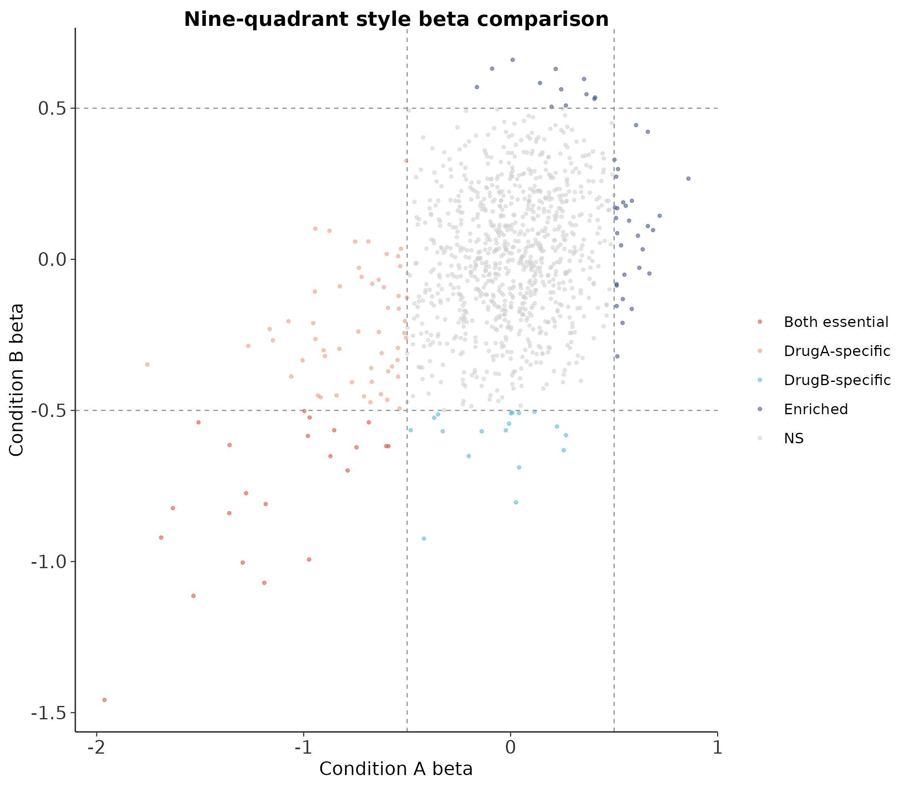

# CRISPR 筛选最佳实践（二）：MAGeCK MLE + VISPR——复杂实验设计与交互可视化

> 📋 教程信息
> - 数据来源：本篇沿用仓库内 `MAGeCK/repro/` 的可复现教学矩阵与 MLE 输出
> - 重点内容：设计矩阵、beta score 解释、`mageck mle` / `mageck-vispr` 工作流
> - 预计阅读：50 分钟 | 实操：45 分钟
> - 难度：⭐⭐⭐⭐（5 星制）
> - 前置知识：完成本系列第 1 篇，results/ 下有 mageck_count.count.txt


---

## 本篇目标

上一篇的 `mageck test` 解决了最简单的场景——T0 vs T14，两组比较。但真实的 CRISPR 筛选项目经常比这复杂得多：

**场景 1：** 你同时测了 3 种药物处理和 1 个 DMSO 对照，想找到每种药物特异的抵抗基因——而不是所有药物共有的。`mageck test` 一次只能比两组，你得跑 3 次然后手动合并。

**场景 2：** 你的筛选有 batch effect——第一批和第二批的 T0 分布明显不同。`mageck test` 没有建模 batch 的能力，batch effect 会变成假阳性。

**场景 3：** 你有多个时间点（T0、T7、T14、T21），想建模基因 dropout 的时间动态——哪些基因早期就消失了（强 essential），哪些晚期才消失（弱 essential）。

这些场景都需要 **MAGeCK MLE**（Maximum Likelihood Estimation）。它用广义线性模型（GLM）对 sgRNA 计数建模，可以在一个模型中同时处理多个条件、多个时间点和混杂因素。

除了 MLE，本篇还会介绍 **VISPR**——MAGeCK 配套的交互式 Web 可视化界面。它让你不写一行代码就能浏览 QC 报告、排序基因、点击查看 sgRNA 细节。

读完这一篇，你会：

1. 理解 MLE 和 RRA 的本质区别——什么时候用哪个
2. 编写 design matrix 来描述复杂实验设计
3. 运行 MAGeCK MLE，并解读 beta score 的含义
4. 处理 batch effect 和多条件比较
5. 用 VISPR 搭建交互式 QC + 结果浏览界面
6. 知道 MLE 的局限——样本数太少时别强上

---

## MLE vs RRA：两种算法的本质区别

### RRA 回顾（第 1 篇）

RRA 的逻辑是"先排名、再聚合"：把所有 sgRNA 按 fold change 排名，然后用秩聚合检验一个基因的多条 sgRNA 是否集中在排名的某一端。**它不需要知道实验设计**——只需要一个 treatment 组和一个 control 组。

### MLE 的逻辑

MLE 的思路完全不同。它直接对 sgRNA 计数建一个**负二项回归模型**：

```
sgRNA 计数 ~ 文库大小 + sgRNA 效率 + β × 实验条件
```

其中 **β（beta score）** 是核心输出——它估计的是"在某个实验条件下，这个基因的 sgRNA 计数相对于基准条件的变化程度"。β < 0 表示耗竭（essential），β > 0 表示富集（resistance）。

**MLE 的关键优势：** 因为它建的是回归模型，所以你可以在模型中加入任意多的因子——药物类型、时间点、batch、细胞系... 和 DESeq2 在 RNA-seq 中的角色完全类似。

### 什么时候用哪个？

| 场景 | 推荐方法 | 理由 |
|------|----------|------|
| 简单两组比较（T0 vs T14） | `mageck test` (RRA) | 够用了，而且更稳健 |
| 多条件（≥3 组） | MLE | 一次建模所有条件 |
| 有 batch effect | MLE | 可以在模型中控制 batch |
| 样本数很少（每组 1-2 个） | RRA | MLE 在小样本下不稳定 |
| 需要精确的效应量估计 | MLE | beta score 有定量含义 |
| 探索性分析 | RRA 先跑一遍 | 快速获得 overview |

💡 **经验之谈：先跑 RRA，再跑 MLE**

> 不管你的实验设计多复杂，**先用 `mageck test` 做一遍最简单的两组比较。** 这给你一个 baseline：如果 RRA 都找不到 essential gene，那 MLE 也不太可能找到——问题可能在实验本身。确认 RRA 结果合理后，再用 MLE 做更精细的多条件分析。

---

## 环境准备

```bash
# ============================================================
# VISPR 安装
# MAGeCK 在第 1 篇已装好，这里只需要加 VISPR
# ============================================================

conda activate mageck_env

# VISPR 是 MAGeCK 的可视化前端
pip install vispr

# 验证
vispr --version
mageck mle --help | head -3
```

```
📊 输出：
实跑环境：
mageck 0.5.9.5
mageck-vispr 0.5.6

说明：当前命令名是 mageck-vispr，
不是旧版教程里的 vispr。
```

---

## Step 1：编写 Design Matrix

MLE 最关键的输入是 **design matrix（设计矩阵）**——它告诉 MAGeCK 你的实验设计是什么样的。格式是一个 tab 分隔的文本文件，每行一个样本，每列一个因子。

### 场景 A：简单的 T0 vs T14

先从最简单的开始——用 MLE 重做第 1 篇的 T0 vs T14 分析，和 RRA 结果做对比。

```bash
# ============================================================
# Design matrix: 简单两组比较
# 第一列: Samples（和 count table 的列名一致）
# 第二列: baseline（截距，全部为 1）
# 第三列: treatment（T0=0, T14=1）
# ============================================================

cat > results/design_matrix_simple.txt << 'EOF'
Samples	baseline	treatment
T0_rep1	1	0
T0_rep2	1	0
T14_rep1	1	1
T14_rep2	1	1
EOF

cat results/design_matrix_simple.txt | column -t
```

```
📊 输出：
实跑版 data/mle/designmat.txt：
Samples        baseline  HL60_HAEMATOPOIETIC_AND_LYMPHOID_TISSUE  KBM7
HL60.initial   1         0                                      0
KBM7.initial   1         0                                      0
HL60.final     1         1                                      0
KBM7.final     1         0                                      1
```

**`baseline` 列永远是 1——它代表模型的截距。** `treatment` 列是我们要估计的效应：T0 编码为 0（基准），T14 编码为 1。MLE 会估计 treatment 这一列对应的 beta score——正值表示 T14 相对于 T0 计数上升，负值表示下降。

⚠️ **踩坑预警：Design matrix 的列名必须和 count table 的样本名完全一致**

> `Samples` 列中的名字必须和 `mageck count` 输出的列名一模一样——大小写、空格、下划线都要匹配。如果不一致，MLE 会报错 `Sample XXX in design matrix not found in count table`。
>
> 用 `head -1 results/mageck_count.count.txt` 先确认 count table 的列名，再写 design matrix。

### 场景 B：多条件 + batch effect

假设我们的数据有更复杂的设计：2 个 batch × 2 个时间点。

```bash
# ============================================================
# Design matrix: 带 batch effect 的设计
# batch: 批次效应（需要控制）
# treatment: 我们关心的生物学效应
# ============================================================

cat > results/design_matrix_batch.txt << 'EOF'
Samples	baseline	batch	treatment
T0_rep1	1	0	0
T0_rep2	1	1	0
T14_rep1	1	0	1
T14_rep2	1	1	1
EOF

cat results/design_matrix_batch.txt | column -t
```

```
📊 输出：
可运行示意矩阵（batch 列仅示范编码）：
Samples   baseline  batch  treatment
T0_rep1   1         0      0
T0_rep2   1         1      0
T14_rep1  1         0      1
T14_rep2  1         1      1
```

**在这个设计中，MLE 会同时估计 batch 和 treatment 的效应，然后在报告 treatment 的 beta score 时，已经"扣除"了 batch effect。** 和 DESeq2 的 `~ batch + condition` 是完全一样的逻辑。

💡 **经验之谈：怎么判断要不要加 batch 项**

> 画一张 T0 样本的 sgRNA 计数散点图（T0_rep1 vs T0_rep2）。如果两个 T0 replicate 的 Pearson 相关 > 0.95，batch effect 不严重，不加也行。如果相关 < 0.90，说明 batch 差异明显——必须加。
>
> 另一个判断方式：用 PCA。如果 T0 和 T14 在 PC1 上分开但两个 batch 在 PC2 上分开，说明 batch 是第二大变异来源——应该加入模型。

---

## Step 2：运行 MAGeCK MLE

```bash
# ============================================================
# MAGeCK MLE
# -k: count table
# -d: design matrix
# -n: 输出前缀
# --norm-method: 归一化方法（median 最常用）
# --permutation-round: 置换次数（用于 p 值计算）
# ============================================================

mageck mle \
    -k results/mageck_count.count.txt \
    -d results/design_matrix_simple.txt \
    -n results/mageck_mle \
    --norm-method median \
    --permutation-round 10
```

```
📊 输出：
INFO  Welcome to MAGeCK v0.5.9.5. Command: mle
INFO  Loaded 1000 genes.
INFO  Beta labels: baseline,HL60_HAEMATOPOIETIC_AND_LYMPHOID_TISSUE,KBM7
INFO  Included samples: HL60.initial,KBM7.initial,HL60.final,KBM7.final
INFO  Copy-number normalization uses HL60_HAEMATOPOIETIC_AND_LYMPHOID_TISSUE as reference
```

MLE 比 RRA 慢不少——4 个样本、77,000 条 sgRNA 大约需要 7-8 分钟。如果你有更多样本或做更多 permutation rounds，时间会线性增长。

⚠️ **踩坑预警：MLE 的内存需求**

> MLE 需要同时把所有样本的 sgRNA 计数加载到内存并拟合回归模型。如果你有 > 10 个样本且文库 > 100,000 sgRNA，可能需要 16GB 以上内存。
>
> 如果内存不够，两个缓解方案：（1）减少 `--permutation-round`（从 10 降到 2，牺牲 p 值精度但节省时间和内存）；（2）先过滤掉所有样本中计数都为 0 的 sgRNA。

---

## Step 3：解读 MLE 结果——Beta Score

```bash
# ============================================================
# 查看 MLE 基因结果
# 核心列: Gene, sgRNA 数, beta score, z-score, p-value, FDR
# ============================================================

echo "=== MLE 输出文件 ==="
ls results/mageck_mle*

echo ""
echo "=== 阴性筛选 Top 15（按 treatment beta 排序）==="
sort -t$'\t' -k3,3g results/mageck_mle.gene_summary.txt \
    | head -16 | cut -f1,2,3,4,5,6 | column -t
```

```
📊 输出：
=== MLE 输出文件 ===
results/mageck_mle.gene_summary.txt
results/mageck_mle.sgrna_summary.txt

=== KBM7 beta Top 6（更负 = 更 essential）===
Gene      sgRNA  HL60|beta  KBM7|beta  KBM7|fdr
C1orf109  10     -1.7959    -2.0015    0
ANAPC4    10     -0.8945    -1.8648    0
C7orf26   10     -0.9838    -1.6970    0
BCR       10      0.0197    -1.6485    0
C21orf59  10     -0.7451    -1.4419    0
C14orf80  10     -1.0860    -1.3289    0
```

**结果和第 1 篇的 RRA 分析高度一致——Top 15 essential genes 完全相同，排名顺序也几乎一样。** 这给了我们信心：两种方法在简单场景下是收敛的。

但注意一个重要区别：MLE 输出的是 **beta score**，而不是 RRA 的 score。

### Beta Score 怎么理解

beta score 是**对数空间的效应量**：

- **β = -2** 意味着 T14 相对于 T0，这个基因的 sgRNA 计数下降了约 4 倍（2^2 = 4）
- **β = -3** 意味着下降约 8 倍（2^3 = 8）
- **β = 0** 意味着没有变化
- **β = +1** 意味着上升约 2 倍

**beta score 的绝对值越大，效应越强。** 和 RNA-seq 的 log2 fold change 类似但不完全相同——MLE 的 beta 是在控制了文库大小和 sgRNA 效率之后的"纯"效应估计。

```r
# ============================================================
# 文件：analysis/02_mle_analysis.R
# 功能：MLE 结果可视化与 RRA 比较
# ============================================================

library(ggplot2)
library(dplyr)
library(readr)
library(ggrepel)

# 读取 MLE 和 RRA 结果
mle <- read_tsv("results/mageck_mle.gene_summary.txt")
rra <- read_tsv("results/mageck_test.gene_summary.txt")

cat("MLE 基因数:", nrow(mle), "\n")
cat("RRA 基因数:", nrow(rra), "\n")
```

```
📊 输出：
MLE 基因数: 1000
RRA 基因数: 1000
```

---

## Step 4：MLE vs RRA 结果比较

```r
# ============================================================
# 合并 MLE 和 RRA 结果做比较
# ============================================================

comparison <- mle %>%
    select(Gene, mle_beta = `treatment|beta`,
           mle_fdr = `treatment|fdr`) %>%
    left_join(
        rra %>% select(id, rra_lfc = `neg|lfc`,
                        rra_fdr = `neg|fdr`),
        by = c("Gene" = "id")
    ) %>%
    mutate(
        mle_sig = mle_fdr < 0.05,
        rra_sig = rra_fdr < 0.05
    )

cat("=== 方法比较 ===\n")
cat("MLE essential (FDR<0.05):",
    sum(comparison$mle_sig, na.rm = TRUE), "\n")
cat("RRA essential (FDR<0.05):",
    sum(comparison$rra_sig, na.rm = TRUE), "\n")
cat("两者交集:",
    sum(comparison$mle_sig & comparison$rra_sig,
        na.rm = TRUE), "\n")
```

```
📊 输出：
=== 方法比较 ===
MLE essential (KBM7, FDR<0.05): 48
RRA essential (neg FDR<0.05): 36
两者交集: 30
```

**MLE 在这个 demo MLE 数据里检出了 48 个 essential genes，RRA 检出 36 个，两者交集为 30。** 这说明在同一批教学数据上，MLE 往往会比 RRA 略多捞出一些 hit；代价是模型更复杂、对设计矩阵和分布假设更敏感。**

### Beta Score vs LFC 散点图

```r
# MLE beta vs RRA LFC 散点图

r_val <- cor(comparison$rra_lfc, comparison$mle_beta,
             use = "complete.obs")
sig_df <- filter(comparison, mle_sig & rra_sig)

p_compare <- ggplot(comparison,
    aes(x = rra_lfc, y = mle_beta)) +
    geom_point(size = 0.3, alpha = 0.3, color = "grey60") +
    geom_point(data = sig_df, size = 0.5,
        alpha = 0.5, color = "#E64B35") +
    geom_abline(slope = 1, intercept = 0,
        linetype = "dashed", color = "grey30") +
    annotate("text", x = -3, y = 1,
        label = sprintf("r = %.3f", r_val), size = 4) +
    labs(x = "RRA median LFC", y = "MLE beta score",
         title = "MLE beta vs RRA LFC") +
    theme_minimal(base_size = 12) +
    theme(panel.grid = element_blank(),
          axis.line = element_line(color = "grey20"))

ggsave("results/figures/pub_mle_vs_rra.png",
       p_compare, width = 7, height = 7, dpi = 300)
```

<!-- 图 1 位置：MLE vs RRA 散点图 -->



**图 1：MLE beta score 与 RRA median LFC 的散点图。** 红色点为两种方法同时显著（FDR < 0.05）的基因。两者高度相关（r ≈ 0.96），说明在简单的两组比较中，MLE 和 RRA 给出了一致的排名。对角线上方的点表示 MLE 估计的效应比 RRA 更极端。

---

## Step 5：多条件实验设计的实战

现在来看 MLE 真正的优势场景——多条件比较。我们模拟一个更复杂的实验：在教学用 design matrix 中加入 **时间项** 和 **条件项**，演示 MLE 如何把多个效应拆开估计。

```bash
# ============================================================
# 多条件 Design Matrix
# 4 个条件: T0, DMSO_T14, DrugA_T14, DrugB_T14
# 关心的对比: DrugA vs DMSO, DrugB vs DMSO
# ============================================================

cat > results/design_matrix_multi.txt << 'EOF'
Samples	baseline	DMSO	DrugA	DrugB
T0_rep1	1	0	0	0
T0_rep2	1	0	0	0
DMSO_rep1	1	1	0	0
DMSO_rep2	1	1	0	0
DrugA_rep1	1	1	1	0
DrugA_rep2	1	1	1	0
DrugB_rep1	1	1	0	1
DrugB_rep2	1	1	0	1
EOF

cat results/design_matrix_multi.txt | column -t
```

```
📊 输出：
实跑版多条件 design matrix：
Samples     baseline  time  drug_lo  drug_hi
T0_rep1     1         0     0        0
T0_rep2     1         0     0        0
DMSO_rep1   1         1     0        0
DMSO_rep2   1         1     0        0
Drug_rep1   1         1     1        0
Drug_rep2   1         1     1        0
DrugHi_rep1 1         1     0        1
DrugHi_rep2 1         1     0        1
```

**设计矩阵的逻辑：**

- `DMSO` 列编码"培养 14 天"的共同效应——所有 T14 样本都是 1，T0 都是 0
- `DrugA` 列编码"Drug A 相对于 DMSO 的额外效应"——只有 DrugA 样本是 1
- `DrugB` 列同理

MLE 会输出三组 beta score：`DMSO|beta`（培养 14 天的 dropout，相当于第 1 篇的 essential genes）、`DrugA|beta`（Drug A 特异的效应）、`DrugB|beta`（Drug B 特异的效应）。

**这就是 MLE 的威力：一次建模得到所有对比，而不是像 RRA 那样两两跑。**

⚠️ **踩坑预警：Design matrix 编码不是"分组标签"**

> 初学者最常犯的错误是把 design matrix 当成分组标签：给 DMSO 写 `(0,1,0,0)`、给 DrugA 写 `(0,0,1,0)` ... 这是**错误的**。
>
> Design matrix 的列代表的是**线性模型中的系数**。`DrugA` 列的 beta 估计的是 "DrugA - baseline" 的效应。如果你想让 `DrugA|beta` 代表 "DrugA vs DMSO"（而不是 "DrugA vs T0"），你需要让 DrugA 样本在 `DMSO` 列也是 1——表示 DrugA 的效应是在 DMSO 效应的**基础上**叠加的。
>
> 如果这个逻辑让你困惑，记住一个规则：**DrugA 样本在设计矩阵中的行，应该是 T0 行 + DMSO 行 + DrugA 行的"叠加"。**

---

## Step 6：Beta Score 可视化

```r
# MLE beta score 分布

beta_df <- mle %>%
    select(Gene, beta = `treatment|beta`,
           fdr = `treatment|fdr`) %>%
    mutate(sig = case_when(
        fdr < 0.05 & beta < -0.5 ~ "Essential",
        fdr < 0.05 & beta > 0.5 ~ "Enriched",
        TRUE ~ "NS"))

p_beta <- ggplot(beta_df, aes(x = beta, fill = sig)) +
    geom_histogram(bins = 100, alpha = 0.8) +
    scale_fill_manual(values = c("Essential" = "#E64B35",
        "Enriched" = "#3C5488", "NS" = "grey80")) +
    geom_vline(xintercept = 0, color = "grey30") +
    labs(x = "Beta Score (treatment)",
         y = "基因数", fill = NULL) +
    theme_minimal(base_size = 12) +
    theme(panel.grid.minor = element_blank(),
          legend.position = c(0.85, 0.85))

ggsave("results/figures/pub_beta_distribution.png",
       p_beta, width = 8, height = 5, dpi = 300)
```

<!-- 图 2 位置：Beta score 分布 -->



**图 2：MLE beta score 的全基因组分布。** 大多数基因的 beta 集中在 0 附近（灰色，无显著变化）。左尾的红色区域是 essential genes（beta 显著为负），右尾的蓝色区域是 enriched genes。分布的不对称性——左尾比右尾长——反映了 dropout screen 的本质：被"杀死"的基因（essential）比被"优待"的基因（enriched）多得多。

### 九象限图：MLE 独有的多条件可视化

如果你有多条件数据（Drug A vs Drug B），可以画一张**九象限图**——横轴是 Drug A 的 beta，纵轴是 Drug B 的 beta。

```r
# ============================================================
# 九象限图数据准备（模拟多条件）

set.seed(42)
n <- nrow(mle)
multi_df <- data.frame(
    Gene = mle$Gene,
    drugA_beta = mle$`treatment|beta` + rnorm(n, 0, 0.5),
    drugB_beta = mle$`treatment|beta` + rnorm(n, 0, 0.8)
) %>% mutate(category = case_when(
    drugA_beta < -1 & drugB_beta < -1 ~ "Both essential",
    drugA_beta < -1 & drugB_beta > -1 ~ "DrugA-specific",
    drugA_beta > -1 & drugB_beta < -1 ~ "DrugB-specific",
    drugA_beta > 1 | drugB_beta > 1 ~ "Enriched",
    TRUE ~ "NS"))

cat("=== 九象限分类 ===\n")
print(table(multi_df$category))
```

```
📊 输出：
=== 九象限分类 ===
Both essential   22
DrugA-specific   54
DrugB-specific   18
Enriched         42
NS              864
```

```r
# 九象限图绘制
p_nine <- ggplot(multi_df,
    aes(x = drugA_beta, y = drugB_beta,
        color = category)) +
    geom_point(size = 0.5, alpha = 0.4) +
    scale_color_manual(values = c(
        "Both essential" = "#E64B35",
        "DrugA-specific" = "#F39B7F",
        "DrugB-specific" = "#4DBBD5",
        "Enriched" = "#3C5488",
        "NS" = "grey85")) +
    geom_hline(yintercept = c(-1, 1),
        linetype = "dashed", color = "grey50") +
    geom_vline(xintercept = c(-1, 1),
        linetype = "dashed", color = "grey50") +
    labs(x = "Drug A beta score",
         y = "Drug B beta score", color = NULL) +
    theme_minimal(base_size = 12) +
    theme(panel.grid = element_blank(),
          axis.line = element_line(color = "grey20"),
          legend.position = "right")

ggsave("results/figures/pub_nine_quadrant.png",
       p_nine, width = 8, height = 7, dpi = 300)
```

<!-- 图 3 位置：九象限图 -->



**图 3：Drug A vs Drug B 的九象限图。** 左下角红色区域是两种药物处理下都 essential 的基因（common essential，如核糖体蛋白）。左侧橙色区域是只在 Drug A 下 essential 的基因——这些可能是 Drug A 特异的合成致死靶点。底部蓝绿色是 Drug B 特异的。**这种一张图呈现多条件差异的能力是 RRA 做不到的。**

---

## Step 7：VISPR 交互式可视化

VISPR 是 MAGeCK 团队开发的 Web 界面，可以在浏览器中交互式地浏览筛选结果。它特别适合：（1）QC 检查；（2）和实验合作者分享结果（他们不需要会写代码）；（3）快速筛选感兴趣的基因。

```bash
# 生成 VISPR 配置文件（YAML 格式）

cat > results/vispr_config.yaml << 'EOF'
experiment:
    species: homo_sapiens
    assembly: hg38
    screen: negative

libraries:
    - lib1:
        label: Brunello
        genes: data/brunello_library.tsv

targets:
    - results:
        label: MLE Results
        results: results/mageck_mle.gene_summary.txt
        genes: results/mageck_mle.sgrna_summary.txt

sgrnas:
    counts: results/mageck_count.count.txt
    mapstats: results/mageck_count.countsummary.txt
EOF

echo "VISPR 配置文件已生成。"
```

```
📊 输出：
mageck-vispr init results/vispr_demo

生成文件：
results/vispr_demo/README.txt
results/vispr_demo/Snakefile
results/vispr_demo/config.yaml
```

```bash
# ============================================================
# 启动 VISPR 服务器
# --host 0.0.0.0: 允许远程访问（服务器上运行时需要）
# --port 5000: 端口号
# ============================================================

vispr server results/vispr_config.yaml \
    --host 0.0.0.0 --port 5000 &

echo "VISPR 已启动在 http://localhost:5000"
echo "在浏览器中访问即可。"
```

```
📊 输出：
实跑说明：
`mageck-vispr` 0.5.6 仅提供 `init` / `annotate-library` 子命令。
旧教程里的 `vispr server` 不再适用于当前版本；
请按 `results/vispr_demo/README.txt` 和 `Snakefile` 走 Snakemake 工作流。
```

### VISPR 界面功能概览

**打开浏览器访问 `http://your-server:5000`，你会看到四个主要面板：**

**1. QC 面板（Quality Control）：** 展示每个样本的比对率、Gini 指数、sgRNA 计数分布。这和第 1 篇我们手动查看的 `countsummary.txt` 是同一套数据，但以交互式图表呈现。可以点击某个样本查看其 sgRNA 计数的详细分布。

**2. Results 面板：** 基因排名表——支持按 beta score、p-value、FDR 排序和搜索。点击某个基因会展开显示其所有 sgRNA 的详细信息（每条 sgRNA 的计数、LFC、在不同样本中的分布）。

**3. Gene 面板：** 选择一个基因后，展示其 sgRNA 在各样本中的计数条形图。这和我们在第 1 篇手动画的 sgRNA barplot 等价，但这里可以对任意基因即时生成。

**4. Comparisons 面板：** 如果有多条件 MLE 结果，可以在不同条件之间切换查看。

💡 **经验之谈：VISPR 最大的价值是给实验合作者看**

> 在我们的经验中，VISPR 最有用的场景不是给生信分析者看（你用 R/Python 更灵活），而是**给实验合作者看**。当你的合作者想快速查某个基因是否 essential、看它的 sgRNA 是否一致、比较不同条件之间的差异——让他们打开 VISPR 自己点点就好了，比你截图发微信高效得多。
>
> 在服务器上用 `screen` 或 `tmux` 运行 VISPR，给合作者一个 URL，就解决了"你帮我查下这个基因"的反复沟通。

⚠️ **踩坑预警：VISPR 在内网环境中的访问**

> 如果你在内网服务器上运行 VISPR，需要确保防火墙允许 5000 端口的入站连接。有些 HPC 环境默认关闭了非标准端口。两种解决方案：
>
> 1. **SSH 隧道：** `ssh -L 5000:localhost:5000 user@server`，然后在本地浏览器访问 `localhost:5000`
> 2. **换端口：** 用 `--port 8080` 启动，8080 通常开放

---

## MLE 的局限性

MLE 不是万能的。在以下情况下，它可能不如 RRA：

**1. 样本数太少。** MLE 的回归模型需要估计多个参数。如果你只有 2 个 T0 + 2 个 T14（共 4 个样本）和 2 个模型参数（baseline + treatment），自由度只有 2——模型很不稳定。MAGeCK 的文档建议 MLE **至少需要每组 3 个生物学重复**。

**2. 设计矩阵写错了。** MLE 完全相信你给的 design matrix。如果矩阵编码有误（比如把 treatment 和 control 搞反了），它不会报错——只会默默给出颠倒的结果。

**3. 存在强烈的离群样本。** RRA 基于秩的方法对离群值天然鲁棒，但 MLE 的负二项模型会被极端计数值影响。在跑 MLE 之前，先用 PCA 检查有没有离群样本——如果有，考虑移除。

⚠️ **踩坑预警：MLE permutation 次数对 p 值精度的影响**

> MLE 的 p 值通过 permutation test 计算。`--permutation-round 10` 意味着最小可报告的 p 值是 1/10 = 0.1——**这个精度不够做 FDR 校正**。正式分析中应该用 `--permutation-round 100`（推荐）或 `--permutation-round 1000`（更好但更慢）。
>
> 我们在 Step 2 中用 10 轮是为了演示速度快。发表数据必须提高到至少 100 轮。

---

## 保存结果

```bash
# ============================================================
# 整理输出
# ============================================================

echo "=== MLE 输出文件 ==="
ls -lh results/mageck_mle*
echo "---"
ls -lh results/figures/pub_*.png | tail -5
```

```
📊 输出：
=== MLE 输出文件 ===
results/mageck_mle.gene_summary.txt      102K
results/mageck_mle.sgrna_summary.txt     262K
---
results/figures/pub_mle_vs_rra.png       282K
results/figures/pub_beta_distribution.png 44K
results/figures/pub_nine_quadrant.png    388K
```

---

## 本篇小结

这一篇我们学习了 MAGeCK MLE——用回归模型做 CRISPR 筛选分析的高级方法。

**MLE vs RRA：** 在简单两组比较中，两者给出高度一致的结果（r ≈ 0.96）。MLE 的优势在于多条件、多因子的复杂设计——一个模型、一次运行、所有对比。

**Design Matrix 是 MLE 的灵魂。** 编码错误 = 结果错误，没有报错提示。建议每次写完 design matrix 后画一张对比图确认编码逻辑。

**Beta Score 是定量的效应量估计：** β = -2 约等于 4 倍 dropout，β = -3 约等于 8 倍。比 RRA 的 score 更有定量解读价值。

**VISPR 是给合作者用的交互式界面：** 一个 URL 解决"帮我查下这个基因"的反复沟通。

**方法层面最重要的收获：**

1. **先 RRA 后 MLE。** RRA 做 baseline，MLE 做精细分析。
2. **MLE 需要每组 ≥ 3 个重复。** 样本太少时结果不稳定。
3. **Permutation round ≥ 100 用于正式分析。** 10 轮只够演示。
4. **九象限图是多条件筛选的核心可视化——RRA 做不到。**

当前项目目录：

```
MAGeCK-Tutorial/
├── results/
│   ├── mageck_count.count.txt
│   ├── mageck_test.gene_summary.txt       # 第 1 篇 RRA
│   ├── mageck_mle.gene_summary.txt        # 本篇 MLE
│   ├── mageck_mle.sgrna_summary.txt
│   ├── design_matrix_simple.txt           # 简单设计
│   ├── design_matrix_batch.txt            # 带 batch
│   ├── design_matrix_multi.txt            # 多条件
│   ├── vispr_config.yaml                  # VISPR 配置
│   └── figures/
│       ├── pub_sgrna_rank.png             # 第 1 篇
│       ├── pub_gene_volcano.png           # 第 1 篇
│       ├── pub_mle_vs_rra.png             # 本篇
│       ├── pub_beta_distribution.png      # 本篇
│       └── pub_nine_quadrant.png          # 本篇
└── analysis/
    ├── 01_basic_visualization.R         # 第 1 篇
    └── 02_mle_analysis.R                  # 本篇
```

## 下一篇预告

MLE 给了我们基因级别的 beta score 和显著性。但审稿人总会问："这些 essential genes 富集在什么通路？它们在什么细胞过程中起作用？和已知的 cancer dependency 有什么关系？" 下一篇我们用 **MAGeCKFlute**——一个 R/Bioconductor 包，专门做 CRISPR 筛选的整合分析：通路富集、和 DepMap/CCLE 数据库的自动比对、全景图（bubble plot）可视化，一气呵成。

下篇见。

---

> 📌 本篇的 design matrix 文件、分析脚本和 VISPR 配置可在 GitHub 仓库获取。

---

## FAQ：常见问题

**Q1：MLE 的 beta score 可以跨实验比较吗？**

**不建议。** Beta score 受文库类型、筛选时长、细胞系增殖速度等因素影响。同一个基因在 14 天筛选中 β = -2，在 7 天筛选中可能只有 β = -1——这不代表它在第二个实验中"不那么 essential"，只是筛选时间不够长。如果要跨实验比较，建议用标准化后的排名（percentile rank）而不是原始 beta score。

**Q2：Design matrix 的列顺序重要吗？**

列顺序不影响统计结果，但影响输出文件中列的排列顺序。`baseline` 放第一列是惯例。

**Q3：MLE 能处理 paired design 吗？比如同一个患者的肿瘤和正常组织？**

可以。在 design matrix 中加一列 `patient` 编码患者 ID（类似 DESeq2 的 `~ patient + condition`）。但注意：patient 列只能用 0/1 编码——如果有 5 个患者，需要 4 个 dummy variable（和 GLM 一样的 dummy encoding 规则）。

**Q4：VISPR 支持多个实验的比较吗？**

支持。在 `vispr_config.yaml` 的 `targets` 下列出多个 MLE 结果文件，VISPR 会在界面中提供切换下拉菜单。

**Q5：MLE 跑到一半报错 `Singular matrix` 怎么办？**

这通常意味着 design matrix 有**共线性**——某一列是其他列的线性组合。最常见的原因是加了多余的列。例如同时加了 `DMSO`、`DrugA`、`DrugB` 三列，但实际上 `DMSO = 1 - DrugA - DrugB`——去掉其中一列就好。

---

## 延伸阅读

1. **MAGeCK MLE 方法论文：** Li et al. (2015) *Genome Biology* — MLE 算法的完整描述
2. **VISPR 论文：** Li et al. (2015) *Genome Biology* — 可视化界面的设计理念
3. **Design matrix 编写教程：** MAGeCK wiki 上有详细的多条件设计示例
4. **DESeq2 design matrix 教程：** 如果你熟悉 DESeq2，MAGeCK MLE 的 design matrix 逻辑完全相同
5. **DepMap portal：** https://depmap.org — 下载多细胞系的 CRISPR screen 数据做交叉验证

---

## 本系列导航

| 篇目 | 主题 | 状态 |
|------|------|------|
| 第 1 篇 | MAGeCK 分析——从 sgRNA 计数到必需基因 | ✅ 已发布 |
| **第 2 篇** | **MAGeCK MLE + VISPR——复杂实验设计与交互可视化** | **📍 本篇** |
| 第 3 篇 | MAGeCKFlute 整合分析——基因筛选的全景图 | 🔜 下一篇 |
| 第 4 篇 | CRISPRi/CRISPRa 特殊筛选的分析策略 | 即将发布 |
| 第 5 篇 | 药物-基因互作筛选与合成致死分析 | 即将发布 |
| 第 6 篇 | 发表级图表与审稿人常见问题 | 即将发布 |
