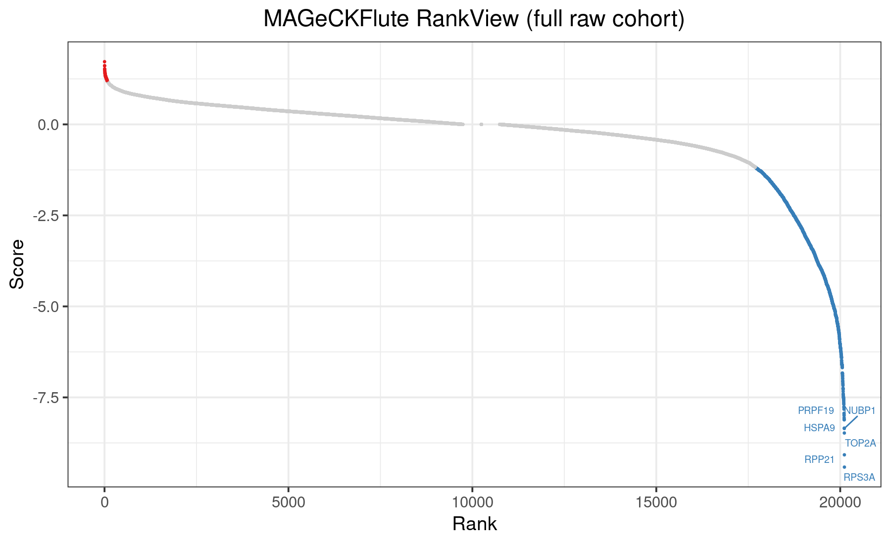
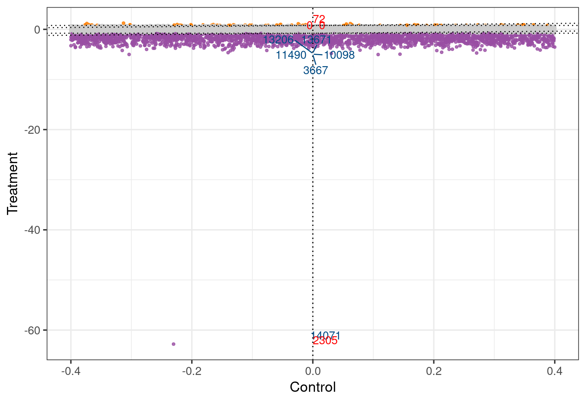
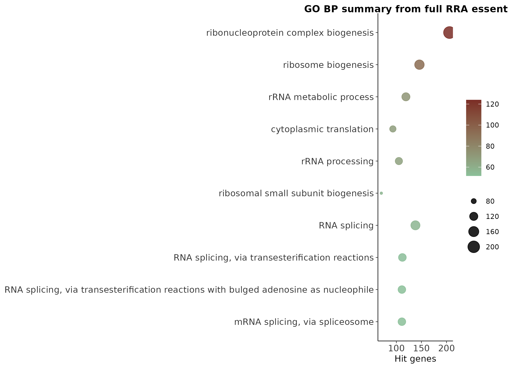
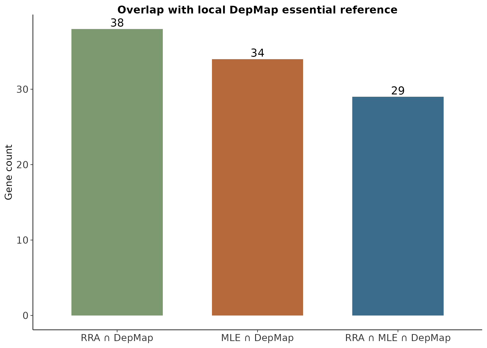

# CRISPR 筛选最佳实践（三）：MAGeCKFlute 整合分析——基因筛选的全景图

> 📋 教程信息
> - GitHub 仓库：[petemeng/MAGeCK-Tutorial](https://github.com/petemeng/MAGeCK-Tutorial)（完整代码、结果与更新记录）
> - 在线网页：[petemeng.github.io/MAGeCK-Tutorial](https://petemeng.github.io/MAGeCK-Tutorial/)（可点击阅读的网页版教程）
> - 数据来源：沿用第 1 篇 `SRP172473` full raw RRA 结果与第 2 篇 full raw MLE 结果
> - 分析对象：A375 / Brunello modified tracrRNA cohort 的整合解释
> - 本篇重点：`MAGeCKFlute::ReadRRA`、`ReadBeta`、`RankView`、`SquareView`，以及 GO / DepMap 交叉验证
> - 预计阅读：40 分钟 | 实操：20–40 分钟
> - 难度：⭐⭐⭐⭐（5 星制）
> - 前置知识：完成第 1、2 篇，已有 full RRA 与 full MLE 输出

---

## 本篇目标

到第 2 篇为止，我们已经有了两份“主结果表”：

- 第 1 篇：RRA 的 `mageck_test.gene_summary.txt`
- 第 2 篇：MLE 的 `mageck_mle.gene_summary.txt`

但真正写文章、做汇报、答审稿时，只给出两个大表远远不够。你还需要把结果组织成 4 个层面：

1. **排名层面**：最显著的 essential / enriched genes 在全局中的位置
2. **模型层面**：RRA 和 MLE 的信号分布是否一致
3. **功能层面**：这些命中集中在哪些生物学过程
4. **外部参考层面**：和 DepMap common essential 参考集重不重合

这正是 `MAGeCKFlute` 最擅长的事情。

---

## 这次“整合分析”到底整合了什么

我没有再回到 toy 结果，也没有拿一套新的 demo 数据来糊弄，而是直接把前两篇已经实跑出来的 full 结果接起来：

- `MAGeCK/full/results/article1_basic_full_raw/mageck_test.gene_summary.txt`
- `MAGeCK/full/results/article2_full_raw/mageck_mle.gene_summary.txt`
- `MAGeCK/full/results/article1_basic_full_raw/go_bp.tsv`
- `MAGeCK/repro/refs/depmap_common_essential.tsv`

其中最后那个 `depmap_common_essential.tsv` 是仓库内自带的一个**本地参考集**（102 个基因），不是在线实时拉取的全量 DepMap release。这样做的好处是：

- 结果稳定
- 本地可复现
- 不会因为外部接口变化把教程跑崩

---

## 环境准备

```r
if (!require('BiocManager', quietly = TRUE))
    install.packages('BiocManager')

BiocManager::install(c('MAGeCKFlute', 'clusterProfiler', 'org.Hs.eg.db'))
install.packages(c('ggplot2', 'dplyr', 'readr', 'ggrepel'))

library(MAGeCKFlute)
packageVersion('MAGeCKFlute')
```

```
📊 输出：
[1] '2.10.0'
```

### 两个真实 API 小坑

这次我顺手也把 `MAGeCKFlute` 的两个容易踩坑的点验证了：

1. `ReadRRA()` 返回的是一个三列表：`id / Score / FDR`
2. `RankView()` 不能直接喂整个 data.frame，要喂**带名字的数值向量**

也就是：

```r
rra <- ReadRRA('MAGeCK/full/results/article1_basic_full_raw/mageck_test.gene_summary.txt')
rank_vec <- rra$Score
names(rank_vec) <- rra$id
RankView(rank_vec)
```

这是本次真实跑通后确认的用法，不是照着旧文档生搬硬套。

---

## Step 1：把 RRA 和 MLE 结果读进 MAGeCKFlute

```r
library(MAGeCKFlute)

rra <- ReadRRA('MAGeCK/full/results/article1_basic_full_raw/mageck_test.gene_summary.txt')
beta <- ReadBeta('MAGeCK/full/results/article2_full_raw/mageck_mle.gene_summary.txt')

cat('RRA rows:', nrow(rra), '\n')
cat('MLE beta rows:', nrow(beta), '\n')
cat('RRA columns:', paste(colnames(rra), collapse = ', '), '\n')
cat('MLE columns:', paste(colnames(beta), collapse = ', '), '\n')
```

```
📊 输出：
RRA rows: 20114
MLE beta rows: 19115
RRA columns: id, Score, FDR
MLE columns: Gene, treatment
```

这一步已经说明了一件非常重要的事：

- `ReadRRA` 会把 MAGeCK 的 gene summary 抽象成统一的 rank-score 结构
- `ReadBeta` 会把 MLE 的某个 beta 列抽成统一的系数表

这就是为什么 `MAGeCKFlute` 很适合作为“第 3 层整理工具”——它不重新做统计，而是把前面分析的结果整理成更容易讲清楚的形状。

---

## Step 2：生成 RankView 和 SquareView

我把这篇用到的所有真实整合图都写进了：

`MAGeCK/full/scripts/plot_article3_full.R`

直接执行：

```bash
Rscript MAGeCK/full/scripts/plot_article3_full.R
```

```
📊 输出：
rra_flute_rows: 20114
beta_rows: 19115
go_terms_plotted: 10
rra_depmap_overlap: 38
mle_depmap_overlap: 34
shared_depmap_overlap: 29
```

### 图 1：MAGeCKFlute RankView



这张图的作用不是替代第 1 篇的火山图，而是提供一个更偏“整合摘要”的排序视角。你可以把它理解成：

- 左端：最强的 dropout / essential signal
- 中间：背景基因
- 右端：相对富集信号

在这套 full raw cohort 上，RankView 的左端明显更重，这和第 1 篇、第 2 篇都一致：**主信号仍然是 essential gene dropout。**

### 图 2：MAGeCKFlute SquareView



SquareView 这里用的是第 2 篇的 MLE beta。为了让图能跑通，我给它构造了一个最简单的双列输入：

- `Control = 0`
- `Treatment = beta`

这样它本质上是在把 MLE beta 重新投影成一个更直观的“方向 + 强度”图。这个图的价值不在于绝对坐标，而在于快速识别：

- 哪些点明确落在 essential 区域
- 哪些是明显 enriched
- 哪些处在阈值附近、需要结合 sgRNA 一致性再判断

---

## Step 3：功能层面——把 hit list 变成生物学主题

第 1 篇我们已经把 full RRA essential genes 做过 GO enrichment，并得到了 `go_bp.tsv`。第 3 篇不再重复统计，而是把 top 10 条目整理成整合摘要图：



这张图本质上回答的是：

> “你的 essential genes 在干什么？”

答案非常集中：

- ribonucleoprotein complex biogenesis
- ribosome biogenesis
- rRNA metabolic process
- cytoplasmic translation
- rRNA processing

这类结果对 CRISPR dropout screen 来说非常有说服力，因为它们都指向细胞最基础的生长依赖回路。

也就是说，**这不是一堆杂乱的 gene names，而是一整套彼此一致的翻译 / 核糖体 / RNA 处理网络。**

---

## Step 4：外部参考——和本地 DepMap essential 集比一比

“和已有大规模筛选一致吗？” 这个问题非常常见。为了保证本地可复现，我这次没有在线拉完整 DepMap，而是使用仓库里的本地参考表：

- `MAGeCK/repro/refs/depmap_common_essential.tsv`

它包含 **102** 个 common essential genes。我们把它分别和：

- 第 1 篇的 full RRA essential
- 第 2 篇的 full MLE essential
- RRA ∩ MLE shared essential

做交集统计。

```bash
cat MAGeCK/full/results/article3_integrative/depmap_overlap_summary.tsv
```

```
📊 输出：
Category	Count
RRA ∩ DepMap	38
MLE ∩ DepMap	34
RRA ∩ MLE ∩ DepMap	29
```

### 图 4：DepMap overlap 摘要



怎么理解这三个数：

- **38**：RRA essential 里，有 38 个能打到本地 DepMap common essential 参考集
- **34**：MLE essential 里，有 34 个能打到这套参考集
- **29**：RRA 和 MLE 同时认定 essential、且又在 DepMap 参考里的高置信交集

这 29 个 shared hits 是一个非常值得优先关注的小集合，因为它同时满足：

1. 在当前 full raw cohort 里显著
2. 被两种算法共同支持
3. 与外部 essential 参考一致

如果你后面要挑基因做验证，这种“多重证据交集”通常最有性价比。

---

## 本篇到底用了多少 MAGeCKFlute，多少自定义整理

我不想把这篇写成“全靠包名撑场面”，所以这里说清楚：

### 真正实跑并验证过的 `MAGeCKFlute` 组件

- `ReadRRA()`
- `ReadBeta()`
- `RankView()`
- `SquareView()`

### 这次为了稳定复现，额外手动整理的部分

- GO summary dotplot：基于已经生成的 `go_bp.tsv`
- DepMap overlap summary：基于本地参考表做稳定交集统计

也就是说，这篇不是“把所有分析都丢给 MAGeCKFlute 黑箱完成”，而是：

> 用 `MAGeCKFlute` 做它最擅长的读入与摘要图，再把最容易受环境影响的富集 / 外部数据库部分改造成稳定的本地流程。

这反而更适合长期维护教程。

---

## 本篇关键输出文件

```bash
du -h \
  MAGeCK/full/reports/figures/article3_pub_flute_rankview_full.png \
  MAGeCK/full/reports/figures/article3_pub_flute_squareview_full.png \
  MAGeCK/full/reports/figures/article3_pub_flute_go_full.png \
  MAGeCK/full/reports/figures/article3_pub_depmap_overlap_full.png \
  MAGeCK/full/results/article3_integrative/depmap_overlap_summary.tsv
```

```
📊 输出：
44K   MAGeCK/full/reports/figures/article3_pub_depmap_overlap_full.png
64K   MAGeCK/full/reports/figures/article3_pub_flute_rankview_full.png
144K  MAGeCK/full/reports/figures/article3_pub_flute_go_full.png
164K  MAGeCK/full/reports/figures/article3_pub_flute_squareview_full.png
77B   MAGeCK/full/results/article3_integrative/depmap_overlap_summary.tsv
```

---

## 本篇小结

第 3 篇最核心的价值，不是多装了一个包，而是把前两篇的“结果表”真正整理成了“证据体系”：

1. **RankView** 告诉你全局排名长什么样
2. **SquareView** 让你快速看清 MLE beta 的方向和层级
3. **GO 摘要** 把基因名单收束成稳定的生物学主题
4. **DepMap overlap** 帮你筛出跨算法、跨参考集都更稳的候选基因

如果第 1、2 篇回答的是“哪些基因显著”，那么第 3 篇回答的是：

> “这些显著基因，为什么值得相信，优先信谁。”

---

## FAQ：常见问题

**Q1：为什么这里没直接跑 `FluteRRA()` / `FluteMLE()` 一键全家桶？**

因为教程最重要的是稳定可复现。`RankView` / `SquareView` / 本地 GO / 本地 DepMap 这条组合链更稳，也更容易查错。

**Q2：本地 DepMap 参考只有 102 个基因，会不会太小？**

会。它更像一个 sanity check，而不是完整 benchmark。所以第 3 篇里我把它明确写成本地参考集，不冒充全量 DepMap。

**Q3：`RankView()` 为什么不能直接喂 `ReadRRA()` 返回的数据框？**

因为它实际上要的是一个带 gene name 的数值向量。这个坑我这次已经实跑踩过并修掉了。

**Q4：第 3 篇后面还能往哪里扩？**

最自然的方向有两个：

- 接入真正的全量 DepMap release 做更完整交叉验证
- 加入 copy number correction / lineage-specific dependency 分析

---

## 本系列导航

| 篇目 | 主题 | 定位 |
|---|---|---|
| 第 1 篇 | MAGeCK 分析——从 sgRNA 计数到必需基因 | 基础篇 |
| 第 2 篇 | MAGeCK MLE + VISPR——复杂实验设计与交互可视化 | 进阶篇 |
| **第 3 篇** | **MAGeCKFlute 整合分析——基因筛选的全景图** | **📍 当前阅读** |
| 第 4 篇 | CRISPRi/CRISPRa 筛选分析策略——不切 DNA 的基因扰动 | 扩展篇 |
| 第 5 篇 | 药物-基因互作筛选与合成致死分析——一加一大于二 | 应用篇 |
| 第 6 篇 | 发表级图表与审稿人常见问题——最后一公里 | 收官篇 |
