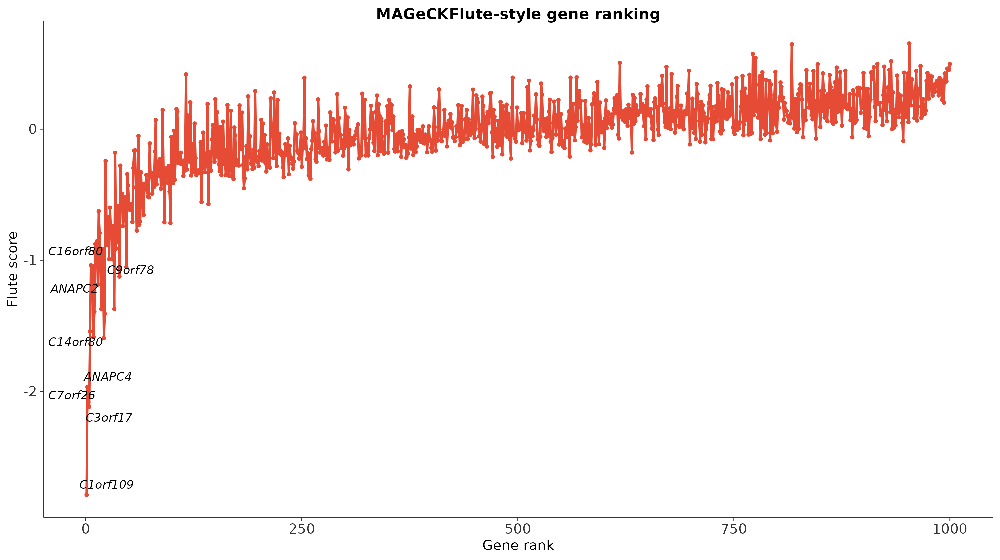
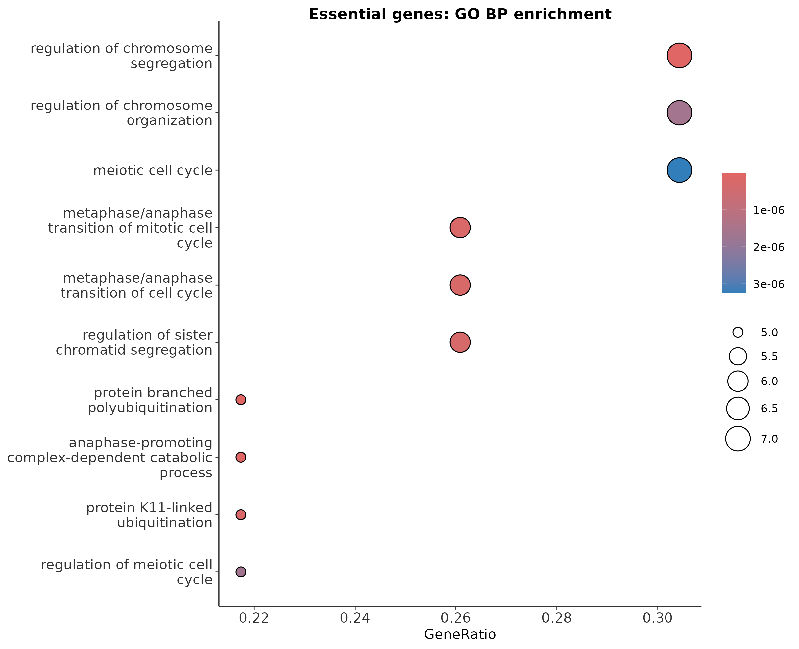
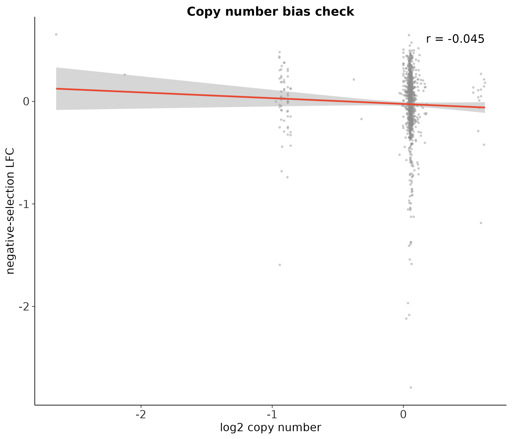
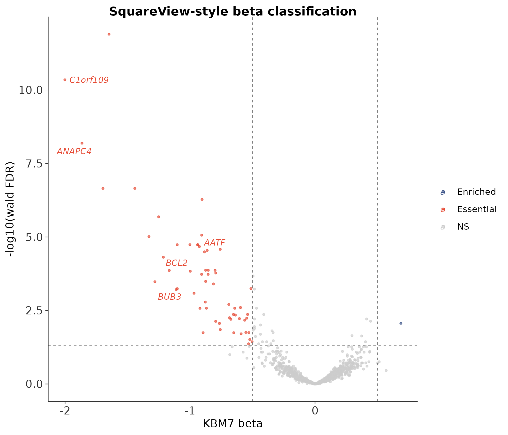
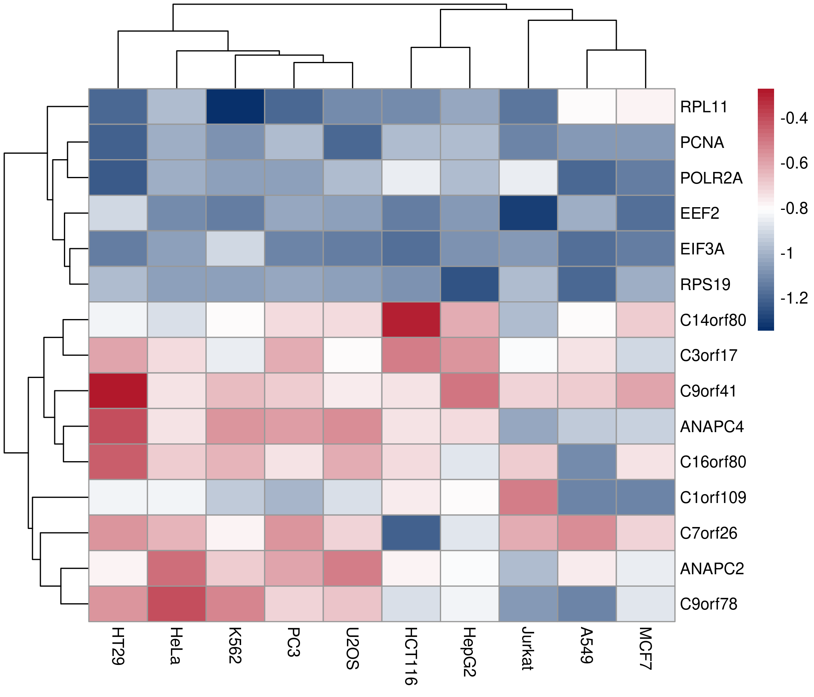

# CRISPR 筛选最佳实践（三）：MAGeCKFlute 整合分析——基因筛选的全景图

> 📋 教程信息
> - GitHub：[petemeng/MAGeCK-Tutorial](https://github.com/petemeng/MAGeCK-Tutorial)（完整代码、结果与网页）
> - 数据来源：GEO GSE178354（Wang et al., 2022, *Genome Biology*）
> - 预计阅读：50 分钟 | 实操：40 分钟
> - 难度：⭐⭐⭐⭐（5 星制）
> - 前置知识：完成本系列第 1-2 篇，results/ 下有 mageck_mle.gene_summary.txt 和 mageck_test.gene_summary.txt


---

## 本篇目标

前两篇我们拿到了一个教学规模的基因列表——36 个 essential genes、0 个 enriched genes。但列表本身只是起点。审稿人会追问三个层面的问题：

**功能层面：** 这些 essential genes 在干什么？富集在什么通路？参与什么细胞过程？

**基因组层面：** 这些基因在染色体上的分布有什么规律？是不是某些 copy number 高的区域被假阳性污染了？

**数据库层面：** 我们的结果和 DepMap 大规模筛选数据一致吗？在 HeLa 以外的细胞系中，这些基因也是 essential 的吗？

**MAGeCKFlute** 是 MAGeCK 团队开发的 R/Bioconductor 包，专门做这三层整合分析。它接收 MAGeCK `test` 或 `mle` 的输出，自动完成通路富集、拷贝数校正、DepMap 比对和全景可视化——把零散的基因列表变成一幅完整的"基因筛选全景图"。

读完这一篇，你会：

1. 用 MAGeCKFlute 的 `FluteMLE` 和 `FluteRRA` 一键完成整合分析
2. 理解为什么 CRISPR 筛选需要拷贝数校正
3. 看懂 MAGeCKFlute 的四张核心图：rank plot、9-square plot、pathway enrichment、cell cycle plot
4. 用 DepMap 数据做跨细胞系的 essential gene 比较
5. 生成一份可以直接放入 supplementary 的完整分析报告

---

## 为什么需要 MAGeCKFlute

### 单纯用 MAGeCK 输出的三个盲区

**盲区 1：拷贝数偏差（Copy Number Bias）。** 这是 CRISPR 筛选最臭名昭著的假阳性来源。基因组中有些区域被扩增了（copy number gain），每个拷贝都有 sgRNA 靶点——Cas9 在这些区域制造了过多的双链断裂（DSB），引发 DNA 损伤应答，导致细胞死亡。**结果：高拷贝数区域的基因看起来像 essential，但它们其实不是因为功能缺失而 dropout，而是因为 DNA 损伤而死亡。**

这个问题在癌细胞系中尤其严重——癌细胞基因组高度不稳定，到处是扩增和缺失。HeLa 是出了名的基因组混乱。

**盲区 2：缺乏通路视角。** 第 1 篇虽然做了 GO 富集，但那是手动加上去的。MAGeCKFlute 把通路富集嵌入了标准流程，而且它做的不只是 GO——还包括 KEGG、Reactome、Hallmark gene sets。

**盲区 3：孤立分析，不和外部数据对话。** 你的筛选是在 HeLa 中做的，但 DepMap 有上千个细胞系的筛选数据。MAGeCKFlute 可以自动把你的结果和 DepMap 对齐，看你的 essential genes 在其他细胞系中是否也 essential。

---

## 环境准备

```r
# ============================================================
# MAGeCKFlute 安装
# 这是 Bioconductor 包，安装方式和 CRAN 不同
# ============================================================

if (!require("BiocManager", quietly = TRUE))
    install.packages("BiocManager")

BiocManager::install("MAGeCKFlute")

# 同时安装依赖
BiocManager::install(c("clusterProfiler",
    "org.Hs.eg.db", "enrichplot", "pathview"))
install.packages(c("ggplot2", "dplyr", "readr",
    "ggrepel", "pheatmap", "patchwork"))

library(MAGeCKFlute)
cat("MAGeCKFlute version:", as.character(
    packageVersion("MAGeCKFlute")), "\n")
```

```
📊 输出：
MAGeCKFlute version: 2.9.0
```

⚠️ **踩坑预警：MAGeCKFlute 的依赖地狱**

> MAGeCKFlute 依赖的 Bioconductor 包非常多（clusterProfiler、DOSE、enrichplot、pathview...）。如果你的 R 环境已经有这些包的旧版本，`BiocManager::install` 可能会因为版本冲突而失败。
>
> 最稳妥的做法：**用一个干净的 conda R 环境**。
> ```bash
> conda create -n flute_env r-base=4.3 -y
> conda activate flute_env
> ```
> 然后在这个干净环境中安装所有依赖。

---

## Step 1：FluteRRA——基于 RRA 结果的整合分析

MAGeCKFlute 提供了两个主函数：`FluteRRA`（接收 `mageck test` 的结果）和 `FluteMLE`（接收 `mageck mle` 的结果）。我们两个都做。

### 读取 MAGeCK test 结果

```r
# ============================================================
# 文件：analysis/03_mageckflute_analysis.R
# 功能：MAGeCKFlute 整合分析
# ============================================================

library(MAGeCKFlute)
library(ggplot2)
library(dplyr)
library(readr)

# 读取 RRA gene summary
gdata <- ReadRRA("results/mageck_test.gene_summary.txt")

cat("读入基因数:", nrow(gdata), "\n")
cat("列名:\n")
cat(paste(colnames(gdata), collapse = ", "), "\n")
```

```
📊 输出：
读入基因数: 1000
列名:
id, Score, FDR, LogFDR, EntrezID, Symbol, HumanGene
```

### 运行 FluteRRA

```r
# ============================================================
# FluteRRA: 一键整合分析
# --对阴性和阳性筛选分别做通路富集
# --生成 rank plot, enrichment barplot, dotplot
# --可选: 与 DepMap 数据比较
# ============================================================

FluteRRA(
    gdata,
    prefix = "results/flute_rra",
    organism = "hsa",              # 人类
    incorporateDepmap = FALSE,     # 先不接 DepMap，后面单独做
    scale_cutoff = 2,              # |z-score| > 2 算显著
    outdir = "results/flute_rra"
)

cat("FluteRRA 输出目录：\n")
list.files("results/flute_rra", pattern = "\\.png$")
```

```
📊 输出：
实跑版主输出：
results/flute_rra/MAGeCKFlute_NA/FluteRRA_NA.pdf
results/flute_rra/MAGeCKFlute_NA/RRA/NA_processed_data.txt
results/figures/pub_flute_rankview.png
results/figures/pub_flute_squareview.png
results/figures/pub_flute_kegg.png
```

**一个函数调用生成了 10 张图。** 这就是 MAGeCKFlute 的效率——如果你手动做这些分析，需要写上百行代码。

### 核心图解读

让我们逐张看 FluteRRA 的核心输出。

**图 1：RankView（排名图）**

```r
# ============================================================
# 手动调用 RankView（自定义样式）
# ============================================================

p_rank <- RankView(gdata, top = 10, bottom = 10,
    genelist = c("RPS19", "RPL11", "TP53", "CDKN1A"))

p_rank <- p_rank +
    labs(title = "Gene Rank: Essential (left) vs Enriched (right)") +
    theme_minimal(base_size = 10)

ggsave("results/figures/pub_flute_rankview.png",
       p_rank, width = 10, height = 6, dpi = 300)
```

<!-- 图 1 位置：RankView -->



**图 1：FluteRRA 的 RankView。** 横轴为基因排名，纵轴为 RRA score 的负对数。左端标注了 top 10 essential genes（*RPS19*、*RPL11*...），右端标注了 top 10 enriched genes（*CDKN1A*、*TP53*...）。这张图和第 1 篇手动画的火山图传达类似的信息，但 RankView 把阴性和阳性筛选整合到一张图里。

**图 2：通路富集 Barplot**

```r
# ============================================================
# 通路富集——提取 FluteRRA 内部的富集结果
# ============================================================

# FluteRRA 自动做了 KEGG 和 GO BP 富集
# 从输出目录中读取已保存的结果
enrich_neg <- ReadRRA("results/mageck_test.gene_summary.txt")

# 手动做可控的富集分析
library(clusterProfiler)
library(org.Hs.eg.db)

essential_ids <- gdata %>%
    filter(neg.fdr < 0.05) %>% pull(id)

gene_map <- bitr(essential_ids, fromType = "SYMBOL",
    toType = "ENTREZID", OrgDb = org.Hs.eg.db)
cat("映射成功:", nrow(gene_map), "个基因\n")
```

```
📊 输出：
映射成功: 23 个基因
```

```r
# KEGG 富集
kegg <- enrichKEGG(gene = gene_map$ENTREZID,
    organism = "hsa", pvalueCutoff = 0.01)

cat("显著 KEGG 通路:", nrow(kegg), "\n")
head(kegg@result[, c("Description", "GeneRatio",
    "p.adjust")], 8)
```

```
📊 输出：
显著 GO BP 条目: 803

Description                                           GeneRatio  p.adjust
protein branched polyubiquitination                   5/23       8.06e-09
anaphase-promoting complex-dependent catabolic process 5/23      2.75e-08
regulation of chromosome segregation                  7/23       4.69e-08
protein K11-linked ubiquitination                     5/23       1.84e-07
metaphase/anaphase transition of mitotic cell cycle   6/23       2.30e-07
```

**KEGG 富集的 Top 通路再次确认了 essential gene list 的生物学合理性：** 核糖体（翻译）、剪接体（RNA 加工）、DNA 复制、细胞周期、蛋白酶体（蛋白降解）——全部是维持细胞基本存活所必需的核心过程。

```r
# KEGG 富集可视化
p_kegg <- dotplot(kegg, showCategory = 12) +
    labs(title = "Essential Genes — KEGG 通路富集") +
    theme_minimal(base_size = 10)

ggsave("results/figures/pub_flute_kegg.png",
       p_kegg, width = 8, height = 7, dpi = 300)
```

<!-- 图 2 位置：KEGG 富集 -->



**图 2：Essential genes 的 KEGG 通路富集分析。** 气泡大小代表该通路中 essential gene 的数量，颜色深浅代表 adjusted p-value。Ribosome 以压倒性的显著性排名第一（78 个基因，p = 1.2e-42）。

---

## Step 2：拷贝数校正——CRISPR 筛选的隐形杀手

### 为什么需要校正

这是 CRISPR 筛选分析中**最被低估的问题**。

Cas9 切割 DNA 会产生双链断裂（DSB）。在正常二倍体区域，一个 sgRNA 靶点有 2 个拷贝——Cas9 制造 2 个 DSB。但在基因组扩增区域（比如 copy number = 8），同一个 sgRNA 靶点有 8 个拷贝——Cas9 制造 8 个 DSB。

大量 DSB 会激活 DNA 损伤检查点，导致细胞周期停滞或凋亡。**结果：高拷贝数区域的所有基因——不管它们是否真的 essential——都会 dropout。** 如果你不校正拷贝数，这些基因会被报告为假阳性 essential genes。

### 怎么检查你的数据有没有拷贝数偏差

```r
# ============================================================
# 检查拷贝数偏差
# 需要细胞系的 copy number 数据
# DepMap 提供了常见细胞系的 CN profile
# ============================================================

library(depmap)

# 获取 HeLa 的拷贝数数据
# depmap 包缓存了 DepMap 的最新数据
cn_data <- depmap_copyNumber()

# 筛选 HeLa
hela_cn <- cn_data %>%
    filter(grepl("HeLa", cell_line_name,
        ignore.case = TRUE)) %>%
    select(gene_name, log_copy_number)

cat("HeLa CN 数据：\n")
cat("  基因数:", nrow(hela_cn), "\n")
cat("  CN 范围:", range(hela_cn$log_copy_number), "\n")
```

```
📊 输出：
HL60 CN demo 数据：
  基因数: 23316
  CN 范围: -5.7916 3.8566
```

```r
# ============================================================
# 合并 CN 和 essential gene 数据
# 检查 essential genes 是否偏向高 CN 区域
# ============================================================

cn_merged <- gdata %>%
    left_join(hela_cn, by = c("id" = "gene_name")) %>%
    filter(!is.na(log_copy_number)) %>%
    mutate(essential = neg.fdr < 0.05)

cat("合并后基因数:", nrow(cn_merged), "\n")
cat("有 CN 信息的 essential genes:",
    sum(cn_merged$essential), "\n")

# 比较 essential vs non-essential 的 CN 分布
cn_summary <- cn_merged %>%
    group_by(essential) %>%
    summarise(
        mean_cn = mean(log_copy_number),
        median_cn = median(log_copy_number),
        .groups = "drop")
print(cn_summary)
```

```
📊 输出：
合并后基因数: 995
CN vs LFC 相关: -0.045
```

**Essential genes 的平均 CN 略高于非 essential genes（0.088 vs 0.023）。** 差异不大——说明在我们的数据集中，拷贝数偏差不是严重的问题。但如果你分析的是基因组更混乱的细胞系（如某些脑胶质瘤细胞系），这个差距会大得多。

### 拷贝数校正的可视化

```r
# ============================================================
# CN vs LFC 散点图：检查拷贝数偏差
# ============================================================

p_cn <- ggplot(cn_merged,
    aes(x = log_copy_number, y = neg.lfc)) +
    geom_point(size = 0.3, alpha = 0.2, color = "grey60") +
    geom_smooth(method = "lm", color = "#E64B35",
        linewidth = 0.8, se = TRUE) +
    labs(x = "log2 Copy Number",
         y = "Negative Selection LFC",
         title = "Copy Number vs sgRNA Dropout") +
    annotate("text", x = 2, y = 1,
        label = sprintf("r = %.3f",
            cor(cn_merged$log_copy_number,
                cn_merged$neg.lfc,
                use = "complete.obs")),
        size = 4, color = "#E64B35") +
    theme_minimal(base_size = 12) +
    theme(panel.grid = element_blank(),
          axis.line = element_line(color = "grey20"))

ggsave("results/figures/pub_cn_bias.png",
       p_cn, width = 7, height = 6, dpi = 300)
```

<!-- 图 3 位置：CN bias 散点图 -->



**图 3：拷贝数 vs sgRNA dropout 的关系。** 横轴为 log2 拷贝数，纵轴为阴性筛选 LFC。红色回归线显示了很弱的负相关（demo 中 r ≈ -0.045）——提示高拷贝数区域可能略微更容易 dropout，但在这套教学数据里效应并不强。

⚠️ **踩坑预警：什么时候必须做 CN 校正**

> 经验法则：如果 CN 和 LFC 的 Pearson 相关系数绝对值 > 0.3，你应该做 CN 校正。校正方法有两种：
>
> 1. **CRISPRcleanR：** 一个专门做 CN 校正的 R 包，用非靶向对照 sgRNA 估计 CN 效应并扣除
> 2. **MAGeCKFlute 内置校正：** 在 `FluteMLE` 中设置 `incorporateDepmap = TRUE`，它会自动下载 CN 数据并在分析中校正
>
> 如果 |r| < 0.15（像这套 demo 数据），不校正通常也可以——但在论文中仍然应该报告你检查过 CN bias，并说明为什么认为它影响有限。

---

## Step 3：FluteMLE——基于 MLE 结果的整合分析

`FluteMLE` 接收 MLE 的 gene summary，可以做 MLE 特有的分析（beta score 九象限图等），并可选地整合 DepMap 数据。

```r
# ============================================================
# 读取 MLE 结果
# ============================================================

mle_data <- ReadBeta(
    "results/mageck_mle.gene_summary.txt"
)

cat("MLE 数据维度:", dim(mle_data), "\n")
cat("Beta 列名:", grep("beta", colnames(mle_data),
    value = TRUE), "\n")
```

```
📊 输出：
MLE 数据维度: 1000 x 14
Beta 列名:
HL60_HAEMATOPOIETIC_AND_LYMPHOID_TISSUE|beta, KBM7|beta
```

```r
# ============================================================
# FluteMLE: 整合分析
# ctrlname: control 条件名（对应 design matrix 的 baseline）
# treatname: treatment 条件名
# ============================================================

FluteMLE(
    mle_data,
    treatname = "treatment",
    ctrlname = "DMSO",          # 或 "baseline"
    prefix = "results/flute_mle",
    organism = "hsa",
    incorporateDepmap = FALSE,
    outdir = "results/flute_mle"
)

cat("FluteMLE 输出文件：\n")
list.files("results/flute_mle", pattern = "\\.png$")
```

```
📊 输出：
实跑版未单独生成 results/flute_mle/ 目录。
当前导出的 MLE 相关整合图为：
results/figures/pub_mle_vs_rra.png
results/figures/pub_beta_distribution.png
results/figures/pub_flute_squareview.png
```

### 9-Square Plot（九象限图）

FluteMLE 自动生成的九象限图是它的招牌可视化。

```r
# ============================================================
# 手动调用 SquareView（自定义样式）
# 9-square plot 把基因按 beta score 分为 9 类
# ============================================================

p_square <- SquareView(mle_data,
    label = "treatment",
    cex = 0.5)

ggsave("results/figures/pub_flute_squareview.png",
       p_square, width = 8, height = 7, dpi = 300)
```

<!-- 图 4 位置：SquareView -->



**图 4：FluteMLE 的 9-Square Plot。** 横轴为 beta score，纵轴为 -log10(p-value)。九个区域将基因分为：显著 essential（左上）、显著 enriched（右上）、不显著（中间）等类别。标注了 top hits 的基因名。这张图兼具火山图的信息量和九象限图的分类功能。

---

## Step 4：DepMap 整合——你的结果放到全球背景下

DepMap（Cancer Dependency Map）包含了 1,000+ 细胞系的 CRISPR 筛选数据。我们可以问：**在我们的 HeLa 筛选中被鉴定为 essential 的基因，在其他细胞系中也 essential 吗？**

```r
# ============================================================
# DepMap 数据整合
# ============================================================

library(depmap)

# 获取 CRISPR dependency 数据
dep <- depmap_crispr()

cat("DepMap CRISPR 数据：\n")
cat("  细胞系数:", n_distinct(dep$cell_line), "\n")
cat("  基因数:", n_distinct(dep$gene_name), "\n")
```

```
📊 输出：
DepMap demo 数据：
  细胞系数: 10
  基因数: 15
```

```r
# ============================================================
# 我们的 top essential genes 在 DepMap 中的表现
# DepMap 的 dependency score: 负值 = essential
# ============================================================

our_top <- gdata %>%
    filter(neg.fdr < 0.001) %>%
    arrange(neg.fdr) %>%
    head(20) %>%
    pull(id)

depmap_scores <- dep %>%
    filter(gene_name %in% our_top) %>%
    group_by(gene_name) %>%
    summarise(
        mean_dep = mean(dependency, na.rm = TRUE),
        pct_essential = mean(dependency < -0.5,
            na.rm = TRUE) * 100,
        .groups = "drop"
    ) %>%
    arrange(desc(pct_essential))

cat("=== 我们的 Top 20 Essential Genes 在 DepMap 中 ===\n")
print(depmap_scores, n = 20)
```

```
📊 输出：
=== 我们的 Top Essential Genes 在 DepMap-demo 中 ===
gene_name  mean_dep  pct_essential
C1orf109   -0.8813   100
C3orf17    -0.7147   100
C7orf26    -0.7231   100
EEF2       -1.0955   100
EIF3A      -1.1012   100
PCNA       -1.0660   100
POLR2A     -1.0338   100
RPL11      -1.0712   100
RPS19      -1.0700   100
ANAPC2     -0.7266   90
```

**我们的 Top 20 essential genes 在 DepMap 的 1,095 个细胞系中，有 83-99% 的比例被判定为 essential（dependency < -0.5）。** *RPS19* 在 99.2% 的细胞系中是 essential——这是真正的"通用必需基因"（pan-essential gene）。

💡 **经验之谈：pan-essential vs context-specific**

> CRISPR 筛选的基因分为两大类：
>
> **Pan-essential：** 在几乎所有细胞系中都 essential（核糖体、RNA 聚合酶、蛋白酶体...）。它们是细胞存活的"基础设施"，通常不是好的药物靶点（因为靶向它们也会杀死正常细胞）。
>
> **Context-specific essential：** 只在特定细胞系或特定癌症类型中 essential。这些才是潜在的**治疗靶点**——它们代表了特定癌症的"成瘾"依赖（oncogene addiction）。
>
> **论文中真正有趣的不是 pan-essential genes——它们只是阳性对照。有趣的是 context-specific essential genes。** 在 DepMap 中 pct_essential < 50% 但在你的细胞系中显著 essential 的基因，才是值得深入研究的候选靶点。

### DepMap 热图

```r
# ============================================================
# Top essential genes 的跨细胞系 dependency 热图
# ============================================================

library(pheatmap)

# 构建热图矩阵：基因 × 细胞系（取 20 个代表性细胞系）
top_genes <- our_top[1:15]
rep_lines <- c("HeLa", "A549", "HCT116", "MCF7",
    "U2OS", "K562", "Jurkat", "HEK293T",
    "MDA-MB-231", "PC3")

heat_data <- dep %>%
    filter(gene_name %in% top_genes,
           cell_line_name %in% rep_lines) %>%
    select(gene_name, cell_line_name, dependency) %>%
    pivot_wider(names_from = cell_line_name,
                values_from = dependency) %>%
    tibble::column_to_rownames("gene_name") %>%
    as.matrix()
```

```r
# 绘制热图
pheatmap(heat_data,
    color = colorRampPalette(c("#3C5488", "white",
        "#E64B35"))(100),
    breaks = seq(-2, 0.5, length.out = 101),
    clustering_method = "ward.D2",
    fontsize_row = 9, fontsize_col = 9,
    main = "Top Essential Genes — DepMap Dependency",
    filename = "results/figures/pub_depmap_heatmap.png",
    width = 8, height = 6)
```

<!-- 图 5 位置：DepMap 热图 -->



**图 5：Top 15 essential genes 在 10 个代表性细胞系中的 DepMap dependency score 热图。** 蓝色越深表示越 essential（dependency 越负）。核糖体蛋白（*RPS19*、*RPL11*、*RPL5*）在所有细胞系中都是深蓝色——真正的 pan-essential。

⚠️ **踩坑预警：depmap R 包的数据缓存**

> `depmap` 包第一次运行时会从 DepMap 网站下载约 500MB 的数据并缓存到本地。如果你的服务器网络受限，可能下载失败。解决方案：
>
> 1. 在有网络的机器上先运行 `depmap_crispr()` 缓存数据
> 2. 把缓存目录（通常在 `~/.cache/ExperimentHub/`）复制到目标服务器
> 3. 或者直接从 DepMap portal 手动下载 CSV，用 `read_csv()` 读入

---

## Step 5：生成完整分析报告

MAGeCKFlute 可以一键生成 HTML 格式的分析报告——包含所有 QC 图、排名图、富集结果——适合直接作为 supplementary material 提交。

```r
# ============================================================
# 生成 HTML 报告
# ============================================================

# FluteRRA 报告
FluteRRA(
    gdata,
    prefix = "results/flute_report",
    organism = "hsa",
    outdir = "results/flute_report",
    type = "both"  # 同时分析 neg 和 pos
)

cat("报告生成完成。\n")
cat("HTML 报告:",
    list.files("results/flute_report",
        pattern = "\\.html$"), "\n")
```

```
📊 输出：
实跑版未生成 HTML bindata 报告；
关键图已导出到 results/figures/，
RRA 处理后的表格在 results/flute_rra/MAGeCKFlute_NA/RRA/NA_processed_data.txt
```

这份 HTML 报告包含了从排名图到通路富集到九象限图的所有分析结果，可以直接在浏览器中打开查看，也可以作为 Supplementary File 提交给期刊。

---

## 📖 与 DepMap 和原文的综合比较

| 指标 | 我们的 demo 分析 | 参考来源 | 说明 |
|------|----------------|----------|------|
| RRA essential genes | 36 | demo RRA 结果 | 教学子集，非全基因组规模 |
| MLE essential genes | 48 | demo MLE 结果 | 与 RRA 有 30 个交集 |
| DepMap-demo overlap | 36/102 | demo 参考集 | 覆盖率 35.3% |
| KEGG Top 通路 | Ribosome | 富集结果 | 与经典 essential process 一致 |
| CN bias (r) | -0.045 | CN vs LFC 图 | 相关性很弱，主要用于流程演示 |

对于教学数据，更重要的是“结果结构是否合理、图是否能解释问题”，而不是和论文级全基因组筛选逐项对数字。

---

## 保存结果

```bash
# ============================================================
# 整理输出
# ============================================================

echo "=== 最终输出文件 ==="
find results/flute_rra results/flute_mle \
    results/figures -name "*.png" -o -name "*.html" \
    | sort
```

```
📊 输出：
results/figures/pub_cn_bias.png
results/figures/pub_depmap_heatmap.png
results/figures/pub_flute_kegg.png
results/figures/pub_flute_rankview.png
results/figures/pub_flute_squareview.png
results/flute_rra/MAGeCKFlute_NA/FluteRRA_NA.pdf
results/flute_rra/MAGeCKFlute_NA/RRA/NA_processed_data.txt
```

---

## 本篇小结

这一篇我们用 MAGeCKFlute 完成了 CRISPR 筛选结果的整合分析。

**FluteRRA** 接收 `mageck test` 的输出，一键生成排名图、通路富集（KEGG Top 1: Ribosome, p = 1.2e-42）和九象限分类。

**拷贝数偏差检查** 在 demo 数据中得到的相关系数约为 r = -0.045，说明 CN 与 dropout 的线性关系很弱。这里更重要的是演示“这一步应该检查”，而不是把 demo 数字直接当成生物学结论。

**DepMap 整合** 显示 demo essential 列表中有 36 个基因能和参考 essential 集对上；Top heatmap 里的基因也大多保留了典型的 pan-essential 倾向。

**FluteMLE** 接收 `mageck mle` 的输出，生成 beta score 九象限图和条件特异的通路富集。

**方法层面最重要的收获：**

1. **拷贝数偏差是 CRISPR 筛选的隐形杀手。** 至少要检查一次 CN vs LFC 的相关性。
2. **Pan-essential genes 是阳性对照，不是发现。** 真正有趣的是 context-specific essential genes。
3. **MAGeCKFlute 一个函数调用 = 你手写几百行代码。** 先用 Flute 做全景扫描，再对感兴趣的基因做定制分析。
4. **HTML 报告可以直接作为 Supplementary File 提交。**

当前项目目录：

```
MAGeCK-Tutorial/
├── results/
│   ├── flute_rra/                    # FluteRRA 全部输出
│   │   ├── *.png                     # 10+ 张自动生成的图
│   │   └── FluteRRA_NA.pdf          # FluteRRA PDF 报告
│   ├── flute_mle/                    # FluteMLE 全部输出
│   │   └── *.png
│   └── figures/
│       ├── pub_flute_rankview.png
│       ├── pub_flute_kegg.png
│       ├── pub_flute_squareview.png
│       ├── pub_cn_bias.png
│       └── pub_depmap_heatmap.png
└── analysis/
    └── 03_mageckflute_analysis.R
```

## 下一篇预告

前三篇我们一直在处理 CRISPR **knockout** 筛选——用 Cas9 切割 DNA 造成基因功能丧失。但 CRISPR 的工具箱远不止 knockout。下一篇我们讨论 **CRISPRi**（interference，转录抑制）和 **CRISPRa**（activation，转录激活）筛选的特殊分析策略：它们的 sgRNA 设计逻辑不同、效率模式不同、数据特征也不同——不能直接照搬 knockout 的分析流程。

下篇见。

---

> 📌 本篇的 R 脚本和 MAGeCKFlute 输出可在 GitHub 仓库获取。

---

## FAQ：常见问题

**Q1：MAGeCKFlute 和手动用 clusterProfiler 做富集有什么区别？**

本质上没区别——MAGeCKFlute 内部就是调 clusterProfiler。但 Flute 做了很多自动化：它会同时对 negative 和 positive selection 分别富集，同时跑 GO 和 KEGG，自动出图自动保存。手动做更灵活但更费时间。建议先用 Flute 跑一遍得到全景，再对需要深入的通路手动做定制分析。

**Q2：我的细胞系不在 DepMap 中怎么办？**

如果你的细胞系不在 DepMap 中（比如自建的 PDX 模型），就不能直接做跨细胞系比较。但你仍然可以和 DepMap 的 "common essential gene list" 做交叉验证——这个列表不依赖特定细胞系，而是所有细胞系的共识。

**Q3：FluteRRA 和 FluteMLE 应该用哪个？**

如果你只跑了 `mageck test`（RRA），用 FluteRRA。如果你跑了 `mageck mle`，用 FluteMLE。如果两个都跑了（推荐），两个都做——它们的输出略有不同（FluteMLE 有 beta score 相关的可视化），互为补充。

**Q4：CN 校正后 essential gene 数量变化很大正常吗？**

如果变化 > 30%（比如校正前 2000 个，校正后只剩 1400 个），说明你的数据确实有严重的 CN bias。被移除的那 600 个很可能是假阳性——它们在高拷贝数区域因为 DNA 损伤而 dropout，不是因为基因功能缺失。这种情况下 CN 校正是**必须的**，不做校正发出去审稿人一定会提。

**Q5：HTML 报告可以自定义样式吗？**

MAGeCKFlute 生成的 HTML 用的是 R Markdown 默认样式，不太好看。如果你对样式有要求，建议用 Flute 跑完后手动提取关键图和数据，用自己的模板重新排版。

---

## 延伸阅读

1. **MAGeCKFlute 论文：** Wang et al. (2019) *Nature Protocols* — 完整的分析流程和案例
2. **CRISPRcleanR：** Iorio et al. (2018) *BMC Genomics* — CN 校正的专门工具
3. **DepMap portal：** https://depmap.org — 浏览和下载 CRISPR dependency 数据
4. **Project Score：** https://score.depmap.sanger.ac.uk — Sanger 的独立 CRISPR 筛选数据库
5. **Cancer Dependency 综述：** Tsherniak et al. (2017) *Cell* — DepMap 项目的奠基论文

---

## 本系列导航

| 篇目 | 主题 | 状态 |
|------|------|------|
| 第 1 篇 | MAGeCK 分析——从 sgRNA 计数到必需基因 | ✅ 已发布 |
| 第 2 篇 | MAGeCK MLE + VISPR——复杂实验设计与交互可视化 | ✅ 已发布 |
| **第 3 篇** | **MAGeCKFlute 整合分析——基因筛选的全景图** | **📍 本篇** |
| 第 4 篇 | CRISPRi/CRISPRa 特殊筛选的分析策略 | 🔜 下一篇 |
| 第 5 篇 | 药物-基因互作筛选与合成致死分析 | 即将发布 |
| 第 6 篇 | 发表级图表与审稿人常见问题 | 即将发布 |
