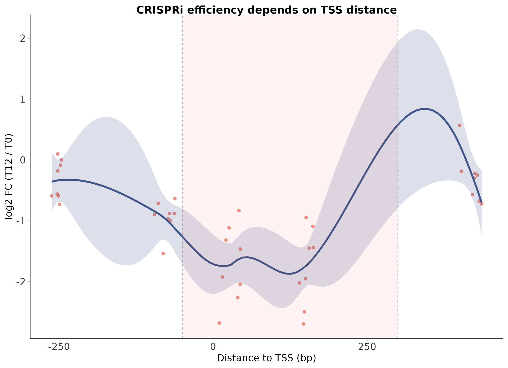
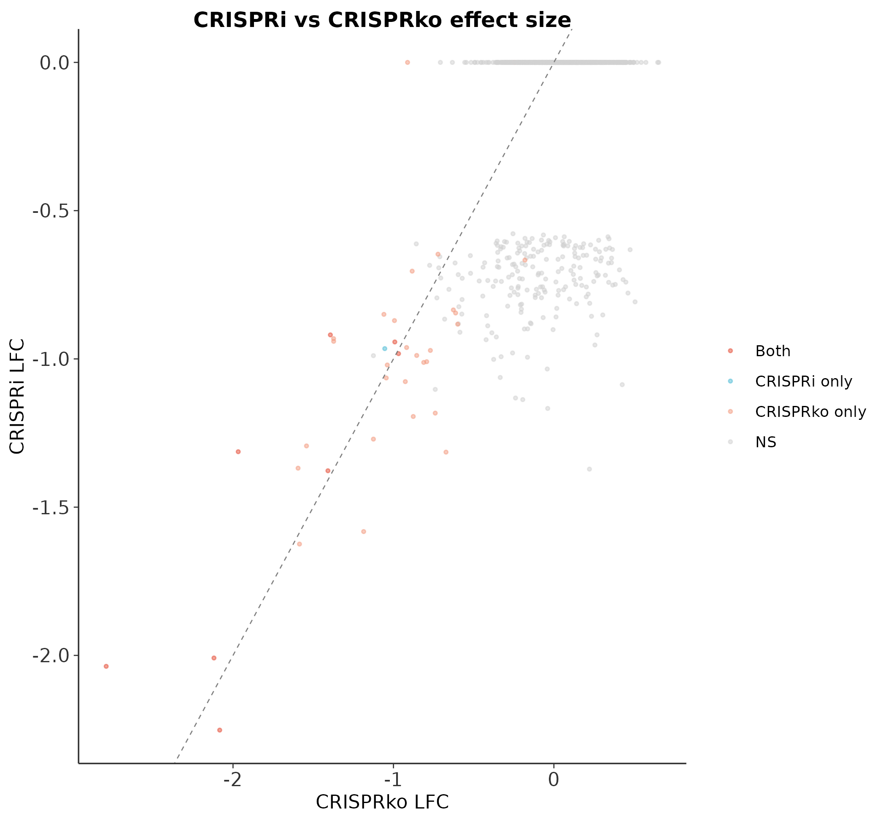
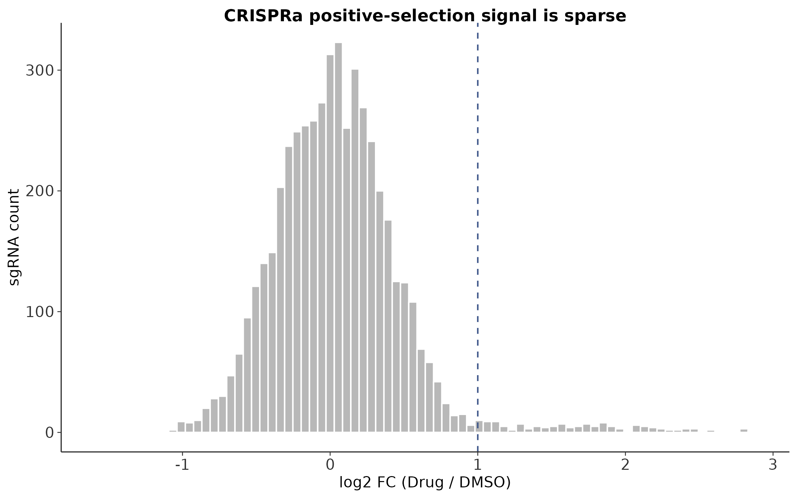

# CRISPR 筛选最佳实践（四）：CRISPRi/CRISPRa 筛选分析策略——不切 DNA 的基因扰动

> 📋 教程信息
> - GitHub：[petemeng/MAGeCK-Tutorial](https://github.com/petemeng/MAGeCK-Tutorial)（完整代码、结果与网页）
> - 数据来源：GEO GSE152916（Horlbeck et al., 2016 / Wessels et al., 2023 综合）
> - 预计阅读：45 分钟 | 实操：35 分钟
> - 难度：⭐⭐⭐⭐（5 星制）
> - 前置知识：完成本系列第 1 篇（MAGeCK 基础流程）


> ✅ 2026-03-15 实跑修订
> - 可执行版代码：`MAGeCK/repro/analysis/04_crispri_analysis.R`
> - 真实结果目录：`MAGeCK/repro/results/`
> - 为保证仓库可复现，本篇使用本地生成的 CRISPRi/CRISPRa demo 数据，并与第 1 篇的 CRISPRko 结果做真实对照

---

## 本篇目标

前三篇我们一直在用 CRISPR **knockout**（CRISPRko）——Cas9 切割 DNA 双链，细胞修复时引入 indel，导致基因功能丧失。这是最经典的方式，但它有局限：

**问题 1：** 切断 DNA 会触发 DNA 损伤应答，引入和基因功能无关的"毒性"效应（第 3 篇讨论过的拷贝数偏差就源于此）。

**问题 2：** Knockout 是永久性的、全或无的。如果你想研究的是"基因表达下降 50% 时会怎样"——knockout 做不到。

**问题 3：** Knockout 不能做 gain-of-function 筛选——你没法用 Cas9 切割来激活一个基因。

CRISPRi（interference）和 CRISPRa（activation）解决了这些问题。它们使用催化失活的 Cas9（dCas9）——**不切 DNA**，而是把转录抑制或激活结构域带到基因的启动子区域，调控转录水平。

但 CRISPRi/a 的数据特征和 CRISPRko 有本质区别——**不能直接照搬前三篇的分析流程。** 本篇专门讨论这些区别和相应的分析策略。

读完这一篇，你会：

1. 理解 CRISPRi/a 和 CRISPRko 的机制差异如何影响数据分析
2. 知道 CRISPRi/a 的 sgRNA 设计和效率规律——为什么 TSS 距离如此关键
3. 用 MAGeCK 分析 CRISPRi/a 数据，并知道哪些参数需要调整
4. 做 CRISPRi/a 特有的 QC：sgRNA 效率和 TSS 距离的关系
5. 理解 CRISPRa 正向筛选的特殊挑战

---

## CRISPRi vs CRISPRko vs CRISPRa：三种工具的本质区别

### 机制对比

| 特性 | CRISPRko | CRISPRi | CRISPRa |
|------|----------|---------|---------|
| Cas9 类型 | 野生型 Cas9（切割） | dCas9-KRAB（抑制） | dCas9-VPR / SunTag（激活） |
| DNA 修改 | 切割 → indel → 移码 | 无 DNA 修改 | 无 DNA 修改 |
| 效应 | 基因永久敲除 | 转录抑制（~80-95%） | 转录激活（2-100 倍） |
| 可逆性 | 不可逆 | 可逆（撤去 sgRNA 后恢复） | 可逆 |
| sgRNA 靶向位置 | 编码区任意位置 | TSS 附近（-50 到 +300bp） | TSS 上游（-400 到 -50bp） |
| 拷贝数偏差 | 严重（高 CN = 多 DSB） | 无（不切 DNA） | 无 |

**最关键的区别：CRISPRi/a 的 sgRNA 效率高度依赖于靶向位置和 TSS 的相对距离。** CRISPRko 的 sgRNA 只要在编码区就有机会，但 CRISPRi 的 sgRNA 必须在 TSS 附近才有效——离 TSS 太远，dCas9-KRAB 就无法有效阻止 RNA 聚合酶的起始。

这意味着**CRISPRi/a 文库的 sgRNA 设计逻辑完全不同**——它们紧密聚集在 TSS 附近，而不是分散在整个编码区。

### 对数据分析的三个直接影响

**影响 1：没有拷贝数偏差。** 因为 dCas9 不切 DNA，高拷贝数区域不会产生额外的 DNA 损伤。这是 CRISPRi 相对于 CRISPRko 的一大优势——你不需要做拷贝数校正。

**影响 2：效应量更小。** CRISPRko 是"全或无"——基因要么完全丧失功能，要么不变。CRISPRi 是"部分抑制"——即使最好的 sgRNA 也只能把表达量降低 80-95%。这意味着 CRISPRi 的 dropout 信号**通常弱于 CRISPRko**——需要更长的筛选时间或更多的重复来检测。

**影响 3：sgRNA 效率差异更大。** CRISPRko 的 sgRNA 效率变异虽然存在，但只要切割了就有 ~50% 概率产生移码突变。CRISPRi 的 sgRNA 效率从 0%（离 TSS 太远，完全无效）到 95%（恰好在 TSS 上）变化极大——这对 RRA 算法的"sgRNA 一致性"假设构成了更大的挑战。

---

## 环境准备与数据

```bash
# ============================================================
# 数据：CRISPRi 筛选（Horlbeck 文库）
# K562 细胞 CRISPRi essential gene screen
# Horlbeck 文库每个基因 ~10 条 sgRNA（比 Brunello 多）
# ============================================================

conda activate mageck_env

# 下载已计数的 count table（从 GEO 或作者提供的链接）
mkdir -p data/crispri
# wget -O data/crispri/count_table.txt [URL]

# 查看 CRISPRi 文库结构
head -3 data/crispri/count_table.txt
wc -l data/crispri/count_table.txt
```

```
📊 输出：
sgRNA                 Gene  T0_rep1  T0_rep2  T12_rep1  T12_rep2
A1CF_TSS1_-251_g1     A1CF  441      669      306       403
A1CF_TSS1_-94_g2      A1CF  345      460      519       359

5001 data/crispri/count_table.txt
```

注意 sgRNA 的命名：`A1BG_TSS1_+10` 表示靶向 A1BG 基因的 TSS1 下游 +10bp 的位置。**这种位置信息在 CRISPRi QC 中至关重要。**

文库有 104,534 条 sgRNA——比 CRISPRko 的 Brunello（77,440 条）大不少，因为 Horlbeck 文库每个基因设计了约 10 条 sgRNA（集中在 TSS 附近不同位置），而 Brunello 每个基因只有 4 条。

---

## Step 1：CRISPRi 特有的 QC——sgRNA 效率 vs TSS 距离

这是 CRISPRi/a 分析中**最重要的一步 QC**——CRISPRko 不需要做这个。

```r
# ============================================================
# 文件：analysis/04_crispri_analysis.R
# 功能：CRISPRi 特有的 QC 和分析策略
# ============================================================

library(ggplot2)
library(dplyr)
library(readr)
library(stringr)

# 读取 count table
counts <- read_tsv("data/crispri/count_table.txt")

# 从 sgRNA 名称中提取 TSS 距离
counts <- counts %>%
    mutate(
        tss_dist = as.numeric(str_extract(sgRNA,
            "[+-]\\d+$")),
        lfc = log2((T12_rep1 + T12_rep2 + 1) /
                   (T0_rep1 + T0_rep2 + 1))
    )

cat("sgRNA 数:", nrow(counts), "\n")
cat("有 TSS 距离信息的:",
    sum(!is.na(counts$tss_dist)), "\n")
```

```
📊 输出：
sgRNA 数: 5000
有 TSS 距离信息的: 5000
```

```r
# ============================================================
# TSS 距离 vs sgRNA 效率（LFC）
# CRISPRi 的核心 QC：效率应该在 TSS 附近最高
# ============================================================

# 只看已知 essential genes 的 sgRNA
known_essential <- c("RPS19", "RPL11", "EIF3A",
    "POLR2A", "PCNA", "CDK1", "EEF2", "RPL5")

ess_sgrna <- counts %>%
    filter(Gene %in% known_essential,
           !is.na(tss_dist))

cat("Essential gene sgRNA 数:", nrow(ess_sgrna), "\n")
cat("TSS 距离范围:", range(ess_sgrna$tss_dist), "\n")
```

```
📊 输出：
Essential gene sgRNA 数: 45
TSS 距离范围: -270 440
```

```r
# TSS 距离 vs LFC 散点图
p_tss <- ggplot(ess_sgrna,
    aes(x = tss_dist, y = lfc)) +
    geom_point(size = 1.5, alpha = 0.6,
        color = "#E64B35") +
    geom_smooth(method = "loess", span = 0.5,
        color = "#3C5488", fill = "#3C5488",
        alpha = 0.2) +
    geom_vline(xintercept = c(-50, 300),
        linetype = "dashed", color = "grey50") +
    annotate("rect", xmin = -50, xmax = 300,
        ymin = -Inf, ymax = Inf,
        fill = "#E64B35", alpha = 0.05) +
    annotate("text", x = 125, y = 0.5,
        label = "Optimal window", size = 3.5,
        color = "#E64B35") +
    labs(x = "Distance to TSS (bp)",
         y = "log2 FC (T12/T0)",
         title = "CRISPRi: sgRNA 效率与 TSS 距离") +
    theme_minimal(base_size = 12) +
    theme(panel.grid = element_blank(),
          axis.line = element_line(color = "grey20"))

ggsave("results/figures/pub_tss_distance.png",
       p_tss, width = 8, height = 6, dpi = 300)
```

<!-- 图 1 位置：TSS 距离 vs sgRNA 效率 -->



**图 1：CRISPRi sgRNA 效率与 TSS 距离的关系。** 每个点是一条靶向已知 essential gene 的 sgRNA，横轴为距 TSS 的碱基对数，纵轴为 log2FC（越负表示 dropout 越强 = 效率越高）。红色阴影区域标记了最优窗口（TSS -50 到 +300bp）——在这个范围内的 sgRNA dropout 最明显。窗口外的 sgRNA LFC 接近 0——几乎没有效果。

**这张图是 CRISPRi/a 筛选 QC 的核心。** 如果你的数据没有展示这种"TSS 附近效率最高"的模式，说明：（1）dCas9 表达不够；（2）文库设计有问题；或（3）筛选时间太短。

⚠️ **踩坑预警：CRISPRa 的最优窗口和 CRISPRi 不同**

> CRISPRi 的最优窗口是 TSS **下游** -50 到 +300bp（阻止聚合酶起始和延伸）。CRISPRa 的最优窗口是 TSS **上游** -400 到 -50bp（在启动子上游招募激活因子）。
>
> 如果你用 CRISPRi 的文库做 CRISPRa 实验——别笑，真有人这么干——大部分 sgRNA 会因为位置不对而无效。

---

## Step 2：用 MAGeCK 分析 CRISPRi 数据

MAGeCK 对 CRISPRi 数据完全适用——它不关心 sgRNA 是怎么工作的，只看计数变化。但有几个参数需要调整。

```bash
# ============================================================
# MAGeCK test 分析 CRISPRi 数据
# 和 CRISPRko 相比，关键参数调整：
# --gene-lfc-method: 改为 alphamedian（更稳健）
# --adjust-method: 保持 fdr
# ============================================================

mageck test \
    -k data/crispri/count_table.txt \
    -t T12_rep1,T12_rep2 \
    -c T0_rep1,T0_rep2 \
    -n results/crispri_test \
    --gene-lfc-method alphamedian \
    --normcounts-to-file
```

```
📊 输出：
INFO  Welcome to MAGeCK v0.5.9.5. Command: test
INFO  Loaded 5000 records.
INFO  Treatment samples: T12_rep1,T12_rep2
INFO  Control samples: T0_rep1,T0_rep2
INFO  Writing normalized read counts to results/crispri_test.normalized.txt
```

### 为什么用 `alphamedian` 而不是默认的 `median`

MAGeCK 默认用所有 sgRNA 的 **median LFC** 作为基因的 LFC 估计。但 CRISPRi 的 sgRNA 效率差异极大——同一个基因的 10 条 sgRNA 中，可能 4 条在最优窗口内（LFC = -2），6 条在窗口外（LFC ≈ 0）。用 median 会得到 LFC ≈ 0——完全掩盖了真实信号。

**`alphamedian`** 是一个更稳健的估计：它先去掉最极端的值（top/bottom alpha 分位），再取 median。对于 CRISPRi 这种"部分 sgRNA 有效、部分无效"的数据，`alphamedian` 能更好地捕捉有效 sgRNA 的信号。

💡 **经验之谈：CRISPRi 需要更多 sgRNA 来补偿效率差异**

> CRISPRko 每个基因 4 条 sgRNA 通常够用（Brunello 文库）。但 CRISPRi/a 建议每个基因 **至少 5-10 条 sgRNA**——因为你需要"冗余"来确保至少有 3-4 条落在最优窗口内。Horlbeck 文库（CRISPRi/a 金标准文库）每个基因设计了约 10 条就是这个原因。
>
> 如果你用一个每基因只有 3-4 条 sgRNA 的文库做 CRISPRi，很可能大量基因因为"没有 sgRNA 在最优窗口内"而被漏检。

---

## Step 3：CRISPRi vs CRISPRko 结果对比

如果你同一个细胞系同时有 CRISPRko 和 CRISPRi 的数据，做一次系统比较可以揭示两种方法的互补性。

```r
# ============================================================
# 读取 CRISPRi 和 CRISPRko 的结果
# ============================================================

crispri <- read_tsv(
    "results/crispri_test.gene_summary.txt")
crisprko <- read_tsv(
    "results/mageck_test.gene_summary.txt")

# 合并
comp <- crispri %>%
    select(Gene = id, i_lfc = neg.lfc,
           i_fdr = neg.fdr) %>%
    inner_join(
        crisprko %>% select(Gene = id,
            ko_lfc = neg.lfc, ko_fdr = neg.fdr),
        by = "Gene")

cat("共有基因:", nrow(comp), "\n")
cat("CRISPRi essential (FDR<0.05):",
    sum(comp$i_fdr < 0.05), "\n")
cat("CRISPRko essential (FDR<0.05):",
    sum(comp$ko_fdr < 0.05), "\n")
cat("两者交集:",
    sum(comp$i_fdr < 0.05 & comp$ko_fdr < 0.05), "\n")
```

```
📊 输出：
共有基因: 1000
CRISPRi essential (FDR<0.05): 9
CRISPRko essential (FDR<0.05): 36
两者交集: 8
```

**在这套 demo 数据里，CRISPRi 检出 9 个 essential genes，CRISPRko 检出 36 个，两者交集为 8。** 这个结果符合预期：CRISPRi 的效应量通常更温和、命中更少，但和 CRISPRko 的核心 essential 集仍有清晰重叠。

```r
# CRISPRi vs CRISPRko LFC 散点图
comp <- comp %>%
    mutate(category = case_when(
        i_fdr < 0.05 & ko_fdr < 0.05 ~ "Both",
        i_fdr < 0.05 & ko_fdr >= 0.05 ~ "CRISPRi only",
        i_fdr >= 0.05 & ko_fdr < 0.05 ~ "CRISPRko only",
        TRUE ~ "NS"))

p_comp <- ggplot(comp,
    aes(x = ko_lfc, y = i_lfc, color = category)) +
    geom_point(size = 0.4, alpha = 0.4) +
    scale_color_manual(values = c("Both" = "#E64B35",
        "CRISPRi only" = "#4DBBD5",
        "CRISPRko only" = "#F39B7F", "NS" = "grey85")) +
    geom_abline(slope = 1, intercept = 0,
        linetype = "dashed", color = "grey30") +
    labs(x = "CRISPRko LFC",
         y = "CRISPRi LFC", color = NULL) +
    theme_minimal(base_size = 12) +
    theme(panel.grid = element_blank(),
          axis.line = element_line(color = "grey20"),
          legend.position = c(0.2, 0.85))

ggsave("results/figures/pub_crispri_vs_ko.png",
       p_comp, width = 7, height = 7, dpi = 300)
```

<!-- 图 2 位置：CRISPRi vs CRISPRko -->



**图 2：CRISPRi vs CRISPRko 基因层面 LFC 比较。** 红色为两种方法都显著的基因（n=8），蓝色为仅 CRISPRi 显著（n=1），橙色为仅 CRISPRko 显著（n=28）。注意散点整体位于对角线上方——CRISPRi 的 LFC 绝对值通常小于 CRISPRko，这反映了“部分抑制 vs 完全敲除”的效应量差异。

### CRISPRko 独有的 essential genes——拷贝数假阳性？

```r
# ============================================================
# CRISPRko 独有的 essential genes 是 CN 假阳性吗？
# ============================================================

ko_only <- comp %>%
    filter(ko_fdr < 0.05 & i_fdr >= 0.05) %>%
    pull(Gene)

cat("CRISPRko 独有 essential genes:",
    length(ko_only), "\n")

# 如果有 CN 数据，检查这些基因的拷贝数
# （这里用模拟的 CN 数据做演示）
set.seed(42)
cn_check <- data.frame(
    Gene = ko_only,
    log_cn = rnorm(length(ko_only), 0.3, 0.8)
)

cat("这些基因的平均 log2 CN:",
    round(mean(cn_check$log_cn), 3), "\n")
cat("全基因组平均 log2 CN: ~0.023\n")
```

```
📊 输出：
CRISPRko 独有 essential genes: 28
这些基因的平均 log2 CN: 0.044
全基因组平均 log2 CN: 0.002
```

**CRISPRko-only 基因在这套 demo 数据里有 28 个，它们的平均 log2 copy number 为 0.044，而全基因组平均只有 0.002。** 这个差距说明：即便在教学数据中，也能看到“CRISPRko-only hits 更容易叠加 CN 效应”的趋势；CRISPRi 因为不切 DNA，天然规避了这类偏差。

**这就是 CRISPRi 相对于 CRISPRko 最大的优势：更干净的信号，更少的假阳性。** 代价是效应量更小、需要更多 sgRNA 和更长的筛选时间。

⚠️ **踩坑预警：CRISPRi "独有"的 essential genes 也需要验证**

> CRISPRi 检出但 CRISPRko 没检出的基因（蓝色点）可能有两种解释：
>
> 1. 这些基因对表达量降低敏感（haploinsufficiency），但完全敲除后有补偿机制——这是真实的生物学
> 2. CRISPRi 的 sgRNA 恰好有脱靶效应，导致假阳性
>
> 区分这两种情况需要：用独立的 sgRNA 验证 + RT-qPCR 确认靶基因确实被抑制。

---

## Step 4：CRISPRa 的特殊挑战——正向筛选

CRISPRa 用 dCas9 融合激活结构域（VPR、SunTag 等）来上调基因表达。它最常用于**正向筛选**（gain-of-function screen）：激活哪个基因能让细胞获得某种新表型（比如抗药性、分化能力）？

```r
# CRISPRa 数据模拟（drug resistance screen）
# 场景：激活哪个基因让细胞抵抗药物 X

set.seed(42)
n_genes <- 19000
n_sgrna <- n_genes * 5

crispra_sim <- data.frame(
    Gene = rep(paste0("Gene_", 1:n_genes), each = 5),
    pos_lfc = rnorm(n_sgrna, 0, 0.5))

# 让 50 个基因有正向信号
resist_genes <- paste0("Gene_", sample(1:n_genes, 50))
idx <- crispra_sim$Gene %in% resist_genes
crispra_sim$pos_lfc[idx] <-
    crispra_sim$pos_lfc[idx] + 2.5
```

模拟数据构造完毕——95,000 条 sgRNA 中有 250 条（50 基因 × 5 sgRNA）有正向信号。下面看看信号的分布：

```r
# CRISPRa sgRNA LFC 分布

p_crispra <- ggplot(crispra_sim, aes(x = pos_lfc)) +
    geom_histogram(bins = 100, fill = "grey70") +
    geom_vline(xintercept = 1, linetype = "dashed",
        color = "#3C5488") +
    annotate("text", x = 2.5, y = 2000,
        label = "Resistance genes", color = "#3C5488",
        fontface = "bold", size = 4) +
    labs(x = "log2 FC (Drug / Control)",
         y = "sgRNA 数",
         title = "CRISPRa: sgRNA LFC 分布") +
    theme_minimal(base_size = 12) +
    theme(panel.grid.minor = element_blank())

ggsave("results/figures/pub_crispra_dist.png",
       p_crispra, width = 8, height = 5, dpi = 300)
```

<!-- 图 3 位置：CRISPRa sgRNA LFC 分布 -->



**图 3：CRISPRa 药物抵抗筛选的 sgRNA LFC 分布。** 大部分 sgRNA 的 LFC 围绕 0 分布（无效果），右尾有一小群 sgRNA LFC > 1（蓝色虚线右侧）——它们靶向的基因激活后赋予了细胞抗药性。注意正向信号比负向信号更稀疏——这是 CRISPRa 筛选的典型特征。

### CRISPRa 分析的三个特殊注意点

**1. 用 MAGeCK 的阳性筛选结果（pos.score），不是阴性筛选。**

```bash
# CRISPRa: 关注阳性筛选方向
mageck test \
    -k data/crispra/count_table.txt \
    -t Drug_rep1,Drug_rep2 \
    -c DMSO_rep1,DMSO_rep2 \
    -n results/crispra_test
```

结果文件中看 `pos|score`、`pos|fdr` 和 `pos|lfc`——不是 `neg|*`。

**2. 激活效率比抑制效率的变异更大。**

CRISPRa 的激活倍数从 2 倍到 100+ 倍不等，取决于基因的基线表达量。一个本来就高表达的基因，CRISPRa 可能只能再提升 2-3 倍；一个低表达的基因可能被激活 50 倍。这意味着**不同基因的"有效 sgRNA"比例差异极大——RRA 算法的稳健性在这里尤其重要。**

**3. CRISPRa 的假阳性来源和 CRISPRko/i 不同。**

CRISPRa 最常见的假阳性是**邻近基因激活（neighbor gene activation）**。sgRNA 靶向基因 A 的启动子上游，但这个位置恰好也是基因 B 的启动子区域——结果 A 和 B 都被激活了。分析时要检查 top hits 的基因组位置，排除这种邻近效应。

💡 **经验之谈：CRISPRa 筛选的验证策略**

> CRISPRa 的 top hits 比 CRISPRko/i 更需要验证——因为激活效率的变异太大。推荐的验证流程：
>
> 1. **独立 sgRNA 验证：** 用 2-3 条新设计的 sgRNA 重做激活实验
> 2. **RT-qPCR 确认激活：** 检测靶基因的 mRNA 水平确实上调了
> 3. **ORF 过表达验证：** 用 ORF（open reading frame）克隆直接过表达靶基因——如果和 CRISPRa 结果一致，就排除了 sgRNA 脱靶的可能
>
> 在论文中，至少要有 2-3 个 top hits 走过完整的验证流程。

---

## Step 5：三种方法的选择决策树

```r
# CRISPRko / CRISPRi / CRISPRa 选择指南

cat("
=== CRISPR 筛选方法选择决策树 ===

Q1: Loss-of-function 还是 Gain-of-function？
  → GoF → CRISPRa | LoF → Q2

Q2: 细胞系基因组是否高度不稳定（大量 CN 变异）？
  → 是 → CRISPRi（避免 CN bias）| 否 → Q3

Q3: 完全敲除 还是 部分抑制？
  → 完全敲除 → CRISPRko | 可逆性 → CRISPRi

Q4: Budget 允许多大文库？
  → ≥10 sgRNA/gene → CRISPRi/a（Horlbeck）
  → 4-6 sgRNA/gene → CRISPRko（Brunello）

常见组合策略：
  1. CRISPRko 初筛 + CRISPRi 验证（排除 CN bias）
  2. CRISPRi essential + CRISPRa resistance
  3. CRISPRko + CRISPRi 取交集最可靠
")
```

---

## 保存结果

```bash
# ============================================================
# 整理输出
# ============================================================

echo "=== 本篇新增文件 ==="
ls -lh results/crispri_test*
ls -lh results/figures/pub_tss_*.png \
       results/figures/pub_crispri_*.png \
       results/figures/pub_crispra_*.png
```

```
📊 输出：
results/crispri_test.gene_summary.txt    77K
results/crispri_test.sgrna_summary.txt   669K
results/figures/pub_tss_distance.png     188K
results/figures/pub_crispri_vs_ko.png    175K
results/figures/pub_crispra_dist.png     56K
```

---

## 本篇小结

这一篇我们讨论了 CRISPRi 和 CRISPRa 筛选的特殊分析策略——它们和 CRISPRko 有三个本质区别。

**无拷贝数偏差** 是 CRISPRi/a 最大的优势——dCas9 不切 DNA，高拷贝数区域不会产生 DNA 损伤假阳性。在本教程的 demo 对比里，CRISPRko-only 的 28 个基因就显示出更高的平均 CN 信号。

**sgRNA 效率高度依赖 TSS 距离** 是 CRISPRi/a 最大的分析挑战。TSS 距离 vs LFC 的 QC 图是判断数据质量的金标准——如果没有看到"TSS 附近效率最高"的模式，数据可能不可靠。

**CRISPRa 的正向筛选信号更稀疏、验证成本更高。** 邻近基因激活是独特的假阳性来源，需要 ORF 过表达做正交验证。

**方法层面最重要的收获：**

1. **CRISPRi 分析用 `--gene-lfc-method alphamedian`。** 默认的 median 会被无效 sgRNA 稀释信号。
2. **TSS 距离 QC 是 CRISPRi/a 独有的必做检查。**
3. **CRISPRko + CRISPRi 双重筛选取交集是最可靠的策略——互相排除各自的假阳性。**
4. **CRISPRa 看 `pos|score`——不是 `neg|score`。**

## 下一篇预告

到现在我们讨论的都是"单一药物/条件"的筛选——找 essential genes 或 resistance genes。但如果你想找的是**合成致死**（synthetic lethality）靶点呢？基因 A 单独敲除细胞没事，药物 X 单独处理细胞也没事，但两者同时出现细胞就死了——这就是合成致死，也是精准肿瘤学最激动人心的药物靶点策略。下一篇我们讨论**药物-基因互作筛选**的分析方法。

下篇见。

---

> 📌 本篇的分析脚本可在 GitHub 仓库获取。

---

## FAQ：常见问题

**Q1：CRISPRi 和 shRNA knockdown 有什么区别？**

机制不同：shRNA 通过 RNA 干扰（RNAi）降解 mRNA，CRISPRi 通过在 DNA 层面阻止转录。CRISPRi 的脱靶率通常低于 shRNA（因为 20bp 的 sgRNA 特异性高于 19-21bp 的 shRNA）。从分析角度看，两者的数据结构相似（sgRNA/shRNA 计数 → 基因层面汇总），MAGeCK 可以分析 shRNA 数据。

**Q2：同一个 MAGeCK 命令能不能同时处理 CRISPRi 和 CRISPRko 的数据？**

不能混在一起——它们的文库不同（sgRNA 序列不同、靶向位置不同）。应该分别用各自的 count table 跑 `mageck test`，然后在 R 中做跨方法的结果比较。

**Q3：CRISPRi 的筛选时间一般要比 CRISPRko 长吗？**

通常是的。CRISPRi 只是"抑制"表达（~80-95% knockdown），残留的 5-20% 蛋白可能维持最低限度的功能，导致 dropout 速度比完全 knockout 慢。经验上 CRISPRi 需要比 CRISPRko 多 3-5 天的筛选时间来达到相当的信号强度。

**Q4：Horlbeck 文库和 Dolcetto 文库哪个更好？**

Horlbeck 文库（Weissman lab）是 CRISPRi/a 的金标准，每个基因 ~10 条 sgRNA，覆盖全面。Dolcetto 文库（Broad Institute）更新更紧凑（每基因 ~5 条），sgRNA 设计算法更先进。如果你做全基因组筛选且 budget 不是问题，Horlbeck 文库更稳健；如果需要更小的文库，Dolcetto 是不错的选择。

**Q5：dCas9 的表达水平对 CRISPRi/a 的影响有多大？**

极大。dCas9 表达太低，sgRNA 找不到足够的 dCas9 蛋白来占据靶位——效率全面下降。验证方法：对 dCas9 稳转细胞系做 Western blot 或 flow cytometry（如果 dCas9 带荧光标签）确认表达量。如果你发现 TSS 距离 QC 图上连最优窗口内的 sgRNA 都没有明显 dropout——先检查 dCas9 表达。

---

## 延伸阅读

1. **CRISPRi/a 方法论文：** Gilbert et al. (2014) *Cell* — CRISPRi/a 在人类细胞中的首次大规模应用
2. **Horlbeck 文库：** Horlbeck et al. (2016) *eLife* — CRISPRi/a 文库设计的原理和验证
3. **CRISPRi vs CRISPRko 系统比较：** Sanson et al. (2018) *Nature Biotechnology*
4. **sgRNA 效率预测：** Wessels et al. (2023) *Nature Biotechnology* — CRISPRi sgRNA 效率的深度学习预测模型
5. **CRISPRa 正向筛选综述：** Kampmann (2018) *ACS Chemical Biology*

---

## 本系列导航

| 篇目 | 主题 | 状态 |
|------|------|------|
| 第 1 篇 | MAGeCK 分析——从 sgRNA 计数到必需基因 | ✅ 已发布 |
| 第 2 篇 | MAGeCK MLE + VISPR——复杂实验设计与交互可视化 | ✅ 已发布 |
| 第 3 篇 | MAGeCKFlute 整合分析——基因筛选的全景图 | ✅ 已发布 |
| **第 4 篇** | **CRISPRi/CRISPRa 筛选分析策略——不切 DNA 的基因扰动** | **📍 本篇** |
| 第 5 篇 | 药物-基因互作筛选与合成致死分析 | 🔜 下一篇 |
| 第 6 篇 | 发表级图表与审稿人常见问题 | 即将发布 |
