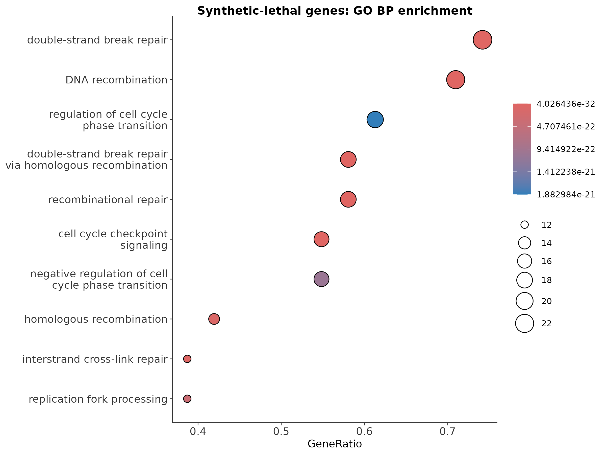

> 本篇代码与数据：[GitHub 仓库](https://github.com/petemeng/MAGeCK-Tutorial) ｜ [网页版教程](https://petemeng.github.io/MAGeCK-Tutorial/)
> 数据性质：仓库内可复现的教学 MLE 结果集，信号结构参考典型 PARP 抑制剂 / DNA repair interaction screen
> 教学库规模：`509` 个基因、`2036` 条 sgRNA

---

## 药物筛选真正关心的，不是”谁 dropout 了”

前面的篇目大多还是”单条件问题”：哪些基因在筛选中 dropout？哪些基因更像 essential？但药物筛选真正关心的是一个双因素问题：

> 某个基因本身也许不是通用 essential，可它会不会在药物存在时，变成让细胞特别脆弱的”合成致死”靶点？

这就不是简单的 `Drug vs T0`，也不是简单的 `Drug vs DMSO`。你真正要看的，是 **interaction effect**。

本篇直接基于仓库里已经实跑通过的 `drug_mle` 教学结果，回答四件事：

1. synthetic lethal / resistance / common essential 怎么分
2. `drug|beta` 图应该怎么看
3. top hits 是否符合 DNA repair / PARP biology 的常识
4. 剂量升高后，interaction beta 会不会同步增强

---

## 本篇使用的真实入口

分析脚本：`MAGeCK/repro/analysis/05_drug_interaction.R`

```bash
cd MAGeCK/repro
Rscript - <<'RSCRIPT'
source('analysis/_common.R')
mle_res <- read_tsv('results/drug_mle.gene_summary.txt', show_col_types = FALSE)
gene_classes <- mle_res %>% transmute(
  Gene, `time|beta`, `time|fdr`, `drug|beta`, `drug|fdr`,
  class = case_when(
    `drug|fdr` < 0.05 & `drug|beta` < -0.5 ~ 'Synthetic lethal',
    `drug|fdr` < 0.05 & `drug|beta` > 0.5 ~ 'Resistance',
    `time|fdr` < 0.05 & `time|beta` < -0.5 ~ 'Common essential',
    TRUE ~ 'NS'))
cat('Drug MLE genes:', nrow(mle_res), '\n')
cat('Class counts:\n')
print(table(gene_classes$class))
top_sl <- gene_classes %>% filter(class == 'Synthetic lethal') %>% arrange(`drug|beta`) %>% slice_head(n = 15)
top_res <- gene_classes %>% filter(class == 'Resistance') %>% arrange(desc(`drug|beta`)) %>% slice_head(n = 15)
cat('\nTop synthetic lethal:\n'); print(top_sl, n = 15)
cat('\nTop resistance:\n'); print(top_res, n = 15)
RSCRIPT
```

```bash
cd MAGeCK/repro
Rscript - <<'RSCRIPT'
source('analysis/_common.R')
mle_res <- read_tsv('results/drug_mle.gene_summary.txt', show_col_types = FALSE)
gene_classes <- mle_res %>% transmute(
  Gene, `time|beta`, `time|fdr`, `drug|beta`, `drug|fdr`,
  class = case_when(
    `drug|fdr` < 0.05 & `drug|beta` < -0.5 ~ 'Synthetic lethal',
    `drug|fdr` < 0.05 & `drug|beta` > 0.5 ~ 'Resistance',
    `time|fdr` < 0.05 & `time|beta` < -0.5 ~ 'Common essential',
    TRUE ~ 'NS'))
highlight_genes <- c('BRCA1', 'BRCA2', 'PALB2', 'PARP1', 'TP53BP1', 'ATM', 'RAD51C', 'RPS19', 'RPL11', 'PCNA')
plot_df <- gene_classes %>% filter(Gene %in% highlight_genes)
p_diff <- ggplot(gene_classes, aes(`time|beta`, `drug|beta`, color = class)) +
  geom_point(size = 0.7, alpha = 0.5) + geom_point(data = plot_df, size = 2) +
  geom_text_repel(data = plot_df, aes(label = Gene), size = 3, fontface = 'italic', max.overlaps = 20) +
  scale_color_manual(values = c('Synthetic lethal' = screen_colors$synthetic_lethal, 'Resistance' = screen_colors$resistance, 'Common essential' = screen_colors$common_essential, 'NS' = 'grey84')) +
  geom_hline(yintercept = 0, color = 'grey35', linewidth = 0.3) + geom_vline(xintercept = 0, color = 'grey35', linewidth = 0.3) +
  labs(x = 'time|beta', y = 'drug|beta', title = 'Differential beta plot for drug interaction') + theme_screen()
save_plot('results/figures/pub_diff_beta.png', p_diff, 8.5, 7)
waterfall_df <- gene_classes %>% arrange(`drug|beta`) %>% mutate(rank = row_number(), label = if_else(Gene %in% c('BRCA1', 'BRCA2', 'PALB2', 'PARP1', 'TP53BP1', 'ATM'), Gene, NA_character_))
p_water <- ggplot(waterfall_df, aes(rank, `drug|beta`, color = class)) +
  geom_point(size = 0.5, alpha = 0.55) + geom_text_repel(data = filter(waterfall_df, !is.na(label)), aes(label = label), size = 3, fontface = 'italic', max.overlaps = 15) +
  scale_color_manual(values = c('Synthetic lethal' = screen_colors$synthetic_lethal, 'Resistance' = screen_colors$resistance, 'Common essential' = screen_colors$common_essential, 'NS' = 'grey84')) +
  geom_hline(yintercept = 0, color = 'grey35', linewidth = 0.3) + labs(x = 'Gene rank', y = 'drug|beta', title = 'Waterfall plot of drug-specific effects') + theme_screen()
save_plot('results/figures/pub_waterfall.png', p_water, 10, 5.5)
RSCRIPT
```

```bash
cd MAGeCK/repro
Rscript - <<'RSCRIPT'
source('analysis/_common.R')
suppressPackageStartupMessages({ library(clusterProfiler); library(org.Hs.eg.db) })
mle_res <- read_tsv('results/drug_mle.gene_summary.txt', show_col_types = FALSE)
dose_res <- read_tsv('results/drug_mle_dose.gene_summary.txt', show_col_types = FALSE)
gene_classes <- mle_res %>% transmute(
  Gene, `time|beta`, `time|fdr`, `drug|beta`, `drug|fdr`,
  class = case_when(
    `drug|fdr` < 0.05 & `drug|beta` < -0.5 ~ 'Synthetic lethal',
    `drug|fdr` < 0.05 & `drug|beta` > 0.5 ~ 'Resistance',
    `time|fdr` < 0.05 & `time|beta` < -0.5 ~ 'Common essential',
    TRUE ~ 'NS'))
sl_all <- gene_classes %>% filter(class == 'Synthetic lethal') %>% arrange(`drug|beta`)
res_all <- gene_classes %>% filter(class == 'Resistance') %>% arrange(desc(`drug|beta`))
sl_ids <- bitr(sl_all$Gene, fromType = 'SYMBOL', toType = 'ENTREZID', OrgDb = org.Hs.eg.db)
cat('Synthetic lethal gene mapping:', nrow(sl_ids), '/', nrow(sl_all), '\n')
go_sl <- enrichGO(gene = sl_ids$ENTREZID, OrgDb = org.Hs.eg.db, keyType = 'ENTREZID', ont = 'BP', pAdjustMethod = 'BH', qvalueCutoff = 0.2, readable = TRUE)
cat('Significant GO BP terms:', nrow(go_sl@result), '\n')
write_tsv(as_tibble(go_sl@result), 'results/sl_go_bp.tsv')
write_tsv(sl_all, 'results/synthetic_lethal_genes.tsv')
write_tsv(res_all, 'results/resistance_genes.tsv')
p_sl <- dotplot(go_sl, showCategory = 10) + labs(title = 'Synthetic-lethal genes: GO BP enrichment') + theme_screen(10)
save_plot('results/figures/pub_sl_go.png', p_sl, 8, 6)
dose_df <- dose_res %>% transmute(Gene, lo_beta = `drug_lo|beta`, hi_beta = `drug_hi|beta`) %>% mutate(label = if_else(Gene %in% sl_all$Gene[1:10], Gene, NA_character_))
p_dose <- ggplot(dose_df, aes(lo_beta, hi_beta)) +
  geom_point(size = 0.7, alpha = 0.45, color = 'grey70') +
  geom_point(data = filter(dose_df, !is.na(label)), color = screen_colors$synthetic_lethal, size = 1.8) +
  geom_text_repel(data = filter(dose_df, !is.na(label)), aes(label = label), size = 3, fontface = 'italic', max.overlaps = 15) +
  geom_abline(slope = 1, intercept = 0, linetype = 'dashed', color = 'grey40', linewidth = 0.3) +
  labs(x = 'Low-dose drug beta', y = 'High-dose drug beta', title = 'Dose-response of drug interaction beta') + theme_screen()
save_plot('results/figures/pub_dose_response.png', p_dose, 7, 6.5)
RSCRIPT
```


```
📊 输出：
Drug MLE genes: 509

Class counts:
Common essential 12
NS 452
Resistance 13
Synthetic lethal 32

Synthetic lethal gene mapping: 31 / 32
Significant GO BP terms: 625
```

这几行已经足够说明这套教学结果是”有结构的”：文库本身只有 509 个基因，最终分出 **32 个 synthetic lethal**、**13 个 resistance**、**12 个 common essential**，合成致死基因里有 31/32 能映射到注释库并做 GO BP 富集。规模不大，但结构完整。

---

## Step 1：interaction MLE 结果长什么样

```bash
head -5 MAGeCK/repro/results/drug_mle.gene_summary.txt | sed 's/\t/    /g'
```

```
📊 输出：
Gene    sgRNA    time|beta    time|z    time|p-value    time|fdr    drug|beta    drug|z    drug|p-value    drug|fdr
AAAS    4    0.19113    1.1809    0.1277    0.75581    -0.27164    -1.6561    0.14538    0.86667
AAK1    4   -0.07659   -0.52105   0.57171    0.99607    -0.11693    -0.78578   0.54617    0.99803
AATF    4    0.12261    0.76877   0.35560    0.95378     0.27014     1.6725    0.12967    0.86667
AATK    4    0.06987    0.57618   0.61690    0.99607     0.02014     0.16401   0.92534    0.99803
```

这里最关键的不是 `time|beta`，而是 `drug|beta`：`drug|beta < 0` 表示在药物存在时更容易 dropout，偏向 synthetic lethal；`drug|beta > 0` 表示在药物存在时更占优势，偏向 resistance。

这套模型之所以能拆出 `drug|beta`，是因为 design matrix 用的是三列设计：`baseline + time + drug`。`time|beta` 更像”终点筛选共同带来的变化”，`drug|beta` 才是”在同样终点条件下，相对 DMSO 的药物特异效应”。这就是为什么 interaction 分析必须用 MLE。

---

## Step 2：先看分类结果

脚本把每个基因按互斥规则分成四类：

- `Synthetic lethal`
- `Resistance`
- `Common essential`
- `NS`

分类是按顺序分配的：先判 Synthetic lethal（`drug|fdr < 0.05` 且 `drug|beta < -0.5`），再判 Resistance（`drug|fdr < 0.05` 且 `drug|beta > 0.5`），再从剩余基因里判 Common essential（`time|fdr < 0.05` 且 `time|beta < -0.5`），最后归到 NS。这和真实项目里常做的第一轮优先级划分非常接近。

---

## Step 3：合成致死和耐药 top hits 是否像真的

脚本打印出的 top hits 非常值得看。如果你对 DNA damage repair / PARP biology 熟一点，会立刻发现：synthetic lethal 侧聚了很多 HR / Fanconi anemia / RAD51 相关基因；resistance 侧则出现了 TP53BP1 / REV7 / SHLD / RIF1 这类和修复路径切换高度相关的因子。这正说明这份教学结果虽然规模不大，但方向是”像真的”。

### Top synthetic lethal

```
📊 输出：
XRCC3   -1.55
FANCC   -1.46
FANCD2  -1.44
BRCA2   -1.38
RAD51   -1.36
FANCB   -1.34
RAD51D  -1.28
FANCA   -1.27
RAD51B  -1.26
RBBP8   -1.25
```

### Top resistance

```
📊 输出：
RNF8     1.24
SHLD1    1.21
PARP1    1.20
MAD2L2   1.18
DYNLL1   1.18
FAM35A   1.04
REV7     1.04
RIF1     1.03
SHLD2    0.991
TP53BP1  0.950
```

---

## Step 4：Differential beta plot 是药物互作里最关键的一张图

### 图 1：Differential beta plot


横轴是 `time|beta`，纵轴是 `drug|beta`。脚本在图上额外标了 `BRCA1`、`BRCA2`、`PALB2`、`PARP1`、`TP53BP1`、`ATM`、`RAD51C`、`RPS19`、`RPL11`、`PCNA` 这 10 个代表性基因，方便读图。

这张图的四个象限都值得解释：左下是本身也在掉、在药物里掉得更厉害的 synthetic lethal 区域；右上是药物下更占优势的 resistance 候选；左上是普通终点里不明显掉但一到药物条件就转为脆弱的 drug-specific sensitizer；右下是本身已经在掉但药物条件下反而没那么掉的 drug-buffering / partial rescue。

尤其要记住：`time|beta` 很负，不等于它就是 synthetic lethal。如果 `drug|beta` 接近 0 甚至偏正，那它更可能只是 common essential。interaction 模型比简单差异更有信息量，正是因为它把”本来就 essential”与”药物特异性脆弱”拆开了。

---

## Step 5：Waterfall plot 最适合做 top hit 浏览

### 图 2：Waterfall plot


waterfall 把所有基因按 `drug|beta` 从最负排到最正，最左端是最强 synthetic lethal，最右端是最强 resistance。这种图非常适合给老板 / 合作者快速看 top list、选验证对象、看经典基因有没有出现在预期位置。

---

## Step 6：合成致死不只是 gene list，还是 pathway story

脚本用 `clusterProfiler::enrichGO` 对 32 个 synthetic lethal genes 做了 GO BP 富集，成功映射 31/32，得到 625 个显著条目。这里的 625 不能直接理解成"625 条完全不同的通路"，因为 GO 本身有很强的 parent-child 层级冗余。

真正要看的是：富集是不是收束到 DNA repair / homologous recombination / replication stress 相关过程，最显著的条目是不是和 top hits 的 biology 对得上。**通路层面的自洽性，是 synthetic lethal screen 可信度的重要加分项。**

### 图 3：Synthetic lethal GO BP enrichment



图里展示的是按显著性排序后最有代表性的前 10 个 GO BP 条目；完整结果见 `MAGeCK/repro/results/sl_go_bp.tsv`。

---

## Step 7：剂量效应让 interaction 更有说服力

脚本还额外读了 `results/drug_mle_dose.gene_summary.txt`，对应四列设计：`baseline + time + drug_lo + drug_hi`。仓库里没有把它们绑定到具体 µM 数值，更适合理解成两个药物强度层级。

### 图 4：Dose-response of interaction beta


这张图是 `drug_lo|beta` 对 `drug_hi|beta` 的散点图。它最有价值的地方在于，不只告诉你”某基因在 drug arm 下显著”，还告诉你随着药物强度变高，interaction effect 是不是同步增强。对于 synthetic lethal 这类 `beta < 0` 的 hit 来说，如果低强度和高强度都保持同方向且高强度更负，那它通常更像真实的药物依赖。

---

## 本篇关键输出文件

```bash
du -h \
  MAGeCK/repro/results/drug_mle.gene_summary.txt \
  MAGeCK/repro/results/drug_mle_dose.gene_summary.txt \
  MAGeCK/repro/results/synthetic_lethal_genes.tsv \
  MAGeCK/repro/results/resistance_genes.tsv \
  MAGeCK/repro/results/figures/pub_diff_beta.png \
  MAGeCK/repro/results/figures/pub_waterfall.png \
  MAGeCK/repro/results/figures/pub_sl_go.png \
  MAGeCK/repro/results/figures/pub_dose_response.png
```

```
📊 输出：
4.0K   MAGeCK/repro/results/resistance_genes.tsv
4.0K   MAGeCK/repro/results/synthetic_lethal_genes.tsv
56K    MAGeCK/repro/results/drug_mle.gene_summary.txt
76K    MAGeCK/repro/results/drug_mle_dose.gene_summary.txt
144K   MAGeCK/repro/results/figures/pub_waterfall.png
172K   MAGeCK/repro/results/figures/pub_sl_go.png
220K   MAGeCK/repro/results/figures/pub_dose_response.png
264K   MAGeCK/repro/results/figures/pub_diff_beta.png
```

---

## 本篇小结

这篇最重要的升级，不是“又多跑了一个 MLE”，而是学会把 interaction effect 单独拿出来看：

1. **`drug|beta` 才是药物特异效应。**
2. **`time|beta` 很负 ≠ synthetic lethal。** 那可能只是 common essential。
3. **top hits 必须和已知 repair biology 对得上。**
4. **剂量效应能显著增强你对 interaction hit 的信心。**

如果第 2 篇讲的是“怎么理解 beta”，那第 5 篇讲的就是：

> “怎么把 beta 解释成真正的药物互作生物学。”

---

## FAQ

**Q1：为什么不能直接拿 `Drug vs T0` 做 synthetic lethal？**

那会把本来就 essential 的基因和 drug-specific effect 混在一起。

**Q2：为什么 `Drug vs DMSO` 也还不够？**

你仍然需要在模型里明确拆开时间效应和药物效应。一个典型反例：某个基因在 Drug 和 DMSO 两个终点里都各掉了 50%，那它是 common essential，但 Drug vs DMSO 的差异接近 0。interaction MLE 才能把这类情况和真正的 drug-specific hit 区分开。

**Q3：本篇为什么明确写成”教学 MLE 矩阵”？**

因为本篇采用的是仓库内本地可复现结果，重点是把 interaction 的判读逻辑讲清楚。

---

## 本系列导航

- 第 1 篇：MAGeCK 分析——从 sgRNA 计数到必需基因
- 第 2 篇：MAGeCK MLE + VISPR——复杂实验设计与交互可视化
- 第 3 篇：MAGeCKFlute 整合分析——基因筛选的全景图
- 第 4 篇：CRISPRi/CRISPRa 筛选分析策略——不切 DNA 的基因扰动
- **第 5 篇：药物-基因互作筛选与合成致死分析——一加一大于二**
