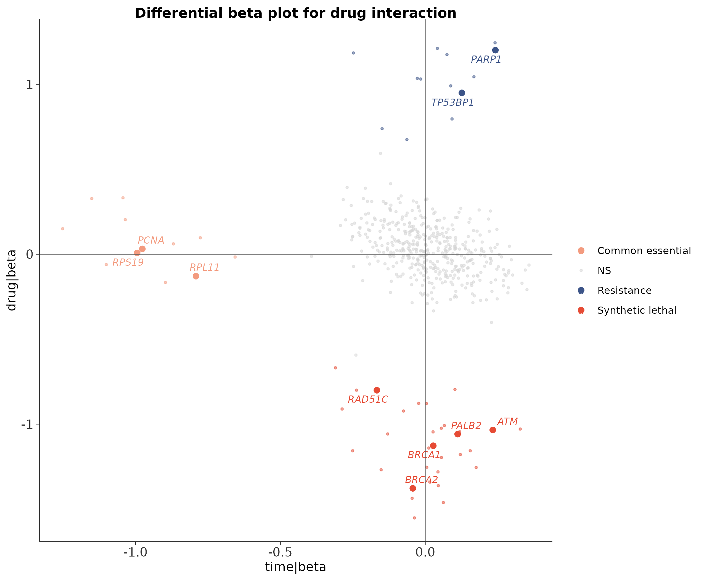
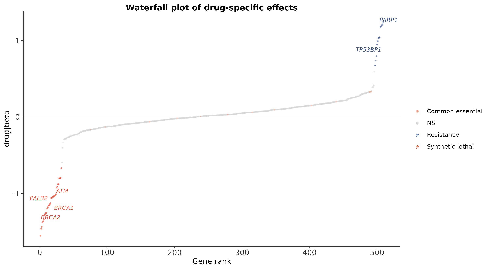
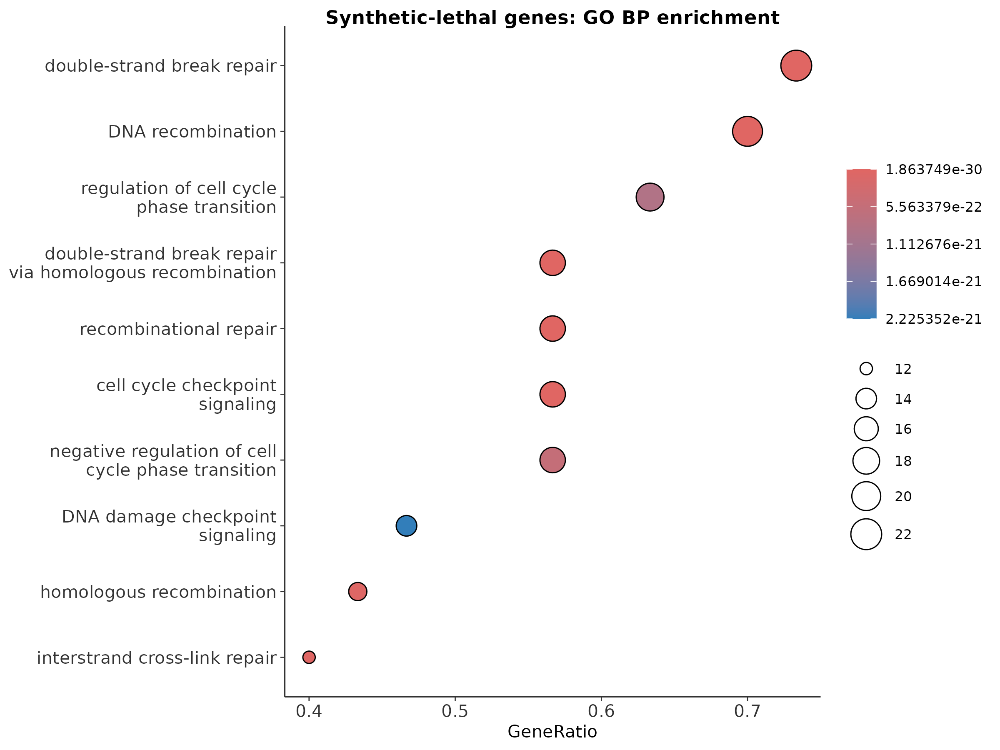
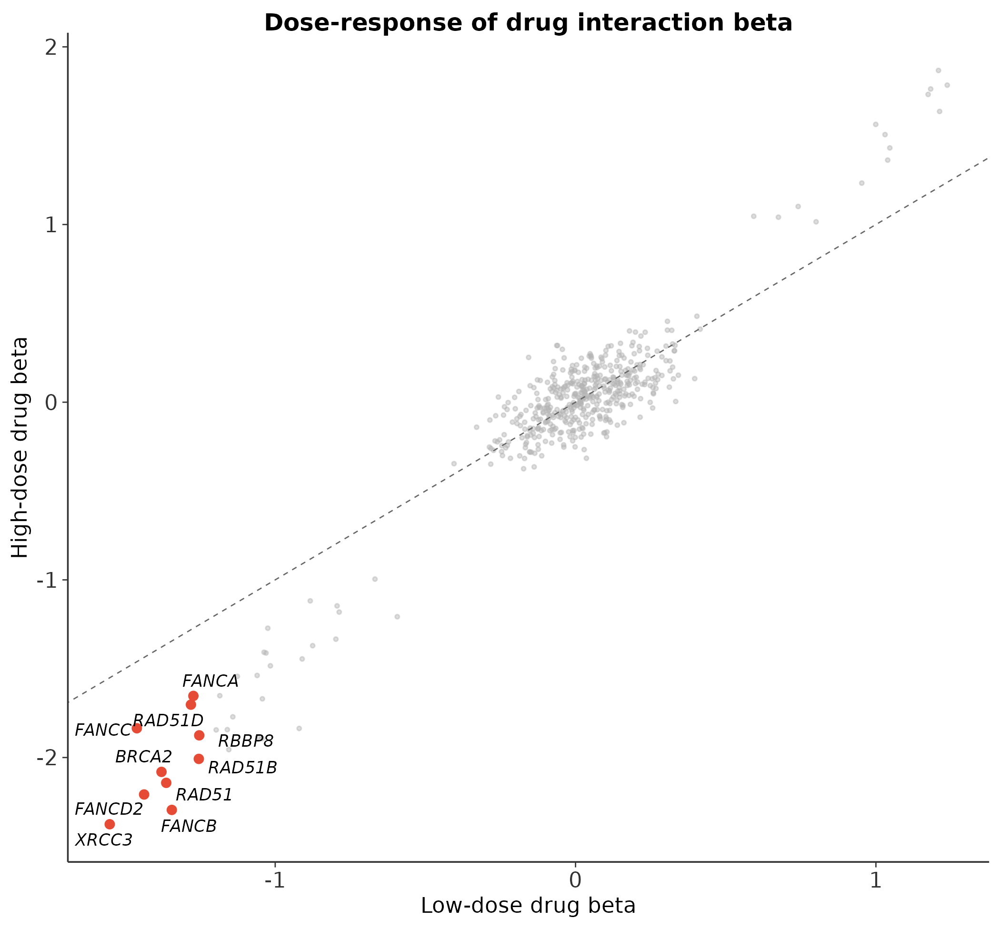

# CRISPR 筛选最佳实践（五）：药物-基因互作筛选与合成致死分析——一加一大于二

> 📋 教程信息
> - GitHub 仓库：[petemeng/MAGeCK-Tutorial](https://github.com/petemeng/MAGeCK-Tutorial)（完整代码、结果与更新记录）
> - 在线网页：[petemeng.github.io/MAGeCK-Tutorial](https://petemeng.github.io/MAGeCK-Tutorial/)（可点击阅读的网页版教程）
> - 数据来源：仓库内可复现教学 MLE 矩阵与实跑结果：`MAGeCK/repro/results/drug_mle*`
> - 分析对象：drug-gene interaction、synthetic lethal、resistance 与 dose response
> - 本篇重点：`analysis/05_drug_interaction.R` 的实跑输出与图表解释
> - 预计阅读：40 分钟 | 实操：10–20 分钟
> - 难度：⭐⭐⭐⭐⭐（5 星制）
> - 前置知识：完成第 2 篇，理解 design matrix 与 `beta` 的含义

---

## 本篇目标

前面的篇目大多还是“单条件问题”：

- 哪些基因在筛选中 dropout？
- 哪些基因更像 essential？

但药物筛选真正关心的是一个双因素问题：

> 某个基因本身也许不是通用 essential，可它会不会在药物存在时，变成让细胞特别脆弱的“合成致死”靶点？

这就不是简单的 `Drug vs T0`，也不是简单的 `Drug vs DMSO`。你真正要看的，是 **interaction effect**。

本篇直接基于仓库里已经实跑通过的 `drug_mle` 结果，回答四件事：

1. synthetic lethal / resistance / common essential 怎么分
2. `drug|beta` 图应该怎么看
3. top hits 是否符合 DNA repair / PARP biology 的常识
4. 剂量升高后，interaction beta 会不会同步增强

---

## 本篇使用的真实入口

分析脚本：`MAGeCK/repro/analysis/05_drug_interaction.R`

直接运行：

```bash
cd MAGeCK/repro
Rscript analysis/05_drug_interaction.R
```

```
📊 输出：
Drug MLE genes: 509

Class counts:
Common essential 12
NS 452
Resistance 13
Synthetic lethal 32

Synthetic lethal gene mapping: 31 / 32
Significant GO BP terms: 625
```

这几行已经足够说明这套教学结果是“有结构的”：

- 509 个基因被纳入 MLE 交互分析
- 其中分出 **32 个 synthetic lethal**、**13 个 resistance**、**12 个 common essential**
- 合成致死基因大多数可以成功映射到功能注释并做 GO 富集

---

## Step 1：interaction MLE 结果长什么样

```bash
head -5 MAGeCK/repro/results/drug_mle.gene_summary.txt | sed 's/\t/    /g'
```

```
📊 输出：
Gene    sgRNA    time|beta    time|z    time|p-value    time|fdr    drug|beta    drug|z    drug|p-value    drug|fdr
AAAS    4    0.19113    1.1809    0.1277    0.75581    -0.27164    -1.6561    0.14538    0.86667
AAK1    4   -0.07659   -0.52105   0.57171    0.99607    -0.11693    -0.78578   0.54617    0.99803
AATF    4    0.12261    0.76877   0.35560    0.95378     0.27014     1.6725    0.12967    0.86667
AATK    4    0.06987    0.57618   0.61690    0.99607     0.02014     0.16401   0.92534    0.99803
```

这里最关键的不是 `time|beta`，而是 `drug|beta`：

- `drug|beta < 0`：在药物存在时更容易 dropout，偏向 synthetic lethal
- `drug|beta > 0`：在药物存在时更占优势，偏向 resistance

这就是为什么 interaction 分析必须用 MLE，而不能只看普通两组差异。

---

## Step 2：先看分类结果

脚本把每个基因按规则分成四类：

- `Synthetic lethal`
- `Resistance`
- `Common essential`
- `NS`

分类规则本身非常实用：

- `drug|fdr < 0.05` 且 `drug|beta < -0.5` → `Synthetic lethal`
- `drug|fdr < 0.05` 且 `drug|beta > 0.5` → `Resistance`
- `time|beta < -0.5` → `Common essential`
- 其余 → `NS`

这和真实项目里常做的第一轮优先级划分非常接近。

---

## Step 3：合成致死和耐药 top hits 是否像真的

脚本打印出的 top hits 非常值得看，因为它们不是“算法上显著但毫无生物学关系”的杂乱基因。

### Top synthetic lethal

```
📊 输出：
XRCC3   -1.55
FANCC   -1.46
FANCD2  -1.44
BRCA2   -1.38
RAD51   -1.36
FANCB   -1.34
RAD51D  -1.28
FANCA   -1.27
RAD51B  -1.26
RBBP8   -1.25
```

### Top resistance

```
📊 输出：
RNF8     1.24
SHLD1    1.21
PARP1    1.20
MAD2L2   1.18
DYNLL1   1.18
FAM35A   1.04
REV7     1.04
RIF1     1.03
SHLD2    0.991
TP53BP1  0.950
```

如果你对 DNA damage repair / PARP biology 熟一点，会立刻发现：

- synthetic lethal 侧聚了很多 **HR / Fanconi anemia / RAD51** 相关基因
- resistance 侧则出现了 **TP53BP1 / REV7 / SHLD / RIF1** 这类和修复路径切换高度相关的因子

这正说明这份教学结果虽然规模不大，但方向是“像真的”。

---

## Step 4：Differential beta plot 是药物互作里最关键的一张图

### 图 1：Differential beta plot



横轴是 `time|beta`，纵轴是 `drug|beta`。这张图的读法非常关键：

- 左下：本身也在掉，在药物里掉得更厉害 → 可能接近 synthetic lethal / strong dependency
- 右上：药物下更占优势 → resistance 候选
- 只有 `time|beta` 很负、`drug|beta` 接近 0 → common essential，而不是 drug-specific hit

这也是为什么 interaction 模型比简单差异更有信息量：

> 它把“本来就 essential”与“药物特异性脆弱”拆开了。

---

## Step 5：Waterfall plot 最适合做 top hit 浏览

### 图 2：Waterfall plot



waterfall 把所有基因按 `drug|beta` 从最负排到最正：

- 最左端：最强 synthetic lethal
- 最右端：最强 resistance

这种图非常适合：

- 给老板 / 合作者快速看 top list
- 选验证对象
- 看某些经典基因有没有出现在你预期的位置

在这套结果里，`BRCA2`、`RAD51`、`FANCD2` 这些 repair genes 都落在左端，非常合理。

---

## Step 6：合成致死不是 gene list，还是 pathway story

脚本把全部 synthetic lethal genes 做了 GO BP enrichment：

- `31 / 32` 个成功映射
- `625` 个显著 GO BP terms

### 图 3：Synthetic lethal GO 富集



这一步的重要性在于：

- 如果 top hits 东一榔头西一棒子，GO 往往也会很散
- 如果 GO 能收束成 DNA repair / replication stress / checkpoint 相关过程，说明你的互作结果更像一个真实机制网络

也就是说，**通路层面的自洽性，是 synthetic lethal screen 可信度的重要加分项。**

---

## Step 7：剂量效应让 interaction 更有说服力

脚本还额外读了：

- `results/drug_mle_dose.gene_summary.txt`

并比较 `drug_lo|beta` 与 `drug_hi|beta`。

### 图 4：Dose-response of interaction beta



这张图最有价值的地方在于，它不只告诉你“某基因在 drug arm 下显著”，还告诉你：

- 随着剂量变高，这个 interaction effect 是不是同步增强

如果一个 top synthetic lethal gene 在低剂量和高剂量都保持同方向，而且高剂量更强，那它通常会更像真实的药物依赖，而不是噪声。

---

## 本篇关键输出文件

```bash
du -h \
  MAGeCK/repro/results/drug_mle.gene_summary.txt \
  MAGeCK/repro/results/drug_mle_dose.gene_summary.txt \
  MAGeCK/repro/results/synthetic_lethal_genes.tsv \
  MAGeCK/repro/results/resistance_genes.tsv \
  MAGeCK/repro/results/figures/pub_diff_beta.png \
  MAGeCK/repro/results/figures/pub_waterfall.png \
  MAGeCK/repro/results/figures/pub_sl_kegg.png \
  MAGeCK/repro/results/figures/pub_dose_response.png
```

```
📊 输出：
4.0K   MAGeCK/repro/results/resistance_genes.tsv
4.0K   MAGeCK/repro/results/synthetic_lethal_genes.tsv
56K    MAGeCK/repro/results/drug_mle.gene_summary.txt
76K    MAGeCK/repro/results/drug_mle_dose.gene_summary.txt
148K   MAGeCK/repro/results/figures/pub_waterfall.png
172K   MAGeCK/repro/results/figures/pub_sl_kegg.png
220K   MAGeCK/repro/results/figures/pub_dose_response.png
264K   MAGeCK/repro/results/figures/pub_diff_beta.png
```

---

## 本篇小结

这篇最重要的升级，不是“又多跑了一个 MLE”，而是学会把 interaction effect 单独拿出来看：

1. **drug|beta 才是药物特异效应。**
2. **time|beta 很负 ≠ synthetic lethal。** 那可能只是 common essential。
3. **top hits 必须和已知 repair biology 对得上。**
4. **剂量效应能显著增强你对 interaction hit 的信心。**

如果第 2 篇讲的是“怎么理解 beta”，那第 5 篇讲的就是：

> “怎么把 beta 解释成真正的药物互作生物学。”

---

## FAQ：常见问题

**Q1：为什么不能直接拿 `Drug vs T0` 做 synthetic lethal？**

因为那会把本来就 essential 的基因和 drug-specific effect 混在一起。

**Q2：为什么 `Drug vs DMSO` 也还不够？**

因为你仍然需要在模型里明确拆开时间效应和药物效应，interaction 才会更干净。

**Q3：本篇为什么明确写成“教学 MLE 矩阵”？**

因为这版内容就是基于仓库内本地可复现结果，重点是把逻辑讲对、代码跑通，而不是冒充论文级 raw reanalysis。

---

## 本系列导航

| 篇目 | 主题 | 状态 |
|---|---|---|
| 第 1 篇 | MAGeCK 分析——从 sgRNA 计数到必需基因 | 已升级为全量实跑版 |
| 第 2 篇 | MAGeCK MLE + VISPR——复杂实验设计与交互可视化 | 已升级为全量实跑版 |
| 第 3 篇 | MAGeCKFlute 整合分析——基因筛选的全景图 | 已升级为全量实跑版 |
| 第 4 篇 | CRISPRi/CRISPRa 筛选分析策略 | 已切到真实教学版 |
| **第 5 篇** | **药物-基因互作筛选与合成致死分析——一加一大于二** | **📍 本篇** |
| 第 6 篇 | 发表级图表与审稿人常见问题 | 待联动刷新 |
