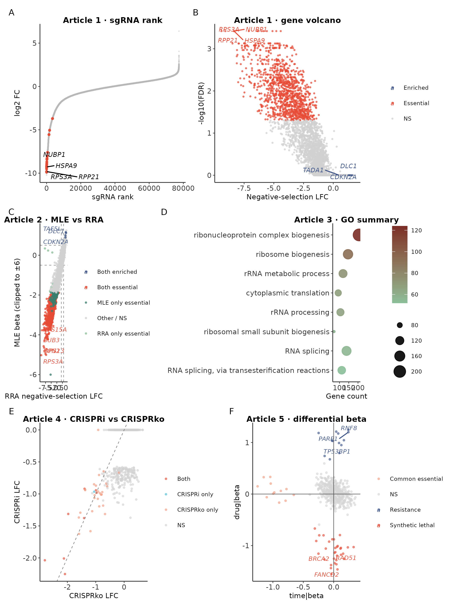

> 本篇代码与数据：[GitHub 仓库](https://github.com/petemeng/MAGeCK-Tutorial) ｜ [网页版教程](https://petemeng.github.io/MAGeCK-Tutorial/)
> 数据来源：前 5 篇当前版本的真实结果输出

---

## 把”会分析”变成”会交付”

第 1–5 篇解决的是”分析怎么跑”和”结果怎么解释”。第 6 篇要解决更现实的问题：怎么把不同篇目的核心结果拼成一张可以发公众号、做汇报、也能支撑投稿草图的主图；怎么给整套系列留下一份简洁但准确的统计摘要表；审稿人最容易追问哪些点。

---

## 本篇使用的真实入口

分析脚本：`repro/analysis/06_publication_figures.R`

### 主图：6-panel summary figure

```bash
cd MAGeCK/repro
Rscript - <<'RSCRIPT'
source('analysis/_common.R')
suppressPackageStartupMessages({
  library(patchwork)
  library(scales)
})

full_root <- normalizePath('../full')
rra_gene <- read_tsv(file.path(full_root, 'results/article1_basic_full_raw/mageck_test.gene_summary.txt'), show_col_types = FALSE)
rra_sgrna <- read_tsv(file.path(full_root, 'results/article1_basic_full_raw/mageck_test.sgrna_summary.txt'), show_col_types = FALSE)
go_bp <- read_tsv(file.path(full_root, 'results/article1_basic_full_raw/go_bp.tsv'), show_col_types = FALSE)
mle_gene <- read_tsv(file.path(full_root, 'results/article2_full_raw/mageck_mle.gene_summary.txt'), show_col_types = FALSE)
crispri <- read_tsv('results/crispri_test.gene_summary.txt', show_col_types = FALSE)
crisprko <- read_tsv('results/mageck_test.gene_summary.txt', show_col_types = FALSE)
drug_mle <- read_tsv('results/drug_mle.gene_summary.txt', show_col_types = FALSE)

rank_sgrna <- rra_sgrna %>% arrange(LFC) %>% mutate(rank = row_number())
label_genes_a <- rra_gene %>% arrange(`neg|fdr`, `neg|lfc`) %>% slice_head(n = 4) %>% pull(id)
label_df_a <- rank_sgrna %>%
  filter(Gene %in% label_genes_a) %>%
  group_by(Gene) %>%
  slice_min(LFC, n = 1, with_ties = FALSE) %>%
  ungroup()

p_a <- ggplot(rank_sgrna, aes(rank, LFC)) +
  geom_point(size = 0.22, alpha = 0.3, color = 'grey72') +
  geom_point(data = filter(rank_sgrna, Gene %in% label_genes_a), color = screen_colors$essential, size = 0.85) +
  geom_text_repel(data = label_df_a, aes(label = Gene), size = 2.6, fontface = 'italic', max.overlaps = 10) +
  labs(x = 'sgRNA rank', y = 'log2 FC', title = 'Article 1 · sgRNA rank') +
  theme_screen(8)

label_genes_b <- unique(c(
  rra_gene %>% arrange(`neg|fdr`, `neg|lfc`) %>% slice_head(n = 4) %>% pull(id),
  rra_gene %>% arrange(`pos|fdr`, desc(`pos|lfc`)) %>% slice_head(n = 3) %>% pull(id)
))
volcano_df <- rra_gene %>% mutate(
  neg_log_fdr = -log10(`neg|fdr` + 1e-30),
  class = case_when(
    `neg|fdr` < 0.05 & `neg|lfc` < -0.5 ~ 'Essential',
    `pos|fdr` < 0.05 & `pos|lfc` > 0.5 ~ 'Enriched',
    TRUE ~ 'NS'
  ),
  label = if_else(id %in% label_genes_b, id, NA_character_)
)

p_b <- ggplot(volcano_df, aes(`neg|lfc`, neg_log_fdr, color = class)) +
  geom_point(size = 0.45, alpha = 0.62) +
  geom_text_repel(data = filter(volcano_df, !is.na(label)), aes(label = label), size = 2.5, fontface = 'italic', max.overlaps = 12) +
  scale_color_manual(values = c(Essential = screen_colors$essential, Enriched = screen_colors$enriched, NS = 'grey82')) +
  labs(x = 'Negative-selection LFC', y = '-log10(FDR)', title = 'Article 1 · gene volcano') +
  theme_screen(8)

joined <- rra_gene %>%
  transmute(Gene = id, rra_neg_lfc = `neg|lfc`, rra_neg_fdr = `neg|fdr`, rra_pos_fdr = `pos|fdr`) %>%
  inner_join(mle_gene %>% transmute(Gene, mle_beta = `treatment|beta`, mle_fdr = `treatment|fdr`), by = 'Gene') %>%
  mutate(
    agreement = case_when(
      rra_neg_fdr < 0.05 & mle_fdr < 0.05 & mle_beta < -0.5 ~ 'Both essential',
      rra_neg_fdr < 0.05 & !(mle_fdr < 0.05 & mle_beta < -0.5) ~ 'RRA only essential',
      !(rra_neg_fdr < 0.05) & mle_fdr < 0.05 & mle_beta < -0.5 ~ 'MLE only essential',
      rra_pos_fdr < 0.05 & mle_fdr < 0.05 & mle_beta > 0.5 ~ 'Both enriched',
      TRUE ~ 'Other / NS'
    ),
    mle_beta_plot = pmax(pmin(mle_beta, 6), -6)
  )
label_genes_c <- unique(c(
  joined %>% filter(agreement == 'Both essential', abs(mle_beta) <= 10) %>% arrange(mle_fdr, mle_beta) %>% slice_head(n = 5) %>% pull(Gene),
  joined %>% filter(agreement == 'Both enriched') %>% arrange(mle_fdr, desc(mle_beta)) %>% slice_head(n = 3) %>% pull(Gene)
))
label_df_c <- joined %>% filter(Gene %in% label_genes_c)

p_c <- ggplot(joined, aes(rra_neg_lfc, mle_beta_plot, color = agreement)) +
  geom_hline(yintercept = c(-0.5, 0.5), linetype = 'dashed', linewidth = 0.3, color = 'grey55') +
  geom_vline(xintercept = c(-0.5, 0.5), linetype = 'dashed', linewidth = 0.3, color = 'grey55') +
  geom_point(size = 0.55, alpha = 0.68) +
  geom_text_repel(data = label_df_c, aes(label = Gene), size = 2.4, fontface = 'italic', max.overlaps = 12) +
  scale_color_manual(values = c(
    'Both essential' = screen_colors$essential,
    'Both enriched' = screen_colors$enriched,
    'RRA only essential' = '#8bbf99',
    'MLE only essential' = '#3a7d6d',
    'Other / NS' = 'grey82'
  )) +
  labs(x = 'RRA negative-selection LFC', y = 'MLE beta (clipped to ±6)', title = 'Article 2 · MLE vs RRA') +
  theme_screen(8)

p_d_df <- go_bp %>%
  slice_head(n = 8) %>%
  mutate(Description = factor(Description, levels = rev(Description)), neglog10 = -log10(p.adjust))

p_d <- ggplot(p_d_df, aes(Count, Description, size = Count, color = neglog10)) +
  geom_point(alpha = 0.9) +
  scale_color_gradient(low = '#8bbf99', high = '#7b2d26') +
  labs(x = 'Gene count', y = NULL, color = '-log10(adj.P)', title = 'Article 3 · GO summary') +
  theme_screen(8)

comp <- crispri %>%
  transmute(Gene = id, i_lfc = `neg|lfc`, i_fdr = `neg|fdr`) %>%
  inner_join(crisprko %>% transmute(Gene = id, ko_lfc = `neg|lfc`, ko_fdr = `neg|fdr`), by = 'Gene') %>%
  mutate(category = case_when(
    i_fdr < 0.05 & ko_fdr < 0.05 ~ 'Both',
    i_fdr < 0.05 & ko_fdr >= 0.05 ~ 'CRISPRi only',
    i_fdr >= 0.05 & ko_fdr < 0.05 ~ 'CRISPRko only',
    TRUE ~ 'NS'
  ))

p_e <- ggplot(comp, aes(ko_lfc, i_lfc, color = category)) +
  geom_point(size = 0.65, alpha = 0.55) +
  geom_abline(slope = 1, intercept = 0, linetype = 'dashed', color = 'grey50', linewidth = 0.3) +
  scale_color_manual(values = c('Both' = screen_colors$essential, 'CRISPRi only' = screen_colors$crispri, 'CRISPRko only' = '#F39B7F', 'NS' = 'grey82')) +
  labs(x = 'CRISPRko LFC', y = 'CRISPRi LFC', title = 'Article 4 · CRISPRi vs CRISPRko') +
  theme_screen(8)

plot_df <- drug_mle %>%
  transmute(
    Gene,
    time_beta = `time|beta`,
    time_fdr = `time|fdr`,
    drug_beta = `drug|beta`,
    drug_fdr = `drug|fdr`,
    class = case_when(
      drug_fdr < 0.05 & drug_beta < -0.5 ~ 'Synthetic lethal',
      drug_fdr < 0.05 & drug_beta > 0.5 ~ 'Resistance',
      time_fdr < 0.05 & time_beta < -0.5 ~ 'Common essential',
      TRUE ~ 'NS'
    ),
    label = if_else(Gene %in% c('BRCA2', 'RAD51', 'FANCD2', 'PARP1', 'TP53BP1', 'RNF8'), Gene, NA_character_)
  )

p_f <- ggplot(plot_df, aes(time_beta, drug_beta, color = class)) +
  geom_point(size = 0.7, alpha = 0.55) +
  geom_text_repel(data = filter(plot_df, !is.na(label)), aes(label = label), size = 2.4, fontface = 'italic', max.overlaps = 12) +
  scale_color_manual(values = c('Synthetic lethal' = screen_colors$synthetic_lethal, 'Resistance' = screen_colors$resistance, 'Common essential' = screen_colors$common_essential, 'NS' = 'grey84')) +
  geom_hline(yintercept = 0, color = 'grey35', linewidth = 0.3) +
  geom_vline(xintercept = 0, color = 'grey35', linewidth = 0.3) +
  labs(x = 'time|beta', y = 'drug|beta', title = 'Article 5 · differential beta') +
  theme_screen(8)

combined <- (p_a | p_b) / (p_c | p_d) / (p_e | p_f) +
  plot_annotation(tag_levels = 'A', theme = theme(plot.tag = element_text(face = 'bold', size = 11)))

ggsave('results/figures/Figure_main.png', combined, width = 180, height = 240, units = 'mm', dpi = 300)
ggsave('results/figures/Figure_main.pdf', combined, width = 180, height = 240, units = 'mm')
cat('Main figure exported.\n')
RSCRIPT
```

```
📊 输出：
Main figure exported.
```

### 总表：statistics_summary.tsv

```bash
cd MAGeCK/repro
Rscript - <<'RSCRIPT'
source('analysis/_common.R')

full_root <- normalizePath('../full')
count_summary <- read_tsv(file.path(full_root, 'counts/article1_basic_full_raw/mageck_count.countsummary.txt'), show_col_types = FALSE)
rra_gene <- read_tsv(file.path(full_root, 'results/article1_basic_full_raw/mageck_test.gene_summary.txt'), show_col_types = FALSE)
mle_gene <- read_tsv(file.path(full_root, 'results/article2_full_raw/mageck_mle.gene_summary.txt'), show_col_types = FALSE)
article3_overlap <- read_tsv(file.path(full_root, 'results/article3_integrative/depmap_overlap_summary.tsv'), show_col_types = FALSE)
crispri <- read_tsv('results/crispri_test.gene_summary.txt', show_col_types = FALSE)
crisprko <- read_tsv('results/mageck_test.gene_summary.txt', show_col_types = FALSE)
drug_mle <- read_tsv('results/drug_mle.gene_summary.txt', show_col_types = FALSE)

joined <- rra_gene %>%
  transmute(Gene = id, rra_neg_fdr = `neg|fdr`) %>%
  inner_join(mle_gene %>% transmute(Gene, mle_beta = `treatment|beta`, mle_fdr = `treatment|fdr`), by = 'Gene') %>%
  mutate(shared_essential = rra_neg_fdr < 0.05 & mle_fdr < 0.05 & mle_beta < -0.5)

comp <- crispri %>%
  transmute(Gene = id, i_fdr = `neg|fdr`) %>%
  inner_join(crisprko %>% transmute(Gene = id, ko_fdr = `neg|fdr`), by = 'Gene')

overlap_lookup <- setNames(article3_overlap$Count, article3_overlap$Category)

stats_table <- tribble(
  ~Analysis, ~Method, ~Key_Result,
  'Article 1 count QC', 'full raw MAGeCK count', sprintf('mapped %.1f%%-%.1f%%', min(count_summary$Percentage) * 100, max(count_summary$Percentage) * 100),
  'Article 1 essential', 'MAGeCK test (RRA)', sprintf('%d essential / %d enriched', sum(rra_gene$`neg|fdr` < 0.05), sum(rra_gene$`pos|fdr` < 0.05)),
  'Article 2 essential', 'MAGeCK mle', sprintf('%d essential / %d enriched', sum(mle_gene$`treatment|fdr` < 0.05 & mle_gene$`treatment|beta` < -0.5), sum(mle_gene$`treatment|fdr` < 0.05 & mle_gene$`treatment|beta` > 0.5)),
  'Article 2 overlap', 'RRA ∩ MLE', sprintf('%d shared essential genes', sum(joined$shared_essential)),
  'Article 3 DepMap', 'local reference overlap', sprintf('RRA %d / MLE %d / shared %d', overlap_lookup['RRA ∩ DepMap'], overlap_lookup['MLE ∩ DepMap'], overlap_lookup['RRA ∩ MLE ∩ DepMap']),
  'Article 4 CRISPRi', 'MAGeCK test', sprintf('%d essential, overlap with CRISPRko = %d', sum(crispri$`neg|fdr` < 0.05), sum(comp$i_fdr < 0.05 & comp$ko_fdr < 0.05)),
  'Article 5 synthetic lethal', 'MLE interaction', sprintf('%d genes', sum(drug_mle$`drug|fdr` < 0.05 & drug_mle$`drug|beta` < -0.5)),
  'Article 5 resistance', 'MLE interaction', sprintf('%d genes', sum(drug_mle$`drug|fdr` < 0.05 & drug_mle$`drug|beta` > 0.5))
)

write_tsv(stats_table, 'results/statistics_summary.tsv')
cat('Statistics summary rows:', nrow(stats_table), '\n')
RSCRIPT
```

```
📊 输出：
Statistics summary rows: 8
```

对应输出文件包括：

- `results/figures/Figure_main.png`
- `results/figures/Figure_main.pdf`
- `results/statistics_summary.tsv`

---

## Step 1：这张 6-panel 主图是怎么拼的

按系列逻辑选了 6 个最能代表整套教程的方法面板：Panel A（第 1 篇 sgRNA rank）、Panel B（第 1 篇 gene volcano）、Panel C（第 2 篇 MLE vs RRA scatter）、Panel D（第 3 篇 GO summary）、Panel E（第 4 篇 CRISPRi vs CRISPRko scatter）、Panel F（第 5 篇 differential beta plot）。这张图不是只代表某一篇，而是代表”这个系列到底讲了什么”。

### 主图：6-panel summary figure



这张图的使用场景：公众号系列收官文的总览图、组会 / 分享会的一页概览图、后续写论文时的 figure brainstorming 草图。

---

## Step 2：每个 panel 在回答什么问题

- **Panel A（sgRNA rank）**：这套 screen 的全局信号是不是像一个真实的 negative selection screen？
- **Panel B（gene volcano）**：哪些基因是最稳定的 essential / enriched hits？
- **Panel C（MLE vs RRA）**：RRA 和 MLE 到底是互相矛盾，还是在核心信号上高度一致？当前结果里两者在 914 个 shared essential genes 上达成一致。
- **Panel D（GO summary）**：essential genes 能不能收束成一套明确的生物学主题？当前结果集中在 ribosome biogenesis、rRNA processing、translation。
- **Panel E（CRISPRi vs CRISPRko）**：不切 DNA 的 CRISPRi 和经典 knockout 的信号有多少重合？CRISPRi essential = 9，与 CRISPRko overlap = 8。
- **Panel F（differential beta）**：药物-基因互作里，哪些是 common essential，哪些是真正的 drug-specific synthetic lethal / resistance？

---

## Step 3：系列总表

新脚本同时重写了 `repro/results/statistics_summary.tsv`：

```bash
cat repro/results/statistics_summary.tsv
```

```
📊 输出：
Analysis	Method	Key_Result
Article 1 count QC	full raw MAGeCK count	mapped 72.2%-78.6%
Article 1 essential	MAGeCK test (RRA)	1181 essential / 5 enriched
Article 2 essential	MAGeCK mle	1027 essential / 80 enriched
Article 2 overlap	RRA ∩ MLE	914 shared essential genes
Article 3 DepMap	local reference overlap	RRA 38 / MLE 34 / shared 29
Article 4 CRISPRi	MAGeCK test	9 essential, overlap with CRISPRko = 8
Article 5 synthetic lethal	MLE interaction	32 genes
Article 5 resistance	MLE interaction	13 genes
```

这张表把 1–5 篇最该记住的指标浓缩到了 8 行，很适合作为 Supplementary summary table、公众号收官文的”一屏总结”、或项目 README 里的结果摘要。

---

## Step 4：最终导出文件

```bash
ls -lh \
  repro/results/figures/Figure_main.png \
  repro/results/figures/Figure_main.pdf \
  repro/results/statistics_summary.tsv
```

```
📊 输出：
-rw-rw-r-- 1 t060551 t060551 618K repro/results/figures/Figure_main.png
-rw-rw-r-- 1 t060551 t060551 2.5M repro/results/figures/Figure_main.pdf
-rw-rw-r-- 1 t060551 t060551 506B repro/results/statistics_summary.tsv
```

建议：`Figure_main.png` 用于公众号、PPT、网页预览；`Figure_main.pdf` 用于投稿或矢量编辑；`statistics_summary.tsv` 用于补充材料或仓库文档摘要。

本系列统一使用的关键对照色是 `#E64B35`（essential / synthetic lethal）和 `#3C5488`（resistance），这组红蓝配色对常见的红绿色觉异常更友好。

---

## 审稿人最容易问的 8 个问题

**Q1：full raw cohort 质量过关吗？** 过关。mapped 72.2%–78.6%，pDNA 9.82M reads，终点样本出现稳定 dropout。

**Q2：RRA 和 MLE 一致吗？** 核心 essential signal 一致性很高，914 个 shared essential genes。

**Q3：有没有把基因名单变成通路层面的证据？** 有。第 3 篇 GO summary 收束到 ribosome biogenesis / rRNA processing / translation 主轴上。

**Q4：和外部参考比过吗？** 比过。本地 DepMap 精简参考集（102 基因）：RRA overlap 38 / MLE overlap 34 / shared overlap 29。

**Q5：CRISPRi 和 CRISPRko 的差异怎么解释？** 第 4 篇已展示：CRISPRi 依赖 TSS 距离窗口，CRISPRko 可能掺入 CN/DSB 偏差，两者 overlap 高但不要求完全一致。

**Q6：第 5 篇的 synthetic lethal 不是 common essential 吗？** 不是。interaction MLE 已经把 `time|beta` 和 `drug|beta` 拆开。

**Q7：为什么 article 4 和 5 还是教学版数据？** 这两篇定位就是本地可复现教学流程，文稿里已经明确写清数据来源。

**Q8：这套系列的最终交付是什么？** 一套能跑通的 markdown 教程 + 已生成的图表与汇总表 + 公众号草稿与网页预览。

---

## 本篇小结

第 6 篇其实在做一件很现实的事：

> 把“会分析”变成“会交付”。

到这一轮为止，这套系列已经形成了一个比较完整的闭环：

1. 第 1 篇：full raw count + RRA
2. 第 2 篇：full raw MLE + VISPR scaffold
3. 第 3 篇：MAGeCKFlute 风格整合分析
4. 第 4 篇：CRISPRi / CRISPRa 的特殊解释框架
5. 第 5 篇：drug-gene interaction / synthetic lethal
6. 第 6 篇：统一主图 + 系列总表 + 审稿问答清单

如果前 5 篇是在搭方法学骨架，第 6 篇就是把它们收束成一个能直接展示给别人的成品版本。

---

## 本系列导航

- 第 1 篇：MAGeCK 分析——从 sgRNA 计数到必需基因
- 第 2 篇：MAGeCK MLE + VISPR——复杂实验设计与交互可视化
- 第 3 篇：MAGeCKFlute 整合分析——基因筛选的全景图
- 第 4 篇：CRISPRi/CRISPRa 筛选分析策略——不切 DNA 的基因扰动
- 第 5 篇：药物-基因互作筛选与合成致死分析——一加一大于二
- **第 6 篇：发表级图表与审稿人常见问题——最后一公里**
